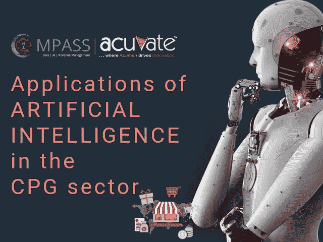
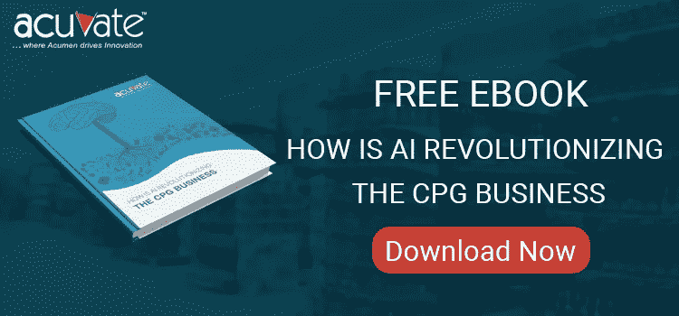

# 人工智能在 CPG 领域的应用

> 原文：<https://medium.com/swlh/applications-of-artificial-intelligence-in-the-cpg-sector-1375da964bb4>

> 到 2020 年，人工智能技术将出现在几乎所有新的软件产品中——Gartner

[**人工智能**](https://acuvate.com/bi-for-fmcg) 在过去几年里一直是一个流行词。然而，仅仅是在没有适当策略的情况下随波逐流可能会给组织带来灾难性的后果。

从人工智能中获得的任何价值都取决于它是如何被利用的。随着人工智能的不断发展，它为组织创造了改善现有软件功能和构建新的增强产品的机会。

随着组织试图围绕如何使用人工智能为他们的组织造福制定战略，它带来了几个问题-什么是正确的道路？什么是理想的第一步？数字创新管理者如何与 AI 一起前行？

> *“成熟品牌也在失去(市场)份额，因为它们不像年轻的 CPG 公司那样灵活地使用数字技术来开发、营销和销售产品”
> –波士顿咨询集团*

但首先，让我们更深入地了解人工智能，以及它如何使用各种技术为 CPG 行业创建实际应用:

# 1.人工智能能够将原始 CPG 数据转换为有意义的见解

做出明智的商业决策对任何行业都至关重要，尤其是对 CPG 领域。各种业务领域的有效决策构成了 CPG 业务的支柱。这些决定必须迅速做出，而且必须极其准确。

但是，当企业被海量数据所困扰时，他们如何实现这一目标呢？伴随着庞大数据量而来的是无法利用任何先进技术将其转化为可操作情报的挑战。

这也是 AI 对于 CPG 公司尤为重要的原因。人工智能和机器学习共同创造了一台强大的机器，能够将大量数据转化为有意义的见解，CPG 业务可以使用这些见解来改善业务成果。

# a)贸易促进优化

贸易促销是 CPG 成功的关键因素。然而，CPG 企业一直在努力衡量他们促销的有效性。这种无法衡量有效性的能力使他们无法做出改进或实现期望的 ROI。

对大多数消费品制造商来说，衡量贸易促进的有效性本身就具有相当大的挑战性。

利用正确的贸易促销软件，组织可以有效地使用从过去的贸易促销中收集的数据，根据分析来衡量有效性，并获得对未来促销的重要建议。

然而，这些关键功能在大多数传统的贸易促进软件中是缺失的，并且它们浅薄的见解在提高促销绩效方面没有提供多少帮助。

理想的 [**TPO 软件**](https://acuvate.com/compass/) 是一种具有高级分析功能的软件，可以将数据转化为相关的、可操作的见解。其核心思想是使企业领导人能够做出快速、准确和高效的决策。

[**Download the Ebook How is AI Revolutionizing CPG Business**](https://lnkd.in/fpxgXDq)

**好处**

*   开展有效的促销活动，创造高回报
*   在正确的时间和地点针对正确的产品开展促销活动
*   衡量促销的效果，判断哪些有效，哪些无效
*   通过利用人工智能分析内部数据(如促销、过去的销售)和外部数据元素(如联合数据、**、事件、社交媒体等)，从 TPO 软件获得关于运行正确促销的相关见解。**
*   **做出准确的销售预测**
*   **发现重要见解并获得即时提醒阅读更多[**Acuvate.com**](https://acuvate.com/blog/applications-artificial-intelligence-cpg-sector/)**

****

## **这篇文章发表在 [The Startup](https://medium.com/swlh) 上，这是 Medium 最大的创业刊物，拥有+ 372，390 名读者。**

## **在这里订阅接收[我们的头条新闻](http://growthsupply.com/the-startup-newsletter/)。**

****