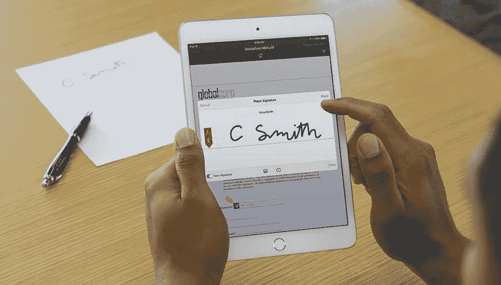
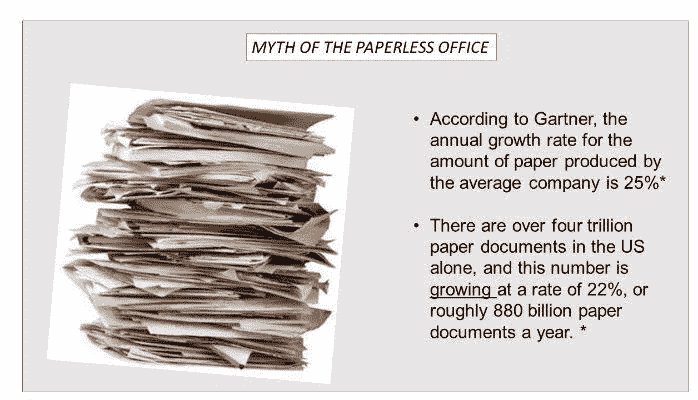

# 你没有想到的 OCR 的应用

> 原文：<https://medium.com/swlh/applications-of-ocr-you-havent-thought-of-69a6a559874b>

由[拉梅什·戈里·拉格哈万](https://medium.com/u/2d339de77f89?source=post_page-----69a6a559874b--------------------------------)，普拉尚·马诺哈罗·卡奇德和[苏坎特·库拉纳](https://medium.com/u/6d41261644a8?source=post_page-----69a6a559874b--------------------------------)

***Source:*** [***African Mold***](https://www.google.co.in/url?sa=i&rct=j&q=&esrc=s&source=images&cd=&cad=rja&uact=8&ved=2ahUKEwjyqpnM3vTYAhWKu48KHTylCcYQjB16BAgAEAU&url=http%3A%2F%2Fwww.afrimold.co.za%2Fadobe-acrobat-pro-dc-our-favourite-pdf-and-ocr-software-application%2F&psig=AOvVaw3SkEY6ZndA5WEB9c1edWBu&ust=1517025119008670)

光学字符识别(OCR)是为数不多的在整个工业领域都得到应用的技术之一。(否则会在繁重的手写或打字数据的重新键入中丢失)得以实现。有了 OCR，跨越多种语言和格式的大量纸质文件可以数字化为机器可读的文本，这不仅使存储更容易(节省空间、防火、虫害控制等)，而且使以前无法访问的数据对任何人都可用。

# 银行业务

银行业以及保险和证券等其他金融行业是 OCR 的主要消费者。OCR 最常见的用途是处理支票:扫描手写支票，将其内容转换为数字文本，验证签名，并实时清算支票，所有这些都需要人工参与。虽然打印支票的准确率已经接近 100%(只有签名验证需要与预先存在的数据库进行匹配)，但手写支票的完全自动化还有很长的路要走。然而，随着深度学习人工智能技术应用于手写 OCR，这个问题并不像看起来那样不可克服。从付款人到银行再到收款人，减少支票清算的周转时间对所有人来说都是一种经济收益。

# 合法的

很少有行业像法律行业那样产生如此多的文书工作，因此 OCR 在这里有多种应用。大量的宣誓书、判决书、文件、声明、遗嘱和其他法律文件，尤其是印刷文件，可以被数字化、存储、数据库化，并可以使用最简单的 OCR 阅读器进行搜索。随着 OCR 技术扩展到不使用罗马文字的语言，这也将中文、阿拉伯文和其他文字的文档带入了数字世界。对于一个严重依赖司法先例的行业来说，快速获取数百万过去案例的法律文件无疑是一个好地方。

# 卫生保健

这是另一个用 OCR 做得很好的行业。将一个人的整个病史存储在一个可搜索的数字存储中意味着过去的疾病和治疗、诊断测试、医院记录、保险支付等可以在一个统一的地方获得，而不必维护报告、x 光片和其他文件的笨重文件。将医院的全部记录数字化存储也是对流行病学(疾病的流行)和后勤(保持药物、设备和其他消耗品的适当存储)的一大推动。更不用说，一个地区的多家医院汇总的此类记录为基于数据的医疗保健政策、立法和供应提供了一个巨大的数据库。

# OCR 的好处

# 可搜索性

一旦您的扫描文件被转换为机器可读的文本，您可以将其保存为一种格式，如。doc，。rtf，。txt(最简单的)，。pdf 等。在 Windows 中使用 Ctrl+F(在 Mac 中使用 Command+F)可以在内部搜索这些文件。通过将它们上传到一个合适的数据库，比如谷歌驱动(供你私人使用)或 Archive.org(任何人都可以访问)，你就可以在全球范围内获得这些文档。

# 可编辑性

你可能想对你写的旧学期论文做出补偿，或者修改旧遗嘱。一旦你的文档被 OCR 数字化，使用文字处理软件就可以很容易地完成，而不需要重新输入整个文档。

# 易接近

一旦一个文档被 OCR 扫描并在一个公共数据库中可用，任何有权访问该数据库的人都可以使用它。例如，这对于银行来说尤其有用，银行可以随时随地访问客户过去的支票，以调查他们的信用历史。另一个显而易见的应用是公开政府档案，这样你可以在任何地方找到你的土地所有权记录或你祖父的出生证明。

# 可储存性

数字化文档将服务器上相同信息所需的存储空间从几立方英寸减少到如此多的字节，从而有可能释放空间用于更有效率的用途(例如安排负责 OCR 的员工)。此外，现在变得不必要的纸张可以回收，减少了对新鲜纸张的需求(从而降低了费用)。

# 备份

数字备份可以很便宜地完成，而且有无限次的潜力；而不是以纸质形式维护成本高昂的副本和三副本。结合以上内容，OCR 使文书工作更加可持续。

# 可译性

今天的 OCR 可以处理各种各样的文字，从阿拉伯语到印度语，再到日语汉字。再加上 Unicode 标准和 mchine 翻译软件(如 Google Translate)，这意味着一种语言的文档可以被扫描、数字化并翻译成任何其他语言，从而消除了人工翻译人员费力浏览打印文档的需要。这反过来减少了业务周转时间。

***Source:*** [***https://www.linkedin.com/csp/bngsync***](https://www.linkedin.com/csp/bngsync)

# OCR 将如何帮助我的业务？

光学字符识别作为迈向数字化的一步，有许多立竿见影的长期好处。以下三个方面会影响您的业务，并带来可观的储蓄:

# 为您的业务获得最佳交易

大量的数据仍然以书面形式存在，无论是合同；法律术语；货运单；政府表格、许可证和证书；各种税率卡；税率表；日历；目录；还有更多。数字化后，您可以将其与其他各种数字(和数字化)文档进行比较，从而获得最佳价格、服务、条款等。

# 审计和管理不匹配

供应不正确？为您提供的服务有问题吗？使用光学字符识别将您签署的合同数字化后，您可以交叉核对与原始条款的差异。同样，可以检查支票的正确金额，比较发票等。

# 启用分析和其他数据处理

一旦你有了诸如提单、发票、税收收据、订单等东西。数字化后，您可以将其用于大多数组织分析，以了解您业务的长期趋势。您可以发现亏损、超额(或少开发票)、逃税或多付等等，从而显著节约成本。这些都是完全数字化的好处，但光学字符识别是转换模拟文档的关键第一步。

**光学字符识别还能做什么？**

光学字符识别的应用远远超出了文档的数字化。结合大数据、人工智能和低成本互联网的力量，光学字符识别将数字革命带给了许多至今尚未享受其成果的人。

# 数字图书馆

大量对人类有用的知识就像在世界各地的公共图书馆和大学图书馆的书架上积灰一样。扫描这些书籍并将其转换成数字文件，可能会将其中的知识向任何拥有电脑或手机的人开放。事实上，这样一个项目是由谷歌图书公司(Google Books)构思的(T2 ),并在一定程度上得以实施，之后因作者和出版商的版权担忧而被美国法院(T4)关闭。然而，大量版权过期的书籍，尤其是罕见的书籍，现在已经通过诸如[Archive.org](https://www.archive.org)或[Academia.edu](https://www.academia.edu)之类的公共存储库在网上提供。

这些知识库不仅使研究中的参考工作更容易，而且有助于开发教学辅助工具和跨学科研究。

# 光学音乐识别

这基本上是应用于乐谱的 OCR。通过扫描乐谱，不仅可以获得数字符号，还可以通过专业应用程序转换成声音，从而允许您的计算机或智能手机读取乐谱并播放写在上面的音乐！

**参考文献**

【http://www.cvisiontech.com】OCR 应用:

## **让商务变得更简单的 OCR 技术的实际应用由 [Matthew Cook](https://blog.omprompt.com/author/matthew-cook) 于 2015 年 8 月 19 日发布[https://blog.omprompt.com](https://blog.omprompt.com)**

## **你没有想到的 OCR 阅读器的五种用途[https://www.neat.com](https://www.neat.com)**

**�Ԟ��**

**— —**

**关于:**

**Raamesh Gowri Raghavan 正在与 Sukant Khurana 博士合作多个项目，从人工智能的流行写作、技术对艺术的影响，到心理健康意识。**

**Raamesh Gowri Raghavan 先生是一位获奖诗人、著名的广告专业人士、历史学家和探索科学与艺术界面的研究人员。他还与 Khurana 博士和 [Farooq Ali Khan](https://medium.com/u/3ed4f198804b?source=post_page-----69a6a559874b--------------------------------) 一起倡导大规模的抗抑郁和预防自杀活动。**

**您可以通过以下网址了解更多关于 Raamesh 的信息:**

**[https://sites.google.com/view/raameshgowriraghavan/home](https://sites.google.com/view/raameshgowriraghavan/home)和[https://www.linkedin.com/in/raameshgowriraghavan/?ppe=1](https://www.linkedin.com/in/raameshgowriraghavan/?ppe=1)**

**Prashant Manoharrao Kakde 先生居住在马哈拉施特拉邦 Yavatmal，是人工智能、数字图像处理、数字仪器和生物医学工程领域的多产研究员。他现在是 H . v . p . m . C . o . e . t . Amravati 的助理教授。他正在 Khurana 博士的指导下制作一种 OCR，这种 OCR 可以高精度地识别世界上所有的语言。**

**Sukant Khurana 博士经营着一个学术研究实验室和几家科技公司。他也是著名的艺术家、作家和演说家。你可以在 www.brainnart.com 的[或 www.dataisnotjustdata.com](http://www.brainnart.com)的[了解更多关于苏坎特的信息，如果你希望从事生物医学研究、神经科学、可持续发展、人工智能或数据科学项目的公益事业，你可以在 skgroup.iiserk@gmail.com 联系他，或者通过 linkedin](http://www.dataisnotjustdata.com) [的 https://www.linkedin.com/in/sukant-khurana-755a2343/](https://www.linkedin.com/in/sukant-khurana-755a2343/)联系他。**

**这里有两个关于 Sukant 的小纪录片和一个关于他的公民科学努力的 TEDx 视频。**

** [## Sukant khu Rana(@ Sukant _ khu Rana)|推特

### Sukant Khurana 的最新推文(@Sukant_Khurana)。创始人:https://t.co/WINhSDEuW0 和 3 家生物技术创业公司…

twitter.com](https://twitter.com/Sukant_Khurana) 

## 这篇文章发表在《T8 创业》(The Startup)杂志上，这是 Medium 最大的创业刊物，拥有 300，118+读者。

## 在这里订阅接收[我们的头条新闻](http://growthsupply.com/the-startup-newsletter/)。

**