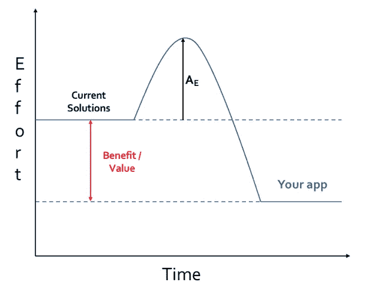

# 激活能量——让人们使用你的应用

> 原文：<https://medium.com/swlh/apptivation-energy-getting-people-to-use-your-app-d47697e5c9a7>

首先，我要说的是，没有什么方法能保证让人们使用你的应用。我和一个朋友最近开发了一个手机应用程序，我想我会和你分享我们的一些经历，并分享我们一路走来学到的最重要的一课。

**应用程序开发者的谬论——创建它，他们就会来**

如果你正在开发一个应用程序，你可能已经意识到，如果你不告诉任何人，开发并使它可用是毫无意义的。

你可能会对自己说，'*这很明显，你没有告诉我任何我不知道的事情。承认这一点需要很大的努力，我们认为我们也知道这一点，但是你真的真的想过吗？*

我要用的类比是任何人都可以理解的，如果你以前学过化学，你可能会熟悉活化能的概念。一个简单的定义是，化学反应的活化能是开始该化学反应所需的最小能量。

什么是应用能量？

出于本文的目的，我将创造术语“应用激活能量(AE)”——以其最简单的形式，这代表了用户持续使用应用所需的最小努力。注意我说的*连续* *使用*和**不是**只是*安装*。看看下面的图表。

对用户来说，一切都是为了努力。对于我们的应用，我们将应用激活能量分解如下:

**发现应用** —潜在用户需要在考虑下载之前了解应用。你需要有一个营销计划，并执行它。有很多文章和资料比我想象的更好地涵盖了这个主题(例如，瞄准谁，社交媒体的使用，特色位置，producthunt.com，非常重要的登陆页面等)。)所以这一点我就不赘述了。[【cf1】](#_msocom_1)

**寻找应用**——你可能会笑，但信不信由你，曾经有一段时间，如果一个用户在谷歌 Play 商店上搜索我们的应用，它甚至排不上前 20(讽刺的是，搜索之王不擅长在自己的平台上搜索)。确保你的应用程序容易被找到，至少要在 ASO/SEO 上做些努力。我们认为有一个简单的名字会有所帮助，但另一方面，你不会总是脱颖而出。做你的研究，做一些简单的调查或者用名字做 A/B 测试。

**安装应用程序** —哇哦，你成功地让人们找到了你的应用程序，并在几秒钟之内按下了那个美妙的下载按钮，但是等一下……你的应用程序的大小是 100mb，而你已经请求使用天底下的所有权限。

首先，是的，我同意，大多数人确实通常通过 Wi-Fi 下载应用程序，但如果你的应用程序有社交成分，并且人们在旅途中下载它是有意义的，那么大小就很重要。人们不想下载会从他们有限的数据计划中占去很大一部分的应用程序。尽最大努力限制下载大小。其次，确保不要要求特权权限，除非(直到)你真的需要它们。如今，用户的安全意识越来越强，所以请尊重这一点。

(可能不适用)**你的 app 上线用户** —酷，有人下载了你的 app。现在，您只需通过一次性入职流程将他们推至线外。问问你自己:

有没有繁琐枯燥的报名流程？

你是不是要求很多个人信息？

你是不是在强迫他们学习教程，把他们当白痴一样对待？

可以肯定的是，在入职过程中，会有一部分人因为上述一个或多个因素而立即脱离。幸运的是，你可以做一些事情来最小化这个子集的相对大小:

1)听取反馈——我们的应用依靠电话号码进行认证(类似于 WhatsApp)。我们使用了一种我们认为非常酷的认证方法，包括直接呼叫用户来认证他们。有几次用户甚至不会看到掉线电话，但对于那些看到的用户来说，他们看起来像是在接收国际电话，有些人认为这是诈骗电话，甚至更糟的是，有些人认为他们可能会被收取国际费用。我们立即切换到短信认证。

2)尽量缩短入职流程的时间。我们尽最大努力将它最小化，同时将它分成简单、易理解的步骤。

3)还记得我说过人们的安全意识越来越强吗？我知道，你的双因素认证系统是为了保护他们，但对他们中的一些人来说，你只是更侵犯隐私。意识到这一点，让他们知道你为什么这么问。

4)这年头在 app 里看到教程是常事。在我的创业之旅中，我看到了关于包容他们的激烈辩论。一种观点认为这是关于教用户，另一种观点认为你的应用不够直观，如果你必须告诉用户如何使用应用，这是糟糕的设计/用户体验。很明显，有一些因素会影响对这类教程的需求，因此引发了激烈的争论。尽管如此，人们普遍认为，如果你包含教程，你应该尽量缩短它们的长度，并少用它们。

**使用应用程序**——不要因为有人费尽心思安装了你的应用程序，就认为这项工作已经完成了。如果您有一个功能性应用程序，您希望替换现有的什么解决方案？还记得苹果的广告吗，“有一个应用程序可以做到这一点”？很可能人们已经在使用另一个应用程序解决你试图解决的问题。不可否认，他们可能没有你的程序解决得好，但是这非常重要。我回头参考图表。

为了让你的用户持续使用你的应用程序，你需要尽可能地提高使用你的应用程序的感知收益/价值，以补偿应用程序的激活能量。在本文的上下文中，我已经解释了当前解决方案和您的应用程序之间的区别，即您为专注于功能性应用程序的用户提供的好处或价值。然而，这个概念可以延伸到其他应用程序(例如，你的游戏是否比竞争对手的更有趣，你的照片应用程序是否比竞争对手的更容易使用等等。).

**总之**

尽你所能降低应用程序的能量，并使用户想要(并记住)使用你的应用程序的好处/价值足够高，以防止他们进入自动驾驶模式并使用现有的方法/应用程序。如果你能做到这一点，你就成功地获得了一个用户。

***阿兰·萨姆拉:****zap plan 联合创始人、开发者、金融专业人士、科技爱好者*

## 这篇文章发表在 [The Startup](https://medium.com/swlh) 上，这是 Medium 最大的创业刊物，拥有 306，072+读者。

## 在此订阅接收[我们的头条新闻](http://growthsupply.com/the-startup-newsletter/)。

