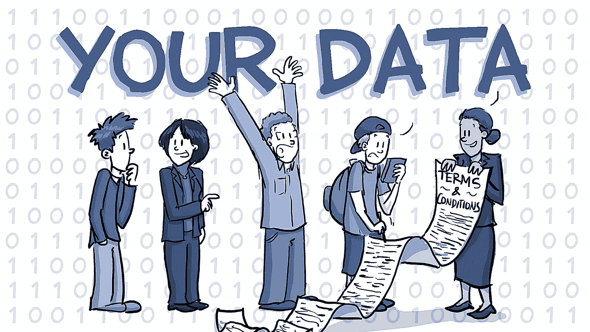

# 谷歌、YouTube 和脸书真的是我们日常生活中使用的免费服务吗？

> 原文：<https://medium.com/swlh/are-google-youtube-and-facebook-really-free-services-that-we-use-in-our-day-to-day-life-2711ded73004>

我们都知道**谷歌**、 **YouTube** 、**脸书**，因为这些东西与我们的日常生活息息相关。他们解决了我们日常生活中的大部分问题。每当我们需要找到一些我们不知道的东西时，我们只需在互联网上搜索该主题，并得到一堆与搜索主题相关的答案，每当我们需要直观地理解某个主题以更好地理解它时，我们就在 youtube 上搜索它。不仅为了更好地了解和理解，我们还通过社交媒体网站如**脸书、**使用互联网与我们的朋友联系，我们还使用这些社交媒体网站在该社交媒体网站的整个社区中传播任何信息。

那么我们使用的所有这些服务真的是免费的吗？我们真的没有为这些在日常生活中使用的有价值的服务付出任何东西吗？

实际上，为了利用这些服务，我们付出了比看起来要多得多。这听起来可能不自然，但这些公司的真正利润在于你利用这些免费服务的多少。这些著名的公司用你的数据来交换他们提供的免费服务。谷歌记录了你的搜索历史，你搜索的内容，你访问的网站，你访问的网站类型，你下载的内容。他们将这些数据存储在数据库中。他们将这些数据出售给其他公司，以换取巨额资金，并从中获利。

不仅通过你的个人数据，谷歌还通过他们展示的广告获得了巨大的利润。每当你访问 YouTube 时，你一定会看到 add 显示在网站的顶部，不仅如此，每当你播放视频时，add 总是显示在视频的开头和中间。这些是谷歌根据用户感兴趣的主题显示的添加，用户感兴趣的主题是谷歌在分析用户在谷歌上的搜索历史和搜索兴趣后估计的。向正确的用户推广自己的组织是每个组织的梦想，谷歌通过向正确的用户推广组织来实现这一愿望，并通过这些推广获得利润。

不仅仅是谷歌脸书公司也应用同样的政策来获取利润。他们跟踪你的个人数据和搜索，并以同样的方式利用它们获利。

> 这是否意味着这些组织一直在跟踪我们，知道我们的每一个个人信息？我们的隐私面临风险吗？

其实不是。诚然，这些公司一直在跟踪我们的信息，但他们不会泄露对我们非常重要或非常私人的信息。是的，他们确实有访问权限，但是为了用户和组织之间的信任和理解，他们绝不会这样做。他们只访问或跟踪对他们有用的用户数据，以给用户一个用户友好的环境，最终也使用户受益。如果他们跟踪你的数据，你也不能责怪他们，因为我们每个人在这些网站开户时都签署了条款和条件。

不仅是谷歌和 facebook，许多其他 sim 卡公司也以低廉的成本提供巨大的高速数据包，从用户那里获取数据并用于盈利。许多其他公司也采用了同样的伎俩，他们的产品和服务被他们提供给我们的不切实际的优惠所吸引，但实际上，他们是通过这些优惠获取巨额利润的人。

# 请在下面评论，让我知道你对这个话题的看法