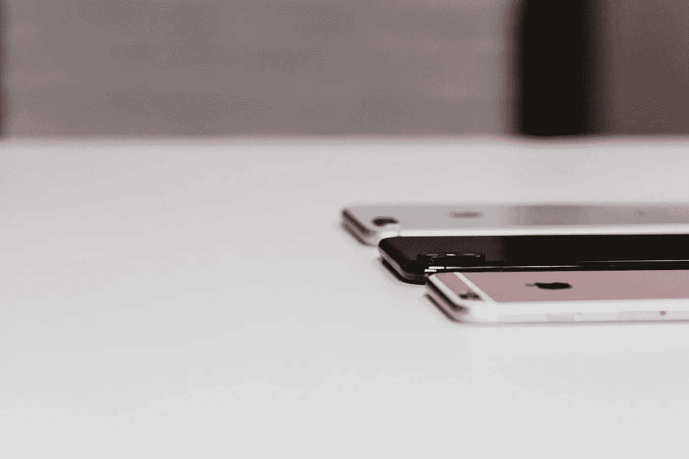

# 智能手机正在变得过时吗？

> 原文：<https://medium.com/swlh/are-smartphones-becoming-obsolete-c1a7ca865868>

十年后，智能手机市场可能会出现衰老的迹象。

Photo by [freestocks.org](https://unsplash.com/photos/Ve-0V0SZ3SU?utm_source=unsplash&utm_medium=referral&utm_content=creditCopyText) on [Unsplash](https://unsplash.com/search/photos/smartphone?utm_source=unsplash&utm_medium=referral&utm_content=creditCopyText)

我想，我的 iPhone 已经用了五六年了，现在仍然很好用。我可以说出它的年龄，因为它是看起来不像三星生产的型号的版本之一——如果你记得更矩形、更块状的 iPhone 版本的话。