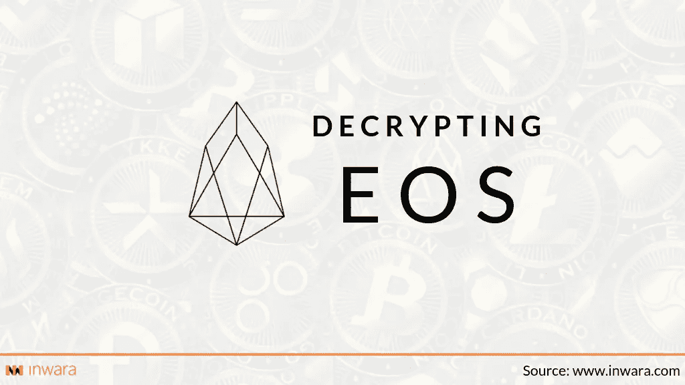

# EOS ICO 是骗局吗？

> 原文：<https://medium.com/swlh/are-the-collusion-allegations-on-eos-true-is-eos-ico-a-scam-complete-analysis-b71b49a0158b>

## 顶级筹款人 EOS ICO 面临串通指控

自从火币员工石飞飞泄露了一份电子表格后，收入最高的项目 EOS 现在面临着骗局的猜测。

# 关于 EOS 的一切

EOS 是区块链空间中的一个分散项目，旨在从根本上改善已经在…