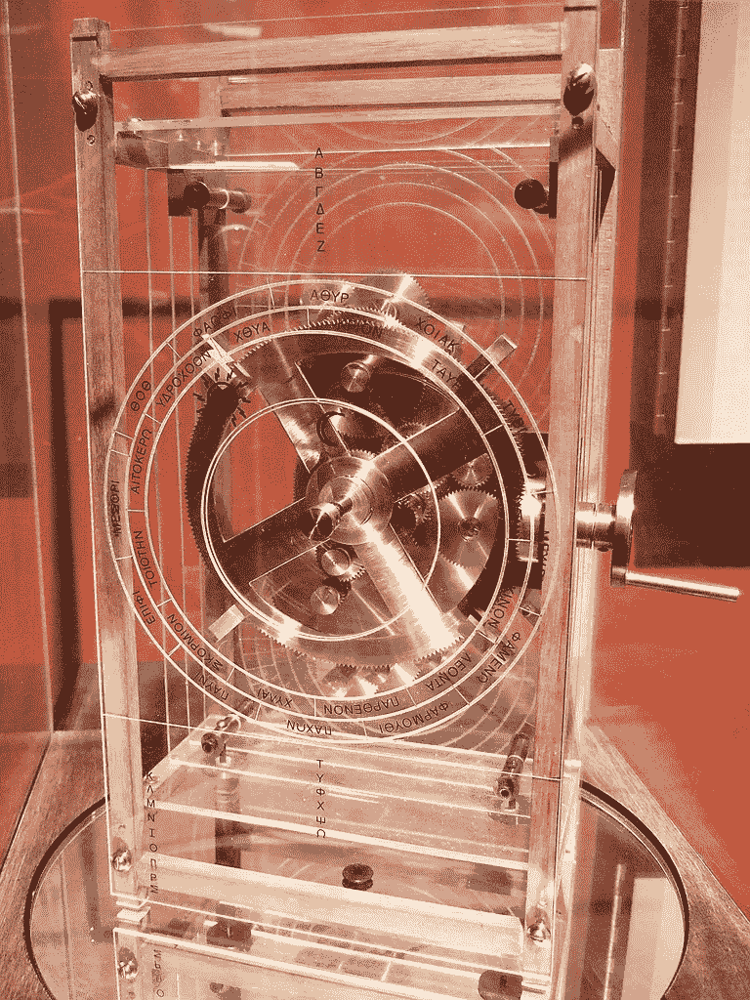

# 有什么不可避免的技术吗？

> 原文：<https://medium.com/swlh/are-there-any-unavoidable-technologies-d470743da22a>

昨晚我很难入睡。于是我开始反思我看过的一部纪录片。它是献给在 19 世纪和 20 世纪之交痴迷于电能的有远见的发明家 [**尼古拉·特斯拉**](https://www.smithsonianmag.com/innovation/extraordinary-life-nikola-tesla-180967758/) 。

让我反思的故事是著名的《海流之战》(一部[电影版**本尼迪克特·康伯巴奇**](http://www.imdb.com/title/tt2140507/) 刚刚上映)。托马斯·阿尔瓦·爱迪生认为直流电是“电气化”世界的理想解决方案，并为此投入了大量资金。在爱迪生手下工作了几个月的特斯拉却坚信应该使用交流电。

我不做技术性的解释。这么说吧，泰斯拉与爱迪生的竞争对手，实业家乔治·威斯汀豪斯合作，赢得了这场胜利。今天，我们使用交流电，但当我们需要为我们的数字设备(或任何其他电池供电的物体)供电时，我们会将其转换为连续的(DC)。

我问自己的问题是:如果没有西屋电气和特斯拉，我们今天会有直流配电网吗？

很可能不会，因为交流配电的优势仍然会出现，甚至会很快出现。

更普遍的问题是:**是否存在不可避免的技术**？

> 有没有可供选择的技术路线？

在唯一可用的案例研究中，人类文明，一些发现和发明，以及它们产生的顺序，似乎是必须的:例如火->金属->农业->城市->车轮->陶器。

但狩猎采集社会也可能发明了轮子:这对他们来说非常方便，没有理由没有这个想法，他们有能力制造它。也许一些部落就是这样做的，在记忆消失之前，世代使用它。

A sculpture of Göbekli Tepe **-**By [Teomancimit](https://commons.wikimedia.org/w/index.php?curid=17377759) — Yükləyənin öz işi, CC BY-SA 3.0

学者们认为，要到达不朽的建筑、城市和文明，我们必须通过农业:生产剩余能够养活大量的人，并产生社会阶级，因为贵族和牧师免除了体力劳动，但能够“委托”伟大的作品。

然而， [**格贝克力神庙**](https://en.wikipedia.org/wiki/G%C3%B6bekli_Tepe) 的非凡发现——可追溯到公元前 9500 年左右——质疑了向有社会分化的城市社会过渡以创造这种建筑的必要性。

再比如。复杂的机械装置，如钟表，在中世纪早期开始传播，第一批标本被放置在教堂的钟楼上。

为什么擅长实用艺术的希腊人或罗马人没有发展出类似的机制？事实上，在发现了****机构**(一种复杂的天文计算器)之后，我们已经看到了制造高精度仪器的能力(例如具有最小公差)和技术是如何存在的。可能是社会、经济和商业结构超过了技术的限制，不允许有罗马摆钟。同样，拥有大量低成本劳动力的奴隶，如果不是一些用于寺庙中“特殊效果”的罕见而简单的系统，也没有刺激蒸汽机的发明。**

****

**A reconstruction Antikytheramechanism- [Dave L via Flickr](https://www.flickr.com/photos/8250578@N06/4563888662/in/photostream/) CC BY 2.0**

**关于过去 120 年的创新，重要的是要强调两次世界大战，尤其是第二次世界大战对加速技术发展的至关重要性；我们只会想到那个时期诞生的火箭学和计算机科学，以及之后不久发展起来的电子学(还有冷战……)。**

**如果没有第二次世界大战，我们的日常生活会被什么技术包围？**

**我们可能会达到 60/70 年代的水平，有大型主机、第一颗轨道卫星、彩色电视但有阴极射线管、第一架商用喷气式飞机、准时生产链等等。**

****由于业余无线电网络与传真和视频/音频磁带等系统的不可预测的发展，也许模拟互联网已经发展起来了。****

**难以确定时间表、个别技术的生命周期、它们的相互联系和相互依赖。**

**在人类社会这样一个复杂的系统中，初始条件的微小变化可以在创新空间的轨迹和方向上产生巨大的变化。**

**最后一个例子是网络。蒂姆·伯纳斯·李爵士于 1990 年在欧洲粒子物理研究所工作时创造了它。**

**网络(或类似的网络)可能至少在 10 年前就已经开发出来了，在美国的一所大学里，已经与远程信息处理网络互联。**

**这意味着第一个网站的门户网站将出现在 80 年代末，web 2.0 将出现在 1994 年左右，社交网络将在 1997 年左右建立，而今天……我们无法知道。还因为有了移动网络会有更长的时间间隔，因为在任何情况下，移动电话的发展都会遵循我们的时间线。还是没有？**

****

## **这个故事发表在 [The Startup](https://medium.com/swlh) 上，这是 Medium 最大的企业家出版物，拥有 285，454+人。**

## **订阅接收[我们的头条](http://growthsupply.com/the-startup-newsletter/)。**

****