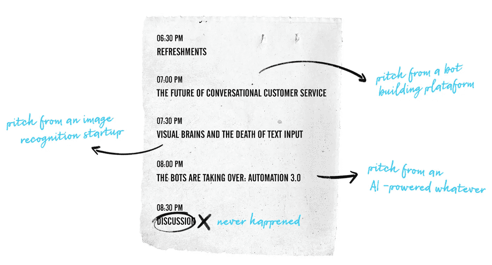

# 我们设计师是不是恬不知耻地擅长自我推销？

> 原文：<https://medium.com/swlh/are-we-designers-shamelessly-good-at-self-promotion-3408de561963>

> 旧金山，下午 6 点 25 分

设计师们在下班后聚集在旧金山索马、金融区和市场街附近的几栋现代建筑里聚会。湾区的聚会往往在下班后举行，要么在共同工作区，要么在科技公司的办公室。转风格，徽章，茶点，网络，会谈，和更多的网络。

在硅谷生活和工作了几年后，我有机会参加了湾区的许多设计和技术聚会，这些行业在这里特别活跃。在 meetup.com 上简单地搜索[，每周会返回至少 20 个不同的活动供选择。从人工智能到增强现实，各种话题充斥着你每天都能在 FastCompany 或 The Verge 主页上看到的流行词汇。](https://www.meetup.com/find/?allMeetups=true&radius=5&userFreeform=94107&gcResults=San+Francisco,+CA+94107,+USA:US:California:San+Francisco+County:San+Francisco:null:94107:37.7618242:-122.39858709999999&change=yes&sort=default)

我的聚会经历通常不太鼓舞人心。有着过于雄心勃勃的话题和令人恐惧的标题，这些聚会被证明只不过是一系列伪装成思想领袖话题的创业推介。

通常安排在晚上结束时进行的更有成效的讨论往往从未发生。公司会太沉迷于谈论自己，以至于每次都没有时间了。这意味着离开时没有深入的讨论，也没有参与的问答。

在参加完这些平淡无奇的活动

### [UX 与产品设计出版、内容消费和社区建设的现状分析…](https://medium.com/u/27353c0f540b#1</h2>
<div class=)

## 这篇文章发表在 [The Startup](https://medium.com/swlh) 上，这是 Medium 最大的创业刊物，有 355，974 人关注。

## 订阅接收[我们的头条新闻](http://growthsupply.com/the-startup-newsletter/)。

