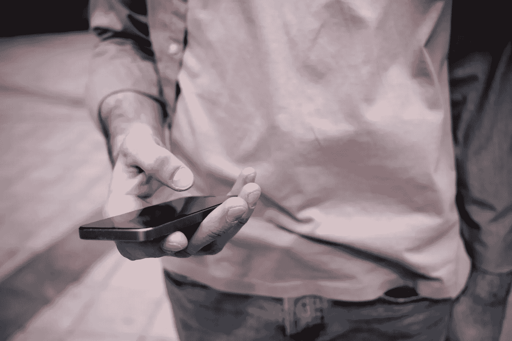

# 我们正在走向一个无现金的世界吗？

> 原文：<https://medium.com/swlh/are-we-heading-towards-a-cash-free-world-9271b301f45c>

## 这不是为了改变而改变。这是我们思考和使用金钱的方式的一个必要和根本性的转变

Photo by [Toa Heftiba](https://unsplash.com/photos/6bKpHAun4d8?utm_source=unsplash&utm_medium=referral&utm_content=creditCopyText) on [Unsplash](https://unsplash.com/search/photos/crime?utm_source=unsplash&utm_medium=referral&utm_content=creditCopyText)

# 你多久使用一次现金？如果你像我们大多数在 Luno 的人一样，很有可能答案是:只有当你不得不这样做的时候。

在直接借记、网上购物、非接触式卡和 PayPal 等系统之间，很容易几天甚至几周不接触实物货币。

你可能会通过银行转账收到你的工资，但你不会看到一分钱以硬币或钞票的形式出现。

现金仍占全球交易的大部分。但是它正在迅速过时。随着数字支付生态系统的成熟，无现金未来的想法开始变得既可行又不可避免。

当我们谈论将世界升级到一个更好的金融体系时，重要的是要考虑目前控制我们资金的力量，以及当前体系的利弊。

因此，我们将带你参观金钱的演变:它来自哪里，我们为什么使用它，决定它的行为的秘密力量，以及它对你意味着什么。

本周我们来看看无现金世界的概念。

# 想一想在平常的日子里你可能会如何使用金钱

*早上醒来，你的房租在你睡觉的时候被* ***直接扣款*** *支付。注意到你的牙膏快用完了，你打开当地的网上购物应用程序，用你生日* *的* ***礼品卡的余额订购了一些。当你在打电话时，你看到一个朋友通过****EFT****或 PayPal 给你汇来现金，以偿还他们昨晚的晚餐。在去车站的路上，你停下来买了一杯咖啡，用手机在收银台扫描一个* ***二维码*** *付款。然后你跳上公共交通工具，在门口扫描你的* ***非接触式卡*** *。***

*Photo by* [*Clique Images*](https://unsplash.com/photos/ImWVsIHiEWI?utm_source=unsplash&utm_medium=referral&utm_content=creditCopyText) *on* [*Unsplash*](https://unsplash.com/search/photos/holding-phone?utm_source=unsplash&utm_medium=referral&utm_content=creditCopyText)

*午餐时间到了，你在* ***应用*** *上从你最喜欢的当地餐馆选择一餐，然后点击“支付”在你等待它到来的时候，你哥哥突然给你发来一条信息。他正在海外旅行，钱快用完了。叹着气，你打开 Luno 钱包，给他发了一些* ***比特币*** *。他用它来预订一家以折扣价接受加密货币且不收兑换费的旅馆。当你这么做的时候，你给你刚刚读过的那篇优秀文章的作者寄去一份小小的* ***以太坊*** *捐款。*

在几个小时的时间里，您已经使用不同的系统进行了多项交易——一切都毫不费力，只需几秒钟。

与传统支付系统的麻烦相比，很明显为什么全球数字支付量从 2010 年的 2820 亿美元增加到 2018 年****的约 5770 亿美元。这些数字预示着巨大的变化。****

# **引人注目的是新的常态**

****在我们生活的各个领域，数字系统让事情变得更简单、更快捷、更便宜。随着娱乐、交通、旅游、购物和结识新朋友，我们看到这种情况正在发生。****

**在英国，财政部预计到 2026 年现金支付量将降至 21%。世界上的一些地方已经在逐步淘汰它。例如，瑞典被认为是使用现金最少的国家。许多瑞典银行不持有任何信用卡，很少有商店接受信用卡，瑞典人可以几个月不办理信用卡。甚至教堂、街头小贩、公共厕所都接受数字支付。**

**我们认为，去中心化的加密货币是货币进化的下一步。但是要理解*为什么*，把这种转变放在远离现金的大背景下是有帮助的。**

# **但是钱到底是什么呢？**

**本质上，金钱是一种交流价值的方式。是信息。这就是为什么形式或材料是无关紧要的——金、银、贝壳、纸、盐、石头，或者在数字货币中什么都不是。**

**太平洋上一个叫雅浦的小岛上的货币就是一个很好的例子。这里的居民雅皮士使用石盘作为货币。**

****

**By Eric Guinther via [Wikimedia Commons](https://upload.wikimedia.org/wikipedia/commons/5/54/Yap_Stone_Money.jpg)**

**它们被称为 Rai 石，直径可达 4 米，重达数吨。在其他岛屿上开采材料，然后运输和加工既费时又危险。这使得供应量保持在低位，从而赋予 Rai 宝石价值。但是它们体积太大，无法移动，雅皮士人也没有记录谁拥有哪块石头。相反，人们只是记住并一致同意。**

# **现金的成本**

**现金最大的缺点是成本。我们花费了大量的金钱、资源和时间来处理它。**

# **赚钱**

**首先，实物货币的缺点是它是…实物的。以下是一些关于货币生产成本的关键事实:**

*   **美国美联储列出了他们 2018 年[的货币生产预算](https://www.federalreserve.gov/foia/files/2018boardbudget.pdf)超过**8 . 6 亿美元****
*   **[印刷一美元纸币的成本在每张 5 到 13 美分之间](https://www.federalreserve.gov/faqs/currency_12771.htm)**
*   **制造一枚 1 分硬币需要 1.5 分**
*   **[皇家造币厂每年生产超过 5 亿枚小硬币](https://www.royalmint.com/help/coinage-faqs/coins-getting-to-the-banks/)**
*   **[60%的 1 便士和 2 便士硬币在丢失、扔掉或以其他方式退出流通之前只使用过一次](https://www.theguardian.com/uk-news/2018/mar/13/1p-2p-coins-demand-treasury-50-note-digital)**

****生产实物货币只是开始。我们还需要考虑运输成本、昂贵的存储安全系统、配送成本以及对假货的监控。****

****这还没有开始考虑环境成本，或者我们每个人都要支付的费用。****

****因为事实是:现金不会永远存在。没有丢失或扔掉的硬币和纸币最终需要收集、运输和销毁。这带来了沉重的资源成本，并造成了严重的环境破坏。****

# ****现金:犯罪的完美搭档****

****我们都在无数的电影和电视剧里见过:一个男人(通常)带着装满钞票的公文包在逃亡。几乎总是相同的铝模型。尽管装满现金的公文包现在已经是老生常谈，但它仍然是一个引人注目的形象。****

****现金和犯罪是天作之合。没有任何其他支付方式能与实物货币在犯罪中的流行程度相提并论，例如:****

*   ****洗钱****
*   ****逃税****
*   ****经营非法商品(尤其是毒品)****
*   ****贿赂和腐败****
*   ****人口贩运和现代奴隶制****
*   ****抢劫、劫车和其他形式的盗窃****

****但是这并不像好莱坞暗示的那样顺利:那个装满 100 美元钞票的公文包能装 130 万美元，重约 30 磅(12.5 公斤)。****

****因此，在私人岛屿上过着奢华的退休生活是不够的，带着行李过海关也是一件痛苦的事。把 100 美元的钞票换成更小面额或其他货币，它会便宜很多。****

****但是现金仍然对罪犯有吸引力，因为它:****

*   ******轻便易运输** —与黄金等其他实物价值储存手段相比****
*   ******难以追踪**——很难说它从何而来，也不知道谁持有它****
*   ******匿名**——无需放弃个人信息来消费少量信息****
*   ******可直接消费**——无需兑换或存入即可使用****
*   ******可兑换外币**——因此几乎可以在任何地方使用****
*   ******有时会有大面额的** —然而，这种情况越来越少了。****

****当然，并不是所有的现金交易都是非法的。是的，罪犯确实使用其他方法。然而，人们相信，通过增加一点摩擦，无现金将减少甚至消除某些形式的犯罪。****

****(顺便说一下，[人们普遍误解加密货币为犯罪分子提供了同样的好处，但事实并非如此](https://www.luno.com/blog/en/post/unravelling-the-misconceptions-about-bitcoin)。)****

****以逃税为例。尽管这通常与拥有瑞士银行账户的富人有关，但小额现金收入占政府每年数千亿美元损失的很大一部分。单个金额可能看起来不多，但它们加起来就多了。没有现金，政府可以指望增加税收。****

****尽管很少有政府在讨论完全禁止现金，但许多政府正在逐步淘汰面值更大的纸币，如 500 欧元和 1 万美元(其中一些仍在流通)。)其他国家正在禁止大额现金交易。例如，在西班牙和法国，上限是 1000 欧元，而希腊将上限降至 500 欧元。****

# ****无现金世界的挑战****

****这并不是说这将是一个平稳的过渡。需要考虑一些重大挑战，包括:****

# ****习惯****

****如果你曾经试图打破你习惯于每天多次做的坏习惯(比如喝咖啡或过于频繁地查看电子邮件)，你会知道这并不容易。习惯很快成为我们生活中根深蒂固的一部分，我们几乎没有注意到——直到我们试图打破它们。然后我们发现，即使是改变最简单的习惯也是一个缓慢、令人沮丧的过程。****

****我们都有使用金钱的习惯。如果我们习惯于以特定的方式使用它，就很难调整它。对于采用新的支付系统来说尤其如此，因为我们必须改变我们的行为，并能够信任它。****

****反对无现金的一个理由是，对于那些可能一生都在使用现金的老年人来说，这将是一个挑战。他们也不太可能拥有智能手机或互联网接入，而这两者是大多数数字支付系统的要求。同样，对现金有强烈文化偏好的国家(如意大利)可能会落后。****

****我们需要确保没有人会被这样的变化抛在后面。每个人都应该获得满足其需求的服务和实际指导。迄今为止，脱离现金的转变速度缓慢，足以让我们适应，而创新的新产品正在帮助填补缺口。例如，随着携带现金进行捐赠的人越来越少，一些慈善机构已经将捐赠罐改为非接触式卡支付。在瑞典，教堂和街头小贩接受移动支付。****

# ****信任****

****这与我们需要改变习惯有关——只是不容易相信不熟悉的东西。但加密货币有可能在其他数字支付方式失败的地方取得成功，因为它们是分散的。用户不需要信任一家公司或一个中央机构。他们不需要担心网络会拿走他们的钱，或者在没有警告的情况下提高费用。****

# ****隐私****

****正如我们在本文前面看到的，数字支付系统可以通过使交易可追踪来帮助减少犯罪。虽然这可能是一件好事，但也意味着隐私的减少。我们每天的交易是我们生活中无意的日记。有了数字支付，就有可能完整记录某人每次花钱的情况，包括花了多少钱，在哪里，什么时候。****

****不管我们作为个体是否有什么需要隐藏的，我们都必须考虑到这些信息的含义和使用方式。我们可能更喜欢用现金进行一些交易，即使它们是合法的。****

# ****小型企业****

****许多小公司仍然只收现金，或者对低于一定金额(通常为 5 英镑)的卡支付收取费用。处理和退款费用可能非常昂贵，尤其是对于小额交易。如果人们身上没有现金或者不愿意使用现金，他们就会去别的地方。****

****但是小企业将从无现金中获益良多。处理金钱使他们容易受到犯罪的伤害，特别是如果他们是孤立的(如加油站)或缺乏强有力的安全措施(如小型家庭经营的企业。)储存、记账，然后将现金运送到银行是很费时间的。小公司还会损失来自不携带现金的人、员工盗窃和支付假币的收入。****

****目前，许多新举措正在让接受低价值数字支付变得更加容易。然而，加密货币有可能通过降低处理费用和消除退款费用来进一步推动这一发展。****

# ****付出的痛苦****

****杜克大学心理学和行为经济学教授丹·艾瑞里用一个简单的练习来教他的学生他称之为“付出的痛苦”。他组织了一次披萨午餐，每吃一口收取 25 美分。****

****不出所料，这改变了学生用餐的方式。Ariely 的学生大口大口地吃，吃得比平时少，并且觉得不舒服。我们支付某样东西的*方式*会影响我们愿意支付的金额以及我们对这种体验的看法。****

****相比现金，我们更倾向于使用数字支付方式消费——这就是为什么只用现金是一种有效的预算技术。一个担忧是，远离实物货币将使人们更容易过度消费，更难存钱。****

****然而，认为不使用现金会让我们变成不计后果、失控的花钱者是愚蠢的。在某些方面，数字支付系统让我们更容易管理支出。我们可以一眼看到我们还剩多少钱，而不需要数硬币和现金(它们也可能会丢失)。)新的预算应用程序让我们能够按类别组织支出，为未来制定储蓄计划，并分析哪些领域我们花费过多。无现金可能意味着重新规划我们如何使用我们的钱，但是调整是可能的。****

# ****无银行账户者的银行业务****

****用现金进行交易的百分比往往反映了一个国家的经济状况。更发达的国家很少使用现金，而新兴经济体使用大量现金。这符合逻辑。无现金交易需要高度的金融包容性和发达的基础设施。****

****全球超过 20 亿人没有银行账户，其中仅在英国就有大约 150 万人。收入越低，人们就越依赖现金来避免费用，或者因为他们无法维持最低余额。在没有现有基础设施的国家，银行的准入门槛很高。出于显而易见的原因，银行不会设立在人口密度非常低、政治动荡或持续冲突的地区。****

****尽管有时人们认为无现金会进一步排斥没有银行账户的人获得金融服务。但事实并非如此——一个无现金的世界可能更具包容性。****

****为没有银行账户的人提供银行服务不一定是建立更传统的银行。任何能上网的人都可以使用数字系统(把廉价的 WiFi 带到偏远地区并不像听起来那么困难。)****

****发展中国家的人们已经在采用和适应收费透明、准入门槛较低、转账快捷的数字系统。所以我们不应该假设是现金或者什么都没有。****

# ****互用性****

****许多数字支付系统不具备互操作性。交易双方需要使用相同的系统，从一方向另一方转账可能会很复杂。****

****例如，只有卖家也有账户，你才能用 PayPal 买东西。鉴于这些公司处于竞争之中，它们没有什么动力相互兼容。****

# ****我们以一句精彩的话开始了这篇文章:金钱就是信息。****

****重要的不是材料、颜色或外观。货币可以存在于任何媒介中，只要它保留了原始信息。****

****出于这个原因，它不需要以**的物理**形式生存。现在我们有了能够做到这一点的系统，我们正在从纸币和硬币过渡。这更有效率，节省资源，可能减少犯罪，让我们的生活更轻松。****

****还记得我们前面提到的拿着沉重石头钱的雅皮士人吗？随着时间的推移，他们转向使用更有效、更便于携带的美元。石头仍然是他们文化的重要组成部分。但它们的主要用途是象征性的，如嫁妆和道歉。如果我们回到过去，雅皮士人首先用珍珠贝壳购买石头作为货币。****

## ****诸如此类的故事很有意义，因为它们提醒我们，金钱总是在进化。****

****当有更有效的选择时(比如美元对石头)，我们会选择它。现在又发生了变化，因为我们有了更合理的选择。****

****在 [Luno](https://www.luno.com/?utm_source=medium&utm_medium=content&utm_campaign=september) ，我们称之为提升你的钱。我们相信加密货币是一个无现金世界的最佳选择。****

> ****这不是为了改变而改变。也不是让富裕国家的人买拿铁咖啡更快一点。这是我们思考和使用金钱的方式的一个必要和根本性的转变。****

********

****Photo by [Sharon McCutcheon](https://unsplash.com/photos/rItGZ4vquWk?utm_source=unsplash&utm_medium=referral&utm_content=creditCopyText) on [Unsplash](https://unsplash.com/search/photos/cash?utm_source=unsplash&utm_medium=referral&utm_content=creditCopyText)****

****加密货币具有支付卡和系统所不具备的优势。它们可以帮助克服无现金世界的挑战:**信任、成本、隐私、访问。******

****加密货币只是依赖于人们对钱包的访问，无论是在 Luno 这样的平台上，还是纸质或硬件钱包。任何人都可以向世界上任何地方的任何人汇款，而不需要中间人。但它们确实依赖于使用加密货币的交易双方，以及存储加密货币的手段。****

****事实上，一个多世纪以来，雅浦岛已经有了自己的无现金版本。****

> ****根据传说，一个采矿归来的船员从船上扔下了一个石盘。雅皮士没有正式的所有权记录，也很少搬动石头。所以他们决定它仍然算数。****

****即使在今天，海底的那块石头也有主人，并算作一种支付方式。****

> ****这向我们表明，金钱的本质远比我们想象的更具有可塑性。如果一块看不见的石头可以在各方之间传递信息，那么问题是:我们到底为什么需要这块有形的石头？****

********

## ****这篇文章发表在[《创业](https://medium.com/swlh)》上，这是 Medium 最大的创业刊物，有+ 370，107 人关注。****

## ****订阅接收[我们的头条新闻](http://growthsupply.com/the-startup-newsletter/)。****

********