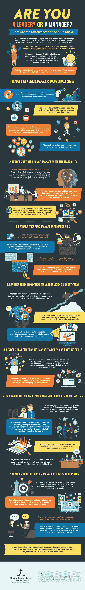

# 你是领导者还是管理者？以下是你应该知道的区别！(资料图)

> 原文：<https://medium.com/swlh/are-you-a-leader-or-a-manager-here-are-the-differences-you-should-know-infographic-5c560333d20a>

你以前有没有问过自己，你更像一个领导者还是一个管理者？你有没有想过你是否真的在领导你的人，或者你只是在管理你的生意？寻找答案是否给你留下了更多的问题而不是答案——是否让你对领导者与管理者的不同之处更加困惑？

有太多的企业家问他们是领导者还是管理者，对于他们是什么，他们有不同的答案和解释。虽然这可能会让许多人感到困惑，但它实际上可以归结为一个原则:领导者都是管理者，但不是所有的管理者都是领导者。从最基本的意义上来说，两者的区别在于他们如何激励员工为一个共同的目标而努力。

通过[这张由 Healthy Business Builder 制作的信息图](https://www.healthybusinessbuilder.com.au/single-post/Are-You-a-Leader-or-a-Manager-Here-Are-the-Differences-You-Should-Know-Infographic)，确定领导者和管理者之间的差异，并找出最能描述你的人。

Are You a Leader or a Manager?

## 这篇文章发表在[《创业](https://medium.com/swlh)》上，这是 Medium 最大的创业刊物，拥有 277，994+读者。

## 在这里订阅接收[我们的头条新闻](http://growthsupply.com/the-startup-newsletter/)。

