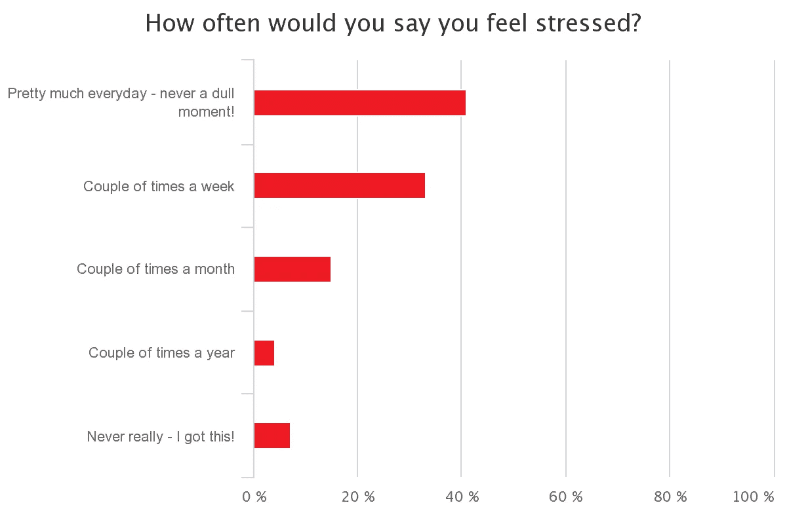

# 你是创业公司的创始人吗？这里有一项你需要发展的成功技能。

> 原文：<https://medium.com/swlh/are-you-a-startup-founder-heres-the-one-skill-you-need-to-develop-to-be-successful-64d9040256cc>

## 这不是天才。而且绝对不是*“稳重的天才”。*

Photo by [Aditya Romansa](https://unsplash.com/photos/m6p4lqWxfy0?utm_source=unsplash&utm_medium=referral&utm_content=creditCopyText) on [Unsplash](https://unsplash.com/?utm_source=unsplash&utm_medium=referral&utm_content=creditCopyText)

*“稳定的天才”到底是什么意思？但那是在不同的日子，不同的文章。*

我们来谈谈创业公司的创始人&解构他们的 DNA。

首先，创业公司异常艰难。在这篇福布斯文章中，Neil Patel 猜测 90%的创业公司会失败。

与更传统的朝九晚五的公司工作不同，初创公司要求你经常工作 60 多个小时，并承受巨大的压力。如下图所示，有[研究](http://www.businessinsider.com/startup-founders-long-hours-stress-strained-relationships-bgf-streetbees-survey-2017-6)显示，大多数创始人几乎每天都会经历压力。

Source: Business Insider

创业公司的创始人必须是罕见的疯子，才能在如此不利的情况下尝试一些事情。

如果你是一个创业公司的创始人，你知道我在说什么。

当你创办自己的公司(无论是 B2C 还是 B2B 还是 SaaS)时，你同意开始一段漫长的探索。寻求第一个“引爆点”，即[产品/市场契合度](https://en.wikipedia.org/wiki/Product/market_fit)。

那么，是什么让初创公司的创始人能够独一无二地追求这一目标，并坚持到他们成功呢？

作为创始人，你需要发展什么样的技能才能茁壮成长？

一个哈佛教授团队从他们最杰出的校友创始人那里寻找答案，以下是他们的发现:

Source: Survey results via Harvard Business Review

尽管这项研究范围广泛，深入涵盖了许多元素，但我认为它强调了一种元技能，可以应用于上述任何答案。

9 年前，[保罗·格拉厄姆](http://www.paulgraham.com/relres.html)已经在他的博客上用一句圆滑的话回答了这个问题。

# “不屈不挠的足智多谋”

砰。这是你作为创始人需要具备的第一技能。简单来说，叫做**“搞定 SH*T”。如果你不知道如何完成任务，其他技能都没用。**

创业比喻商业中的炸弹旋风——无论你准备得多么充分，你都将面临不确定性和不足的高峰。无论是资金、人才库、技术工具、相信你的人、想从你这里买东西的顾客、想报道你的媒体，几乎创业公司生活中的一切都是你不会拥有的资源。

你需要用更少的资源获得更多的价值。

这就是为什么发展足智多谋的技能非常重要。

根据牛津词典，足智多谋的**这个词的意思是:**

> 有能力找到快速聪明的方法来克服困难。

发展足智多谋就是榨取你每一滴创造性的汁液，使事情运转起来，绕过障碍。日复一日坚持不懈地这样做。

大卫·卡明斯，一位充满活力的亚特兰大企业家/投资者，在这篇[博客](https://davidcummings.org/2017/04/05/characteristics-of-successful-atlanta-entrepreneurs/)中称韧性和足智多谋是成功企业家的两大特质。

在科技领域，还有另一个传奇式的直言不讳的信徒。杰夫·贝索斯。贝佐斯在本文中开玩笑地说，他妻子的理由是，她“宁愿要一个有九个手指的孩子，也不愿要一个没有智力的孩子。”现在，这是一个艰难的家庭成长(相比之下，我妈妈甚至现在都不让我碰锋利的刀！)但似乎他们正在国内培养未来的领导人。

## 无论如何，就像大多数多产的创始人如何开始他们的一年一样，永远要学习。如果有改进的空间(总是有的！)，我希望你在 2018 年考虑努力锻炼肌肉，变得更加足智多谋。

*你有什么想法？你认为一个成功的创始人需要发展哪些技能？(本文由 KP 撰写，最初发表于* [*关闭页面*](https://getclosingpage.com/blog/relentlessly-resourceful) *博客)*

## 这个故事发表在 [The Startup](https://medium.com/swlh) 上，这是 Medium 最大的企业家出版物，拥有 282，454+人。

## 在这里订阅接收[我们的头条新闻](http://growthsupply.com/the-startup-newsletter/)。

