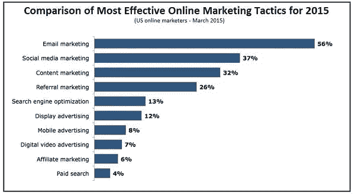

# 你是创业公司吗？像‘约会’一样对待邮件营销！

> 原文：<https://medium.com/swlh/are-you-a-startup-treat-email-marketing-like-dating-f265573d8e7b>

创业是一项具有挑战性的工作。

温迪快餐的创始人迪夫·托马斯说得好:

> “创业需要什么？三件简单的事情:比任何人都了解你的产品，了解你的客户，并有强烈的成功欲望。”

如果你困惑于如何让你的目标受众和潜在客户更有吸引力并与之建立关系。

*电子邮件营销可以成为你的朋友！*

**电子邮件营销**已经成为与你的目标受众沟通和建立关系的宝贵工具。

在获取新客户方面，电子邮件的效率是脸书或推特的 40 倍。

成功的创业公司之所以成功，是因为他们明白电子邮件营销在与客户建立关系中的重要性。

如果你是一家初创公司，那么你必须将你的电子邮件营销视为你的“**日期**”。

想知道营销策略如何成为你的约会？

我列出了一些在电子邮件营销和约会中起重要作用的关键因素。

*尽情享受吧！*

# 信任

所有的关系都依赖于信任！

正如斯蒂芬·柯维所说，

> “信任是生活的粘合剂。这是有效沟通中最重要的因素。这是维系所有关系的基本原则。”

好吧，告诉我一件事。

当你有约会时，你可能知道你要见谁，他们长什么样。你会敲一个陌生人的门，然后期望他们马上和你约会吗？

不，当然，你不会。她不认识你，你也不认识她。

类似于**电子邮件营销**，访问者给你他们的联系方式，希望你能随着时间的推移增加价值。

多想想给予而不是接受。提供一些有价值的东西——一份信息丰富的时事通讯、方便的提示、一本电子书、一个折扣、灵感——是提供信任的第一步。

你不会在“第一次约会”就结婚。第一次约会的目标不是结婚。目标是获得另一次约会。

你不会在你的第一次电子邮件营销活动中成功或失败。你们开始互相了解了。

你在建立信任。如果你是匹配的，你就在学习。

# 兴趣

例如，和某人约会时，注意他/她是素食主义者还是讨厌恐怖电影是很重要的。一次伟大的约会从不谈论你的喜好。

注意你的订户的好恶。允许客户选择他们希望在收件箱中收到的信息类型。

尊重这些偏好，发送相关邮件。想想他或她的需求是什么，把你的内容集中在这些需求上。

电子邮件营销顾问 Tamara Gielen 表示:

> “了解顾客旅程、购买周期和你名单上的人，这样你就能发出相关的、有价值的信息。”

# 会话

当你约会时一直在说话会发生什么？

没好事，对吧？

你知道成功约会的秘诀是什么吗？

对和你在一起的人表现出兴趣。如果你想变得有趣，那就去感兴趣。

允许对方回应你。如果你在约会时开怀大笑，玩得开心，谈话流畅，那么你们可能是很好的一对。

同样的原则也适用于你的**电子邮件营销**。给你的订户一个声音。征求评论、投票、调查反馈。

听听他们怎么回复你。即使不全是积极的，这也是一个互动和建立真正联系的机会。

# 战略的

你应该定期约会以建立牢固的关系。在你们的关系中做一些实验。

你可以加点香料，但不要太多。适量的一点改变会很有趣。晚餐约会可能是一个晚上吃中国菜，另一个晚上吃意大利菜。

*她喜欢我赞美她，给她按摩，为她开门吗？*

你可以用**电子邮件营销**做同样的事情。你必须定期发送消息。但是不要用太多的邮件激怒你的订户。不要过于急切。慢慢来，给它时间。

尝试你的关系或电子邮件中的不同元素，看看是什么让他们开心和回应，这很重要。

# 行动起来！

谢谢你听了这个故事。如果你喜欢这个故事，点击👏按钮，并与他人分享！

## 你想从成功作家那里得到可操作的写作建议吗？[获取您的免费副本](https://mailchi.mp/d0442b655c31/get-your-ebook)。

*本文原载于*[*TechRevolve*](https://www.techrevolve.com/why-a-startup-should-treat-email-marketing-like-dating/)

## 这个故事发表在 [The Startup](https://medium.com/swlh) 上，这是 Medium 最大的企业家出版物，拥有 308，589+人。

## 在这里订阅接收[我们的头条新闻](http://growthsupply.com/the-startup-newsletter/)。

