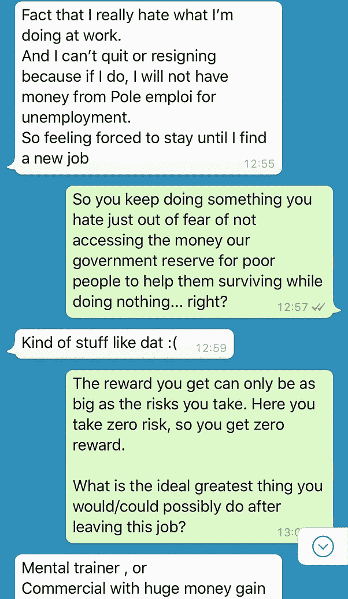
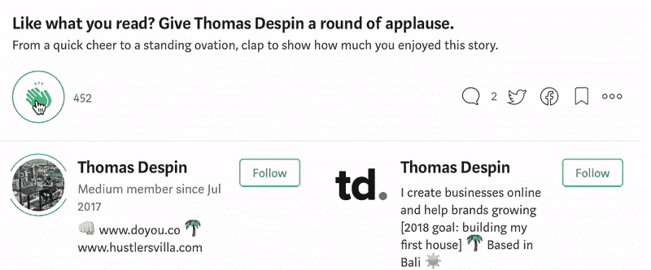

# 你已经生活在最坏的情况下了吗？

> 原文：<https://medium.com/swlh/are-you-already-living-your-worst-case-scenario-95e2b2db4f7a>

[Source](http://www.unsplash.com)

今天下午，一位多年未见的老朋友发短信给我，向我咨询他面临的一个工作情况。

我引导他回答我每天用来做选择的“最坏情况”问题。

我第一次读到这个“窍门”是在 5 年前，从那时起，每当我面临一个具有挑战性的选择时，我都坚持使用它。

这对我来说太自然了，以至于我有时会忘记很多人从未听说过它。

## 对话如下:

Copy of our WhatsApp conversation, from left to right

我们常常无法做出决定，因为我们害怕失败后会发生什么。

我明白，这很自然。

但经常发生的是，我们只是坚持最初的恐惧，而没有进一步挖掘，问自己正确的问题。

以下是我每天都会问自己的一些问题:

*   假设我的项目惨败，会发生什么？
*   我能从中恢复吗？
*   怎么会？我具体会怎么做？
*   我成功的可能性有多大？失败吗？
*   满分为 10 分的成功感觉有多好？
*   目前的情况感觉如何？
*   满分 10 分的话，失败的感觉有多糟糕？

通过理性化和有针对性地解决恐惧，我们设法正确看待它们，并意识到我们实际上冒了多大的风险。

当我计划骑自行车环游世界并睡在帐篷里时，我就用这个。

我没有钱，也没有赚钱的具体计划。

在飞往巴厘岛之前，我在 14 个月内骑行了两大洲的 18 个国家，并在那里定居了两年半。

我最糟糕的情况是，如果我失败了，我只能回家，找到我能找到的第一份赚钱的工作。

我必须自己去看世界，在路上面对自己，这种意愿远远高于我当时所冒的风险。

所以我上路了，无论什么时候出了问题，我都会做任何人在别无选择时都会做的事情:我想明白了。

我当时 23 岁。

今天，我 27 岁，住在巴厘岛，我最近正式成为那里的居民。

我还拥有自己的[服装品牌](http://www.doyou.co)，开发[皮条客别墅](http://www.hustlersvilla.com)，在 3 周内开设我的第一家合作咖啡馆。

下个月，我将飞往印度尼西亚的另一个地区苏拉威西岛，在那里我将买下一个小小的处女岛，把它开发成一个名为“重新连接”的生态度假村。

这一切常常让我感到害怕，我的学习曲线如此陡峭，有时感觉就像是面前的一堵墙。

我觉得我没有领导这些项目所需的技能、金钱或魅力。

我可能没有。

但是当我写下我最糟糕的情况，看看如果一切都出错会发生什么，我意识到对我来说最糟糕的事情就是不去尝试。

我失败了几次。
以前也有几次我放弃了。

我总能康复。

事实上，我所面临的每一次失败都是一个深刻的教训，并且很快就恢复了。

想想看，你会花 10-15 分钟的时间来问你这些问题，并意识到你将要冒的实际风险。

但是不要停留在一个你已经生活在最坏情况下的位置，你害怕万一你失败了。

大多数时候，无所事事是发生在你身上最糟糕的事情。

来自❤巴厘岛的爱

## 这篇文章发表在 [The Startup](https://medium.com/swlh) 上，这是 Medium 最大的创业刊物，拥有+ 372，390 名读者。

## 订阅接收[我们的头条新闻](http://growthsupply.com/the-startup-newsletter/)。

*此处最初发表* [*。*](https://doyou.co/blogs/daily-hustle/are-you-already-living-your-worst-case-scenario)