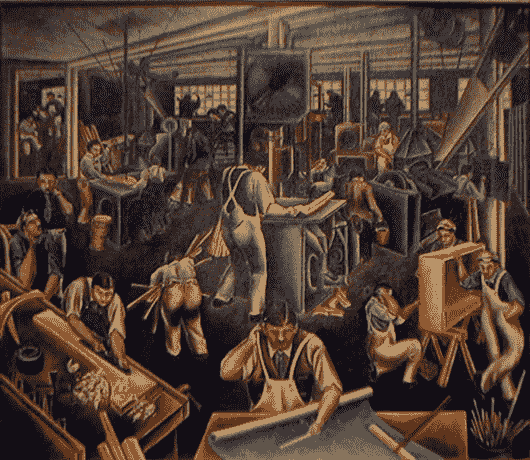

# 你是艺术家还是画框师？

> 原文：<https://medium.com/swlh/are-you-an-artist-or-a-frame-maker-15a6caabfaa1>

为什么知道你最适合哪个角色是值得的，以及当你想加入一个新的社区时，这有多重要。

上周，我收到一封来自伦敦的电子邮件，询问我在纽约的生活怎么样，以及我对大都会博物馆的看法。

他们知道我需要等一段时间才能拿到工作许可证，所以很自然地认为我已经在强制休假期间花了不少时间去参观博物馆。我内疚地回答说我没有。我几乎没去过 75 街以北，更不用说探索博物馆一英里了。

昨天，我花了几个小时探索中央公园旁边的大都会艺术博物馆。

我决定大致按照时间顺序旅行，从古代中国开始，经过荷兰 16 世纪的肖像画和 19 世纪的美国家具，最后到达 20 世纪 20 年代的立体主义。

在我参观的最后一个房间里，有样东西吸引了我的目光——一幅日本艺术家臼井文平的画。

这件作品本身对我没有太大的吸引力(它也和我最喜欢的两位艺术家 Gris 和 Leger 的一堆作品放在一起，没什么帮助)，但是臼井旁边的海报吸引了我的注意。

> 20 世纪 30 年代末，臼井邦平从日本移民到纽约。他没有以画家的身份融入这个城市的艺术界，而是做了一名画框匠，通过这种做法，他受到了许多当代顶尖艺术家的欢迎。*【1】*

关于这个非常短的大纲，有两点引起了我的注意。

首先，他是一个刚到一个新国家的人，试图融入一个特殊的创意社区。我能理解。

其次，他决定专注于他的多种技能之一，而不是直接成为该社区的一员，而是通过为其成员提供他们可以信任的有价值的服务来建立自己的声誉。一个非常简单而有效的策略。

我立刻看到了画框制作者在其他工作领域的形象:相对不被人注意地工作；为艺术家的作品提供结构、保护和背景；但也有他们自己的价值观、工具、工艺和语言。

当然，有些画根本没有画框，有些当然最好没有，但对许多其他人来说，画框是整个作品的重要组成部分。

就像在其他创意行业一样，虽然很少有人既能成为画框师又能成为画家，但更多的时候两者是相辅相成的。

参观完博物馆几个小时后，我去市中心会见了一位从事新事业的广告创意人员。我们相处得很好。

在他讲述完自己的故事后，他邀请我讲述自己的故事，并问道:

> *“那么，你用什么画笔？”*

我笑了。我以前从未听过有人用这个词。

我告诉他我并没有真的用画笔。

我更喜欢做相框制作者。

## 行动号召:无论你是一名相框制作者还是一名艺术家(或者两者都是！)，我正在建立一套工具来帮助你设计你的职业生涯，设定和实现目标，并与志同道合的人联系。如果你想获得测试版，请通过[www.howardgray.net](http://www.howardgray.net)或[推特给我](http://www.twitter.com/howardgray)留言

[1]第二次世界大战期间，臼井在纽约的许多朋友为他辩护，使他免遭监禁。在战争期间，他的大量日本刀剑收藏(超过 120 把)存放在他的许多朋友家中，战争结束后归还给他。

*原载于 2018 年 1 月 28 日*[*howardgray.net*](http://howardgray.net/2018/01/28/are-you-an-artist-or-a-frame-maker/)*。*

## 这个故事发表在 [The Startup](https://medium.com/swlh) 上，这是 Medium 最大的企业家出版物，拥有 290，182+人。

## 在此订阅接收[我们的头条新闻](http://growthsupply.com/the-startup-newsletter/)。

