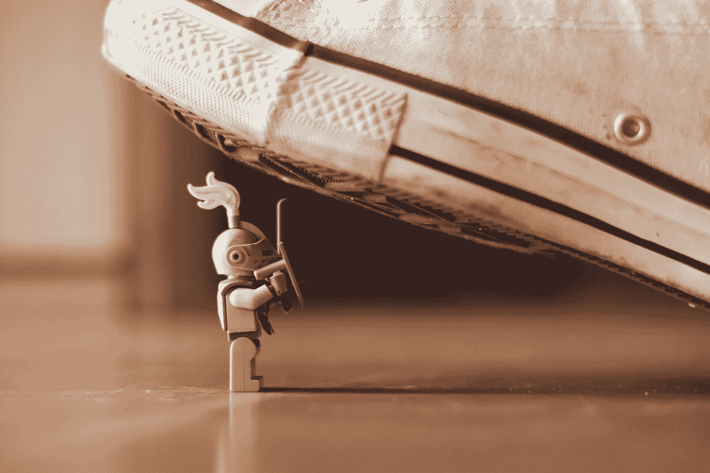

# 你是艺术家吗？创作艺术和赚钱之间的疯狂冲突

> 原文：<https://medium.com/swlh/are-you-an-artist-the-crazy-conflict-between-making-art-making-money-cf0d6821e5c2>

Photo by [James Pond](https://unsplash.com/photos/HUiSySuofY0?utm_source=unsplash&utm_medium=referral&utm_content=creditCopyText) on [Unsplash](https://unsplash.com/?utm_source=unsplash&utm_medium=referral&utm_content=creditCopyText)

我是一名*艺术家*。

我在*做生意*。

等等。

*这可能吗？*

**是的，当然……**

但是为什么这个概念在很多人看来很奇怪呢？

我从事法律工作。但我在法学院之前花了 10 年时间想成为一名艺术家。