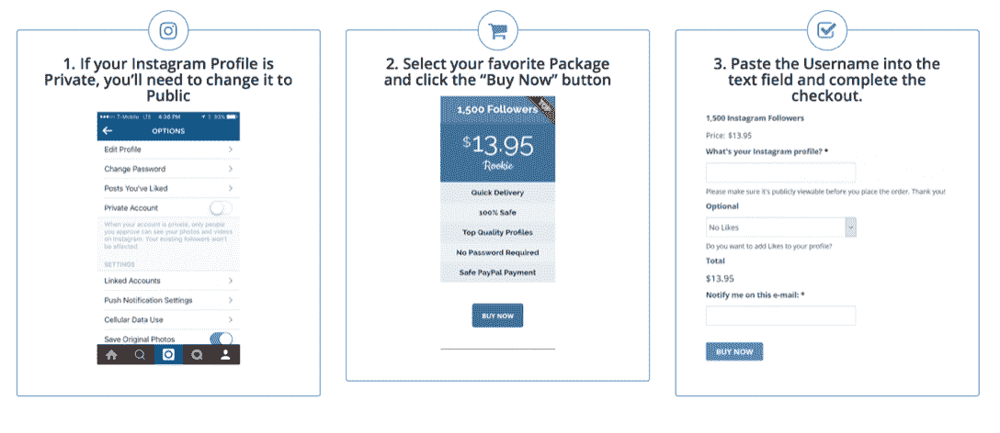

# 你被机器人跟踪了吗？你应该购买追随者吗？Instagram 机器人，完全指南

> 原文：<https://medium.com/swlh/are-you-being-followed-by-robots-and-should-you-buy-followers-instagram-bots-the-complete-guide-90b3dc92ecf3>

“A Lego stormtrooper on sand” by [Daniel Cheung](https://unsplash.com/@danielkcheung?utm_source=medium&utm_medium=referral) on [Unsplash](https://unsplash.com?utm_source=medium&utm_medium=referral)

# [***insta gram***](https://www.instagram.com/einsteinmarketer/)关注者越多越好吧？

上周，我们收到了一封来自“Instagram 影响者”的电子邮件，他想为我们的博客写一篇关于“影响者营销”的优势的文章。

我回复了他的邮件，要求提供主题标题，并请我们的一位社交媒体人员做了一些调查。

我们发现的**并不漂亮**。

我们将很快回来，但首先，让我们深入了解主板和铜线。

对于品牌、企业、企业家、有影响力的人和普通用户来说，Instagram 是一个令人惊叹的平台。他们已经证明了这一点，年同比增长，在 2018 年达到超过**10 亿月活跃用户**。

除了分享照片、提高知名度和推广品牌/个人，这个世界还发布了在这个平台上可以赚很多钱的消息。

根据《福布斯》*报道，一个拥有 **10 万+关注者的 Instagram 账户，每篇帖子可以获得 5000 美元**。*

*两分钟工作 5000 美元？不错吧，嗯？*

*这些数字创造了数字淘金热，因为哪里有钱，哪里就有捷径。在 Instagram 的例子中，是机器人，它们变得越来越受欢迎。*

*在谷歌上简单搜索“购买 Instagram 粉丝”,我们得到了 4920 万个结果。*

**

*考虑到拥有大量追随者的潜在回报，这些服务也相对便宜。*

*我研究了销售追随者的十大网站(从我的搜索结果中)，分析了它们的价格，发现平均 6.78 英镑可以买到 500 个追随者。*

*对于较大(批量)订单，这一平均价格会下降。*

**

*这些优惠对于渴望提高其社会证明的品牌、旨在赢得严肃对待的影响者以及希望接触更多受众的企业来说是一个诱人的提议…*

*…但是，机器人真的会做这些事情吗？*

# *工作中的机器人*

*在得出明智的结论之前，我们需要了解 Instagram 机器人是如何工作的。在研究了前 3 页的[***Google***](http://google.com/)结果后，我发现了通往追随者乐土的四条主要路线:*

***#1-从机器人那里购买***

*最初的 Instagram 机器人。购买这项服务立即从 bot 公司拥有的账户中获得大量追随者。*

**

***#2-订婚机器人***

*这将购买对您的照片的评论和赞。高参与度的帖子在 Instagram feed 上排名很高，甚至可能把你推到你选择的标签类别的顶部。这增加了曝光率，提供了社交证明，还可能忽悠用户追随你。*

***# 3——自动跟随机器人***

*一个越来越常见的机器人，你们很多人以前都见过。这项服务会自动跟踪真实账户，希望他们会回报并跟踪你。这个机器人会自动**取消关注**任何没有回复的人，并且可以设置在一定时间后取消关注所有人。*

**

***#4-自动接合***

*这项服务评论和喜欢其他账户上的帖子，特别是那些目前没有被关注的人。你挑选出一般的评论，机器人就会发出成千上万的评论和赞，旨在增加曝光率，最终为你赢得关注。*

**

*在你的 Instagram 帖子上见过这样的评论吗？这是一个机器人的截图，加载了通用的评论发送给不知情的用户。*

*虽然这是 4 种最常见的方法，但其中许多方法**需要协同工作才能取得成效**。例如，一些服务提供自动参与并一起关注，称自己为*“有机成长工具”*，导致*“关注真实的人”*。*

# *发现机器人！*

*还记得那个想给我们博客投稿的“有影响力的人”吗？*

*我们的社交媒体经理很快意识到他使用了机器人。不过，这并没有改变我发表客座博文的决定。事实上，我问过他，并鼓励他以 Instagram 机器人的买家视角为中心写一篇文章*

*……遗憾的是，他仍未回复。如果你正在读这篇文章(你知道你是谁！)，请回复我们！我们的观众很想从你的经历中读到一篇关于机器人的文章！*

*考虑到这一点，我要求我们的社交媒体经理列出机器人追随者的最明显迹象，如下所示:*

*   ***不断关注和不关注你的账号。爱因斯坦营销商的 Instagram 每月会被相同的账户定期关注和取消关注 2-3 次。***
*   ***当天上传的照片少于 25 张的新帐户。***
*   ***帐户名称是标点符号、字母和数字的随机集合。***

**

*   *拥有大量关注者和很少帖子的帐户。3000 人怎么可能关注一个贴了 10 张照片的人？*

**

*   ***发表与帖子完全无关的评论的用户***

**

*   ***照片上有 1，000 个赞的帐户，但没有评论***
*   *拥有大量追随者的账户，这些追随者看起来像这个列表中的任何一个例子。*
*   ***拥有大量具有相似社交指标的追随者的账户，即所有机器人都喜欢彼此的帖子，即使他们几乎没有上传任何帖子。***

****看看你能发现这两个“Instagram 档案”有多少不同之处:****

**

# *Instagram 怎么看？*

*Instagram 的官方说法是，他们有一个专门识别垃圾邮件的团队，他们不怕停用似乎在使用机器人的账户。*

*这是由他们的 [*社区指南*](https://help.instagram.com/477434105621119/?helpref=hc_fnav&bc%255b0%255d=Instagram%2520Help&bc%255b1%255d=Privacy%2520and%2520Safety%2520Center) 支持的，它声明了“*尊重 Instagram 上的每个人，不要给人发垃圾邮件”*。早在 2014 年，他们就清除了数以百万计的虚假账户，以增加平台的真实性。*

*这意味着使用机器人可能会导致你的帐户被团队停用或暂停。*

*Instagram 还实施了反垃圾邮件限制，防止帐户反复发布相同的评论，或在短时间内喜欢太多的帖子。*

*但是**机器人已经找到了绕过这个**的方法，然而 Instagram 却对此无动于衷。*

*在 Instagram 上发现机器人从未如此容易，但他们的专门团队似乎无法找到他们。那么，有什么问题呢？**都是蒙着眼睛工作**？*

**

*我们不这么认为。*

*事实上，他们忽略这么多机器人的原因很明显。Instagram 是脸书所有的，当涉及到他们公司的价值时，[脸书](http://facebook.com/einsteinmarketer)认为**参与度**是一个**关键指标**。*

*他们宣布今年已经接触了超过 10 亿的用户，但是有多少是真实的呢？*

*计算股价时不会问这些问题。*

*一个可以加载 30 条通用评论并在社区中广泛传播的机器人，实际上并不妨碍 Instagram。这是炸药。*

**

*将这些数字乘以 Instagram 机器人的受欢迎程度，你就得到了一个他们不想失去的天文数字。*

*告诉我们禁止发送垃圾邮件符合 Instagram(和脸书)的利益，但事实上，这给了他们不想失去的增长数据…*

*…因为让我们面对现实吧，如果他们想一夜之间禁止所有的机器人，那么像他们这样规模的企业必须有足够的资源来做到这一点。*

# *Instagram 机器人，你应该去吗？*

*Instagram 的算法(主要)根据三个主要因素对其新闻订阅源上的帖子进行排名:*

*   ***-兴趣-** 他们的 AI 相信你会喜欢这个帖子的程度，取决于你过去与类似内容的互动。*
*   ***-及时性-** 新帖子优先于旧帖子。*
*   ***-关系-** 你与发帖用户互动的频率。*

*参与度在他们的排名系统中也起着重要的作用，这使得自动点赞和评论的流行程度激增…*

*…但是，有一个大问题…*

*… **这不是真的！***

*企业、企业家和有影响力的人都看到了将 Instagram 作为核心社交媒体平台的重要性。这个平台为他们提供了拓宽视野的工具。*

**

****来源:***[***eMarketer***](http://emarketer.com/)*

*但是，当另一端的人被操纵跟随或被同一批人拥有时，reach 就不是真实的。*

*这使得这些数字只不过是**空洞的数字**和**虚荣指标**。*

*有 10000 个关注者会给人留下好印象，但是一个面具也可以。数字营销已经发展到这样一个水平，企业必须是真实的、相关的和真实的。为 Instagram 的关注者付费不会做这些事情。*

*如果一个潜在客户知道你用社交证明号码收买了他们的信任，他们还会信任你吗？如果你开始向他们发送通用表情符号，他们会有什么感觉？如果你经常用关注和不关注来骚扰他们呢？*

*问题也没有就此结束…*

*…粉丝数量的急剧膨胀会影响你衡量真实指标的能力。没有这些重要的数据，你怎么能分析出什么行得通，什么行不通呢？*

**

*假设我的 Instagram 账户有 300 个关注者，他们喜欢我的内容并与之互动。我的个人资料在慢慢增长，我能够看到我的观众喜欢什么样的内容。但是后来，我不耐烦了，买了一万个关注者，继续发内容。我如何判断我的目标受众喜欢什么，不喜欢什么？他们会迷失在被收买的档案中。*

*第二种情况(我在我的个人 Instagram 上见过)，是如果我购买自动评论。想象一下，如果机器人出去放评论，***‘爱死它了！****‘*随便上一个帖子，那其实是关于含泪分手的。那我会是什么样子？我的品牌声誉如何？*

# *结论*

*令人遗憾的是，一个看似把用户放在第一位的社交平台缺乏从其系统中禁止机器人的真实性。作为营销人员、企业和企业家，我们不能影响它，而是必须学会适应它。*

*我们应该越来越警惕 Instagram 的自动化机器人。尤其是，希望将血汗钱投入“影响者营销”的企业。*在投资之前，使用我们的 bot 警告标志列表(在本文前面)!**

*与其花钱走捷径来增加你的参与度和粉丝，不如在你的 Instagram 策略上投入时间、精力和测试。**创造品质，始终如一。***

*我们每天都被信息轰炸，重要的是你的内容要穿过污染，对你的观众有意义。*

*忘记机器人，重复的评论和空消息。发现你的观众想要什么，并提供给他们。*

*你对 Instagram 机器人有什么想法？你曾经成功地使用过吗？你同意我们的结论吗？留下评论或者[给我们发消息](http://m.me/einsteinmarketer)！您的意见对我们至关重要！*

**原载于 2018 年 6 月 29 日 www.einsteinmarketer.com***。***

****

## **这个故事发表在 [The Startup](https://medium.com/swlh) 上，这是 Medium 最大的创业刊物，拥有 339，876+人关注。**

## **在这里订阅接收[我们的头条新闻](http://growthsupply.com/the-startup-newsletter/)。**

****