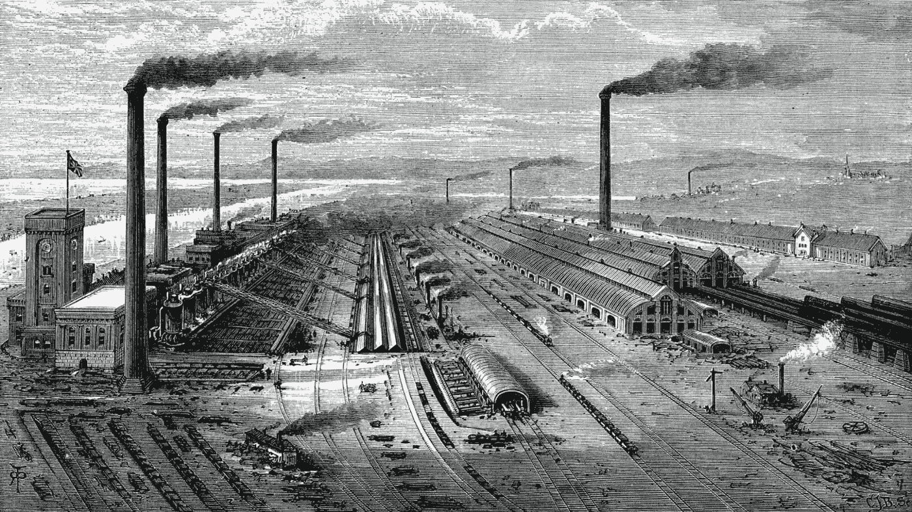
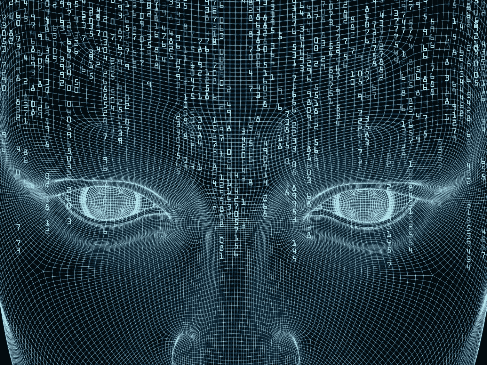

# 你是不是完全低估了 AI？

> 原文：<https://medium.com/swlh/are-you-completely-underestimating-ai-96c7083cfd50>

## ”“如果我问人们想要什么，他们会说是更快的马。”—亨利·福特

把你们自己放在一个 17 世纪早期人类的位置上。当时的工业发展极其缓慢——工人们必须手工制作物品，大规模生产根本不存在。

> 对那个时代的工人来说，今天的世界似乎是不可思议的。对他们来说，像我现在坐的这座 23 层的建筑是“不可能”建造的。

从 17 世纪到今天发生变化的是机器。工业革命让我们以前所未有的速度制造产品，并让我们将自己的创造扩大到前所未有的规模。

摩天大楼、大型钢铁船、汽车和你家中的家具，以及从它们衍生出来的系统，如航运业，每天用汽车运输数百公里，以及你已经习惯于每天看到的建筑，都因为工业革命而成为可能。

The industrial revolution enabled us to break past our physical constraints and build things that we couldn’t have otherwise.

> 工业革命把体力劳动从人手里拿走了。

没有了身体的束缚，我们现在有了像起重机和汽车这样的机器，可以举起比我们重几百倍的重物。他们帮助我们实现我们现在认为无处不在的事情，只是因为他们巨大的体力。

人工智能被誉为“下一次工业革命”。人们认为他们将通过提供智能解决方案来改变世界——一切都由 AI 解决；客服？换成机器人。数据分析师？用无监督学习算法代替。收银员？换成 Amazon Go。

> 所有人能想到的就是 AI 如何解决现有的问题。他们不明白的是，这将解决我们甚至没有意识到存在的问题。

我们必须停止认为人工智能只是解决当前的问题或它们的轻微变种。一个普通的 17 世纪的人不知道他想要一座 23 层的建筑，或者一台能让他每小时行驶 100 公里的机器。

> “如果我问人们想要什么，他们会说是更快的马。”—亨利·福特

不要考虑对现有系统和行业的改进，*考虑全新的行业人工智能有潜力创造*，因为创造新行业的产品做得最好。

就像 AI 带走了人类的身体约束一样，AI 也将能够带走我们的精神约束。就像机器的力量比我们强几百倍，如果不是几千倍，AI 的智能也会比我们聪明几百倍，如果不是几千倍。

人工智能的理解能力比我们强得多。看似不可理解的科学理论的障碍将被未来的机器轻易打破。像这样的物理问题将会比人类解决问题的速度快几千倍。

机器消除了人类的身体限制，解放了我们，让我们可以追求更多的智力道路，如信息产业，人工智能将消除我们的精神限制。

但是，从繁重的体力劳动和脑力劳动中解放出来后，人类还剩下什么可做的呢？

¯\_(ツ)_/¯

萨尔瓦夫

***你一直在使用完全错误的介质***——[https://medium . com/swlh/You ve-be-use-medium-complete-error-52 df 28 f 95876](/swlh/youve-been-using-medium-completely-wrong-52df28f95876)

你认为人工智能尚未解决的最荒诞的事情是什么？一定要给我写个回应！