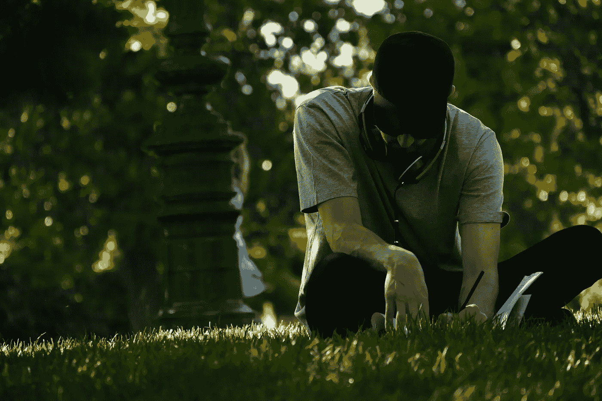

# 你是清醒的还是无知的？

> 原文：<https://medium.com/swlh/are-you-conscious-or-clueless-6df3ce67ee3f>

Photo by [Wenceslas Lejeune](https://unsplash.com/photos/o9nqZMt21mo?utm_source=unsplash&utm_medium=referral&utm_content=creditCopyText) on [Unsplash](https://unsplash.com/search/photos/conscious?utm_source=unsplash&utm_medium=referral&utm_content=creditCopyText)

通过精神疾病的痛苦，我学到了一些宝贵的经验:

*   写作是组织思维的最佳方式。
*   当你应用你所读到的东西时，进步就会发生。
*   通过观察自己可以学到很多东西。
*   有意识地生活就是对你的生活结果负责。

在这次经历之前，我对自己的人生方向一无所知。然而，在处理疼痛的过程中，我获得了这些工具——它们帮助我变得更加清醒。

可悲的事实是，许多人在生活中从未关注过自己的想法。他们一遍又一遍地生活在相同的模式中，几乎意识不到自己的生活方式。

在心理学文献中，随着年龄的增长而变得有意识被视为一种正常的发展模式。但文献也指出，有些人永远不会达到最高水平的意识。

有些人，虽然为数不多，但就是没有能力。其他人就是不会，因为成长为意识会很痛苦。你被迫离开童年的无意识领域，为你的生活承担一些责任。有意识，就是意识到——这意味着意识到自己的错误。这意味着意识到人性的阴暗面。

然而，如果你没有有意识地生活，你可能会去你不想去的地方。如果你没有有意识地控制你的生活，其他的东西，或者其他人会。

瑞士心理学家卡尔·荣格说过，“在你让潜意识变得有意识之前，它将指导你的生活，你称之为命运。”

本文的其余部分将帮助您解决这个问题。

# 构建你的思维

> "我听了就忘，我看了就记，我写了就懂了。"—中国谚语

如果你没有集中注意力，你只会表现出你已经习惯的习惯。你在自动驾驶仪上——无意识地操作。

虽然我们有时都在这样做，但打破习惯性模式可能是有用的。例如，如果事情进行得不太顺利，你就有可能需要更加意识到自己的处境。

写作可以帮助你。你可以获得关于你自己和你的处境的重要见解——那些不写下来可能很难指出的东西。

通过写作，你会意识到你是谁，你的人生将走向何方。

如果你有很强的意识，写作甚至是有用的；你可能知道有时候思考真的很混乱——尤其是在困难的情况下。当出现问题时，比如精神疾病、压力或心痛，控制自己的想法会非常困难。

幸运的是，写作可以帮助你获得控制权。通过简单的写作练习，一个混乱的头脑可以很快变得有条理。它改变了你思想的心理表征，使它们更加客观，从而更容易观察和分离。

写作使你能够组织你的思维，清晰地表达你自己，并且清楚地了解你的处境。问题变得更加明显，错误的想法显露出来，你让自己被理解。

写作是治疗。

# 学以致用

> “知道是不够的；我们必须申请。”—约翰·沃尔夫冈·冯·歌德

另一个与写作密切相关的习惯当然是阅读。

阅读可以让你意识到新的想法、概念和你从来不知道存在的东西。这样，你会对这个世界，甚至对你自己有一个更全面的了解。你变得有意识，因为你接触到新的事物，被迫做一些反思。

正如写作是一种治疗方式一样，阅读也可以提供这种功能。在有效的心理干预中，心理教育通常是第一步。在这里，人们了解手头的问题，使他们能够更好地理解问题和应对情况。通过清楚地解释现象，阅读可以使困难的情况正常化。

虽然阅读一直是获取信息的一种简单方式，但现在，有了互联网，你能学到的东西没有限制。全世界的信息都有。问题是，你打算怎么办？

事实是，人们阅读的东西和申请的东西之间往往有很大的差异。企业家兼作家德里克·西弗斯这样说:*“如果信息是答案，我们都将成为拥有完美腹肌的亿万富翁”*

读书不够；我们必须申请。

读书的确很厉害。它可以启发思想，通过故事激发灵感，并从世界上最伟大的人那里带给你最伟大的教训。但是申请才是你让信息变得有价值的方式。

仅仅为了读书而读书，可以说只是浪费时间——让你什么都不做。

# 通过观察学习

> “你只能通过观察你的行为来发现你实际上相信什么(而不是你认为你相信什么)。在那之前，你只是不知道你相信什么。你太复杂了，不了解自己。”—乔丹·彼得森

如果你没有意识到自己的行为，当事情没有进展时，你会感到沮丧。“为什么这个世界这么不公平？”你可能会问。

嗯，确实不公平。然而，通过提高你的意识——对自己完全诚实——你可以消除任何不必要的痛苦。世界可能不是问题所在；你可能会。

当你退一步有意识地观察自己时，你肯定会学到很多东西。你可以观察自己的习惯、选择和反应。你可以了解你的模式、信仰和你的存在方式——包括你的优点和缺点。

基于任何新的信息，你可以让你的生活变得更好；通过观察，你可以了解什么可行，什么不可行。

# 自觉生活

> “除了我们自己，没有人能拯救我们。[……]我们自己必须走这条路。”—佛陀

有意识地生活就是对你的生活结果负责。理论上，没那么难。归结起来只有三件事:

*   **瞄准。你必须设定一个有意识的目标。这是你的目的地，也是你有责任实现的目标。你可以用写作和阅读的技巧来帮助你确定目标。**
*   **对齐。**光有目标是不够的，你必须参与让你实现目标的行为。你需要应用你所读到的，并与你的梦想保持一致。
*   **调整。如果你瞄准目标并保持一致，你会在生活中走得很远。但是如果你最初的目标是错的，会发生什么呢？嗯，你必须有足够的意识，如果事情不顺利，你能够调整。今天行得通，明天可能行不通。你需要睁大眼睛；观察你自己。**

# 最后

你不必一无所知。你可以变得有意识，尽可能过最好的生活。

这里有几个与本文配套的收尾练习:

写作是组织你思维的最佳方式。

*   拿出一张纸，用至少一句话写下你留下的印象。你有什么感想？

**当你应用你所读到的东西时，进步就会发生。**

*   你已经读过一些东西了。现在，把它付诸实践(如果你做了上面的练习，你已经做了。如果你做下一个，你会的。))

**观察自己可以学到很多东西。**

*   观察你现在正在做的一件事。你是坐在椅子边上，咬指甲，还是抠上一次锻炼留下的老茧？抓住机会展示一下你自己。

有意识地生活就是对你的生活结果负责。

*   制定一个有意识的目标，做一件与目标一致的行为……记得在需要的时候调整。

# 想要成长？

注册我的[时事通讯](http://eepurl.com/dAtfdv)并获得一套免费的成长工具！

## 这篇文章发表在 [The Startup](https://medium.com/swlh) 上，这是 Medium 最大的创业刊物，拥有+ 375，985 名读者。

## 在这里订阅接收[我们的头条新闻](http://growthsupply.com/the-startup-newsletter/)。

