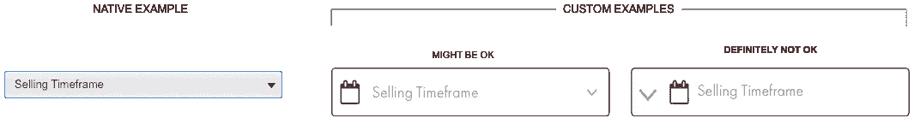
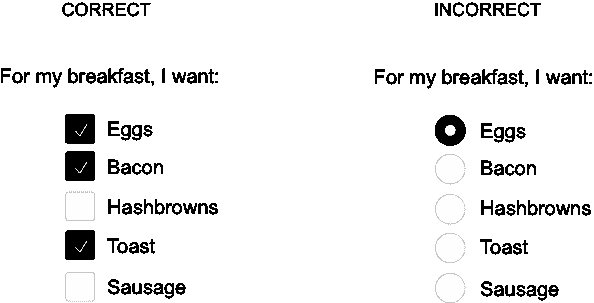
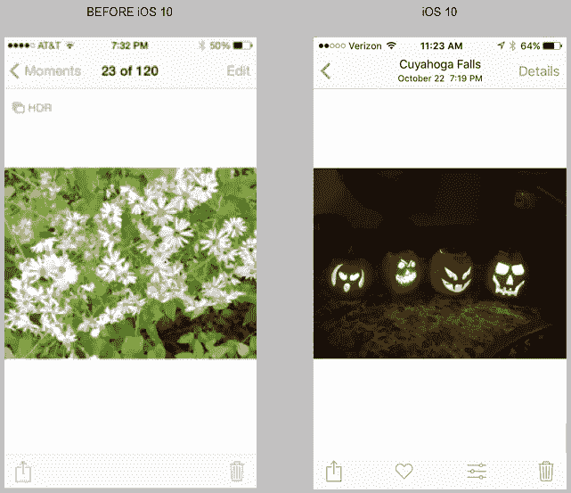
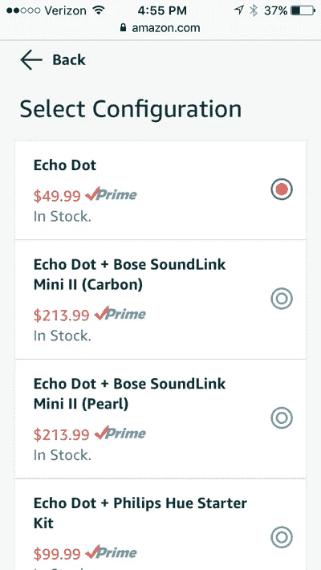

# 你在泄露可用性吗？要避免的 2 个公式

> 原文：<https://medium.com/swlh/are-you-leaking-usability-2-formulas-to-avoid-44efd7cd47b3>

Illustration by Jon Walter

高效。有效。令人满意。

术语“可用性”可能会根据你的来源或者你问的人而有不同的定义，但是这三个词会以这样或那样的方式出现在大多数定义中。即使没有明确地写出来，它们也是隐含的。但是你知道哪个词不可能出现在任何定义中吗？“摩擦。”也就是说，除非摩擦力被否定，因为摩擦力基本上被定义为阻力。

没人想要摩擦。然而，如此多的软件应用程序背负着它。这导致**可用性泄露，**最终阻碍用户的生产力。根本原因可能有很多，其中一些相当明显——比如让一个重要的行动号召难以找到，或者设计一个困住用户的工作流。然而，有几个不太明显的原因造成了可用性漏洞。我怎么知道这个？我犯了引入这些摩擦原因的错误，甚至没有意识到这一点。事实上，我认为许多其他不知情的用户体验从业者也有，因为他们可能相当微妙。但是它们也是可以避免的——为了理解*如何避免它们，清楚地定义它们是有帮助的。因此，这里有两个导致摩擦的常见但微妙的公式:*

**观感=可用性**

和

**我的方式>当前用户知识**

# **观感=可用性**

我们迷恋美学，有时，看起来好像*外观和感觉*是拉可用性车的马。我不是在否定外观和感觉。如果你的产品的外观和感觉是干净的、美观的，用户会更信任它，从而暗示高质量。众所周知，注重强烈的外观和感觉有助于建立与用户的亲和力，这一点绝对应该在你的产品中体现出来。**但不能以可用性为代价。**

当过分强调美观妨碍了可用性时，就会发生摩擦。毕竟，这不仅仅是外观和感觉的问题。史蒂夫·乔布斯总结得很好:

> *“设计不仅仅是它看起来和摸起来的样子。设计就是它的工作方式。”*

**你的设计方案*管用吗*？**

过于关注外观和感觉可能会不经意地影响某些东西的工作方式。有时，它实际上会损害可用性。比方说，您认为某些本机操作系统或浏览器组件在视觉上不适合您的用户界面，因此创建您自己的定制版本更有助于您的期望外观和感觉是有意义的。这可能是一个崇高的事业，所以让我们暂时选择本地复选框。继续用您自己的定制版本替换您的目标操作系统或浏览器的本地复选框组件。外观和感觉可能已经改变了，但是它还能工作吗？考虑:

*   复选框会适当缩放吗？
*   如果您有一个通过浏览器交付的 web 应用程序，那么当您大幅缩小浏览器窗口时会发生什么——复选框的点击区域是否仍然足够(复选标记图标是否也会响应)?
*   屏幕阅读器可以访问它吗？
*   如果使用键盘，用户是否可以通过定位来直观地给出复选框焦点？
*   它能在所有主流浏览器和版本上完美运行吗(如果基于浏览器的话)？
*   最重要的是，它是否以用户*期望的方式*直观地工作？

虽然大多数本机组件肯定会受益于一些视觉效果，但它们通常表现良好，没有错误，并且会随着每个操作系统或浏览器版本的更新而保持最新。对我来说，这听起来是一个非常好的用户体验。你的定制值得冒这些风险吗？

不要误解我，这并不是说所有的定制都是邪恶的。他们也不是生来平等的。变化越大，你冒的可用性泄露的风险就越大，这包括用户*期望*如何工作。如图 1 中的下拉示例所示，在大多数情况下，允许组件的外观和感觉与界面的其余部分更好地保持一致的增量更改可能是可以的…只要它们不影响组件的工作方式*。*

如图 1 所示,“可能没问题”的定制示例显示了明显的变化，但是它仍然保持了与原生示例相同的内容排列(文本标签和向下插入符号在熟悉的地方)。用户仍然应该期待它像本机下拉菜单一样工作。然而，“肯定不行”的例子完全重新排列了标签和向下插入符号。虽然我知道这是一个极端的情况，但这种变化会引起很大的摩擦，因为它确实为用户修改了组件——以至于他们可能不期望它像下拉菜单一样工作。

**Figure 1**: The“DEFINITELY NOT OK” version moves the down-caret to the left of the input. This could completely change a user’s expectations for how the component works. The “MIGHT BE OK” version features an incremental visual change.

**你用对东西了吗？**

对正确的组件的外观进行合理的定制是一回事。但是仅仅基于其外观而不是其预期用途选择使用不正确的*组件是另一回事。例如，让我们看看复选框的一个经常混淆的邻居，单选按钮(图 2)。它旨在指示列表中互斥选项的选择—一次只能选择一个选项。它不是复选框，允许一次选择任意数量的选项。然而这两个组件经常被误用，因为善意的人们只是选择他们认为*看起来*最好的组件，而不了解其真正的预期用途。这确实会发生。*

**Figure 2**. When a user can choose multiple items at the same time (like a food order), a list with checkboxes makes sense. But you could always force them to order food items a la carte by using radio buttons. NO BACON FOR YOU!

如果你像我一样，在思考审美选择时，你的大脑可能不会联想到复选框和单选按钮。但是过分关注外观而对预期用途(及其工作方式)关注不够，会导致重大的可用性漏洞——即使是在处理看似普通的组件时。

**关键外卖**

仅仅因为你可以在视觉上改变一些东西，并不意味着你应该这样做——特别是当改变延伸到它如何工作或预期如何工作的时候。毕竟，根据您的更改幅度，您不仅会将摩擦直接传递给用户，而且随着时间的推移，您可能会增加自己的开发债务和维护，因为您的定制可能不会随着更新的操作系统或浏览器版本而优雅地更新。说到底，你不是你的用户，这是关于它如何直观地工作，而不是仅仅关于它看起来和感觉如何。

# **我的方式>当前用户知识**

正如公式所示，有时我们认为我们的方式比用户目前所知的更好。但是我们需要一个现实核查。除非你是苹果或者其他模式的权威影响者，否则你的软件产品可能只是用户日常工作流程中的一个小角色。用户不断地接触到模式，他们本能地认识到许多模式，因为随着时间的推移，它们已经规范化了。某人带给您的应用程序的当前知识在他们如何假设事情将会工作中起着至关重要的作用。不管你喜不喜欢，这都是包袱——你也不能幸免。为什么

**股权**

以“保存”图标为例，它在许多软件应用程序中通常表示为软盘(图 3)。想想看:save 在现代软件中以一个如此过时的对象出现，许多千禧一代从未见过它在使用中。你不应该错过这个讽刺。它不仅过时，而且不是最合理的形状，尤其是与其他现代标志的简约外观和感觉相比。

**Figure 3**. “Who you calling antiquated? I’m Floppy Disk Save icon, and I’ll NEVER die. I’ll haunt your dreams…FOREVER.”

许多好心人达成的解决方案？“去它的。我将使用勾号图标来表示“保存”，或者我将创建自己的文件。”但是决定创建你自己的图标——或者改变一个不同的图标的用途，而这个图标并不真正具有相同的意义，这个问题是它忽略了当前的用户知识。它引入了摩擦，因为用户可能不理解你试图描述的操作。现在你的体验没有效率，可能没有效果，而且肯定不令人满意。可用性漏洞。

软盘保存图标继续存在，因为它受益于当前的用户知识。而且你可以从 *it* 中获益。不管你喜不喜欢，它是公平的，因为它在过去以某种方式获得了牵引力。用户已经习惯性地接触它很多年了，尽管实际的软盘比灰尘还老。这并不是说你应该停滞不前，不去寻找创新的方法或者寻找其他的方法——尤其是如果你的产品有独特的需求。但是 T2 说，如果某样东西已经存在足够长的时间，就不应该轻率地把它扔掉。

**外景，外景，外景**

对于你的 iPhone 用户来说，你可能会也可能不会注意到 iOS 10 版本更新对原生照片应用程序的重大改变。看一下图 4，它显示了在 iOS 10 之前的个人照片视图*(在左边)和在 iOS 10 之前的个人照片视图*(在右边)。你看到了什么？提示:不是左视图中的花和右视图中的南瓜灯。注意 iOS 10 不仅改变了一些动作的视觉表现，还改变了它们的位置。**

**Figure 4\.** Comparison ofthe photos app before iOS 10 (left) and with iOS 10 (right)

这一变化可能是受与照片视图相关的一些新操作的引入的启发:底部固定操作栏中的“收藏”(心形图标)，以及位于右上角的“详细信息”(Details)。但是你有没有注意到从一个版本到下一个版本“编辑”改变了多少？你有没有注意到它现在由“删除”图标(垃圾桶)左边的“水平滑块”图标表示？如果你马上收到这个，恭喜你。但也许你没有。也许你和许多人一样对这种变化感到困惑。这不仅是对 Edit 表示方式的一个巨大改变(现在是一个无标签图标，而不是以前的动词文本)，也是对其位置的一个巨大的*改变。以前是在一个世界之外——在右上角，现在是在底部的固定动作栏里。这种位置上的巨大变化是造成摩擦的最大原因，这将影响用户有效使用该应用程序的能力，特别是如果他们没有为此做好准备的话。*

位置是至关重要的，因为用户随着时间的推移发展肌肉记忆。伸手去摸熟悉的地方成了第二天性——这在智能手机上尤其重要，因为在这种情况下，人们通常一次只用一个拇指和一个眼球。当他们不能立即找到这些熟悉的地点时，他们变得沮丧。也许苹果觉得某些动作位置的巨大变化被加入细节和收藏夹等新功能的好处抵消了。毕竟，他们已经通过改变让编辑离用户更近了。这是一项崇高的事业，用户可能会很快学会。然而，他们可以在底部标出图标以减少歧义。在随后的版本更新中，一旦用户有足够的时间来适应这些变化，他们就可以逐步淘汰这些标签。

听起来像乌托邦，对吗？事实上，苹果不会这么做，因为他们不需要这么做。他们可以吸收较小的可用性漏洞，并且知道他们的用户群会容忍这些漏洞，因为用户完全更换操作系统是如此痛苦。他们不会因此失去用户。但你和我都不是苹果公司，可能不会以这种方式获得强制用户容忍的好处。

公平地说，我认为苹果的 iOS 10 设计更好。他们在智能手机上将一个重要的动作放在用户的拇指附近。还有一个面向未来的好处，因为由水平滑块图标表示的编辑可能会一直存在(希望如此)。忍受过去的设计选择——比如继续把“编辑”放在右上方，只是因为“这是一贯的做法”，这不是这里的重点。这是为了谨慎和合理地改变位置。很多时候它们是合理的和必要的，尤其是在受到用户反馈影响的情况下。但是变化越剧烈和突然，你冒的可用性泄露的风险就越大；尤其是如果这个决定没有经过仔细的计算。

**使用模式**

虽然忽视公平和位置的价值是否定当前用户知识的决定，但肯定还有其他的。忽略使用模式怎么办？伴随可识别组件的是不变的真理——用户期望它们以某种方式工作。然而，这些既定的模式经常被误用。

以在智能手机上查看亚马逊网站的产品配置页面为例(图 5)。你可能认为我会对右对齐的单选按钮吹毛求疵。当然，这些按钮的位置有点出乎意料，因为用户熟悉它们与每个列表项文本的左边*对齐。我刚刚吼完了位置的问题。但这并不完全是极端的，它们之间略有不同可能有一个很好的原因。我猜想亚马逊有意识地做出这个决定，是为了让单选按钮更容易被用户的右手拇指触及，同时不遮挡左对齐的列表文本。有很多惯用右手的用户，所以这可以说是一项崇高的事业。*

**Figure 5\.** There’s more to those radio buttons than meets the eye with Amazon’s product configuration workflow.

但是等一下。这个屏幕上少了什么？实际上，是非常重要的事情。单选按钮仅用于指示设置或配置环境中的*选择*。命令按钮在哪里？命令按钮(“确定”、“应用”或“提交”等。)应该出现，这样用户可以捕捉他们的选择，然后按*然后*退出视图。亚马逊让单选按钮为双重操作服务，从而使它们的预期用途超载。

为什么单选按钮不仅指示对所需配置的选择(正确)，它们实际上还被用作导航，一旦用户做出选择就退出视图(不正确)。这是不和谐的，因为单选按钮不打算用作*动作*，因此单选按钮的使用模式被误用了。增加这种体验的摩擦是，配置步骤占据了屏幕的整个可视区域。尽管有一个“返回”按钮可用，但它给人的感觉*就像是另一个页面——就好像用户被带到了完全不同的地方。*

这有什么大不了的？有些人可能会认为亚马逊忽略单选按钮的正确使用模式是无害的。像苹果一样，他们会毫不犹豫地吸收可用性漏洞。事实上，有些人可能把单选按钮(选择+导航)的使用看作是加速器，因为它们省去了命令步骤，让用户更快地完成购买工作流程。然而，他们对一个已建立的*使用模式*的误用忽略了当前的用户知识，给体验增加了不必要的摩擦。这影响效率。

当某些东西不工作或表现不符合*预期*时，用户可能会认为他们犯了一个错误。事实上，当我第一次与这个工作流程互动时，我就这样做了。我必须执行几次配置步骤，才能真正理解发生了什么。它*没有*加速我的进步。它实际上降低了速度，因为它破坏了我目前对单选按钮应该如何工作的了解。现在，随着与亚马逊采购工作流程的后续交互，当我看到另一个单选按钮时，我可能会停下来思考。可用性漏洞。

尽管亚马逊正在按照自己的意愿改变现有的使用模式，我还是要说雅虎！梦幻足球 iOS 应用(图 6)对于配置有更直观的使用模式。尽管它处理的是“移动”的球员，但基本意图与亚马逊的模式并没有太大的不同——你只是配置了一个花名册位置，而不是一个产品。

**Figure 6.** Yahoo!’s Fantasy Football iOS application makes configuring a roster fairly intuitive.

这个工作流程*不仅没有*贬低现有的使用单选按钮的既定模式(这需要一个命令按钮)，而且*感觉*是短暂的，因为它没有占据屏幕的整个可视区域。请注意，模式对话框窗口只占据了可视区域的一部分，并且用半透明的覆盖物覆盖了主界面。这种成熟的使用模式有助于加强工作流的瞬时性，而 Amazon 的模式则不和谐，因为配置感觉像导航到一个完全不同的页面。

在雅虎！例如，用户可以简单地选择左对齐的圆形按钮(“RB”、“BN”等)。)在列表行中选择他们希望用来替换当前首发球员(顶行)的球员，并立即进行选择。此外，它令人满意地加强了一个微妙的动画，显示选定的球员行移动，以取代当前的球员行。模态对话框立即消失，不需要用户的额外操作。

与 Amazon 的配置工作流程不同，在 Yahoo！因为它不会引起错误的使用模式。用户只需选择编辑他们的花名册，就会弹出一个短暂的对话框，他们进行更改，然后对话框就消失了。高效、有效——因此令人满意。

**关键外卖**

亚马逊可以吸收他们的配置可用性漏洞…因为，嗯，他们可以。但是对于我们大多数设计软件应用程序的人来说，这并不是同样的现实。小摩擦点可以累积成比预期更大的泄漏。因此，使用最适合工作的使用模式，不要随意使用错误的模式。

正如软盘保存图标的情况一样，内置权益是当前用户知识的一个重要方面。但是你引入的摩擦不一定是由外力决定的。就像苹果公司的例子一样，如果在足够长的时间内，关键交互在你的应用程序的某些位置被发现，它们就会开始影响用户的肌肉记忆。谨慎做出合理的改变，如果可以的话，循序渐进。当然，让用户提前测试它们。

当前用户知识应该是你的朋友。不要羞于充分利用它。

# **要遵守的公式**

观感等同于可用性的概念会让你陷入麻烦，因为它会对直觉上*的工作方式产生负面影响。认为你的方法比当前的用户知识更好，这不仅会将摩擦直接传递给用户，还会给你制造不必要的麻烦——以昂贵的产品开发和维护的形式。*

唉，我不希望整篇文章都是关于*不*做什么，所以这里有两个积极的公式可以考虑:

**观感+ N =可用性**

强大的外观和感觉通过暗示产品的质量和关怀来建立用户的信心。这是绝对重要的——但这只是伟大可用性的一个方面。不要忘记其他重要的方面，所有这些都应该通过定性和定量的用户研究来提供信息:

*   可发现和直观的交互
*   在所有目标环境中的卓越性能
*   逻辑信息架构和导航
*   优雅地处理错误和失误

这个列表并不详尽。任何有助于提高可用性的东西都可以达到第 n 级，这就是为什么公式中包含“+ N”。但至少，要谦虚地知道你不是用户，即使是善意的视觉变化也可能会带来你可能没有预料到的摩擦点。

**当前知识=权力**

作为用户体验的实践者，我们的工作是为用户移除巨石。更细微的障碍不应该被忽略，但它们通常是最能从当前用户知识中受益的。事实上，它们可能最终看起来不像障碍，而更像成功的垫脚石，因为它们可以利用用户已经知道和认可的东西。查看当前知识及其包含的所有内容(股权、位置、模式等。)作为捷径。它可以帮助你减少摩擦，让你的整体体验更加高效、有效和令人满意。

**底线**

我们的技能需求量很大，尤其是随着设计变得如此商品化，任何人只要一接触到 Twitter Bootstrap 或字体牛逼图标库，就会突然认为自己是一名设计师。不幸的是，没有公式可以神奇地创造出高效、有效和令人满意的高可用性体验。这需要致力于此的人努力工作，并且认真对待用户的反馈。但是作为用户体验的实践者，我们应该知道一个密闭的体验始于有时走出我们自己的方式，抵制改变可能最终导致可用性泄漏的东西的冲动。

这些公式只是我遇到的几个，我相信还有更多。你知道哪些公式会造成可用性漏洞？我很想听听你的想法。