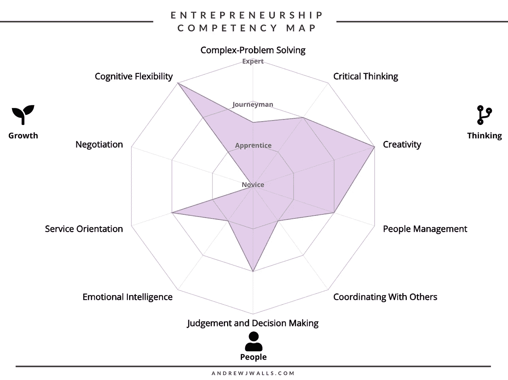

# 你准备好迎接 2020 年的就业市场了吗？使用此工具进行检查。

> 原文：<https://medium.com/swlh/are-you-prepared-for-the-job-marketplace-of-2020-check-using-this-tool-9f3295dc6dc7>

几周前，我写了我有史以来最好的文章。它表现不佳(不到 5%的掌声[这篇关于设计的文章得到了](https://hackernoon.com/dieter-rams-10-principles-of-good-design-e7790cc983e9))。

**那篇文章是关于每个企业家在 2020 年竞争成功时需要发展的 10 项技能。**

但我坚信，持续创新、领导力、解决问题、同理心和以人为本的设计等创业技能是各行各业的任何人都能从中受益的。

基于这项研究，我设计了一个工具*任何人都可以使用*来评估他们对 2020 年工作市场的技能准备程度。

> 免责声明*该研究基于这些模型:O*Net 内容模型、欧盟 EntreComp 框架和具体的技能名称分别来自世界经济论坛关于该主题的报告。

How can you be the crayon that stands out?

# 介绍创业能力图

这个工具被称为蜘蛛地图。它将你对 10 种不同技能的熟练程度映射到四种熟练程度中的一种。使用这些级别，你可以确定你在三个象限之一的总体体验。

这些技能是:

1.  **复杂问题解决**
2.  **批判性思维**
3.  **创意**
4.  **人员管理**
5.  **与他人协调**
6.  **情商**
7.  **判断和决策**
8.  **服务导向**
9.  **谈判**
10.  **认知灵活性**

在这篇文章中，我将详细描述每一项技能，以及你可以用来开发每一项技能的工具列表。这是同一主题的播客。

这些技能中的每一种都有四个技能级别。

1.  新手:对某一领域或情况不熟悉或没有经验的人。
2.  **学徒:**某种实践经验或能力。
3.  **熟练工:**有能力、有经验的专业人士。
4.  专家:能够在该领域领导他人。真正的大师。

这是我填写的能力图的一个例子。

请注意，我在谈判方面完全是个新手，但我很有创造力，而且认知灵活。我擅长领导、服务导向和情商。我肯定需要一些经验，以及解决复杂问题和协调方面的指导。

注意这些技能是如何映射到三个象限的。

1.  思维技能
2.  人际技巧
3.  成长技能

根据我的测试结果，我是一个善于思考的人，与人交往的能力一般，但缺乏成长技能。这深深地代表了我是谁。通过多年的学术追求，学习哲学等，我已经成为一个熟练的思想家(无论如何不是专家，但精通)。

通过领导我的初创公司 PlantBox，我获得了一些人事管理和领导力方面的经验(在咖啡馆当了 3 年战斗工程师也有所帮助)。

然而，我的成长技能很弱。我努力保持一种成长的心态，很容易被压倒和耗尽。

这个工具的价值在于它足够灵活和灵敏，任何人都可以通过填写它并亲眼看到自己的优势和劣势来获得价值。

# 创业能力地图的含义

我看到了这张地图的 3 个潜在用例，如下所示。

1.  **自我评价:**检查自己的技能，看看自己哪里强，哪里弱。
2.  **测试他人:**员工、同事、客户。这份具体的能力地图很有价值，因为它追踪了企业家、员工和领导者在 2020 年及以后的就业市场中需要的高水平技能。
3.  **让它成为你自己的:**这个工具对你看重的技能适应性很强。也许作为销售经理，你重视沟通、协调和同理心。重新设计技能和象限，以一种更有意义的方式来评估你的员工，而不是问应聘者三个最大的弱点。

[订阅我的 Patreon](https://www.patreon.com/andrewjwalls) (每月 3 美元或以上)并获得该工具的可编辑版本，您可以使用它来映射您的技能或其他技能。或者[下载工具](https://www.andrewjwalls.com/store/product/competency-map/)的空白和填充版本。

## 更多关于创业技能和能力的阅读

*   [目标驱动的企业家精神:改变你的生活、开创你热爱的事业和改变世界所需的 10 种企业家技能](https://amzn.to/2tb1BaR)
*   [彻底的坦诚:做一个牛逼的老板，但不失去你的人性](https://amzn.to/2LSO8vX)
*   [创新者的 DNA:掌握颠覆性创新者的五项技能](https://amzn.to/2yaxeae)
*   [创造者守则:非凡企业家的六大必备技能](https://amzn.to/2la2A7u)

**想要更多？**访问我的博客 [**大胆引领**](https://www.andrewjwalls.com/blog/competency-map/) 。或者加入 100 多名读者的行列，获得 10 个故事，每周一次我最好的文章、引用、我使用的资源等等。另外，我会寄给你一个文件夹，里面装满了帮助你了解你的业务的工具。[点击这里订阅！](https://www.andrewjwalls.com/subscribe/)

评论你如何使用能力图。我希望听到一些案例，了解你们中的一些人如何从这个工具中获得价值，或者对未来工具的建议。

## 这篇文章发表在 [The Startup](https://medium.com/swlh) 上，这是 Medium 最大的创业刊物，拥有 335，210 多名读者。

## 在这里订阅接收[我们的头条新闻](http://growthsupply.com/the-startup-newsletter/)。

