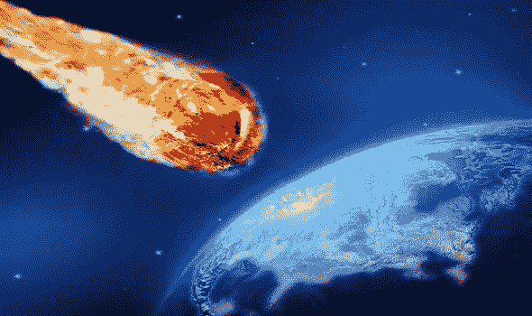

# 你准备好迎接三英里宽的星形线了吗？

> 原文：<https://medium.com/swlh/are-you-ready-for-a-three-mile-wide-astroid-66cabb26c6cb>

## 2018 年 12 月 12 日–17 日，双子座流星雨将在夜空中达到峰值。

# 今晚，2018 年 12 月 14 日；我们将会看到一场流星雨，来自小行星 3200 法厄同。