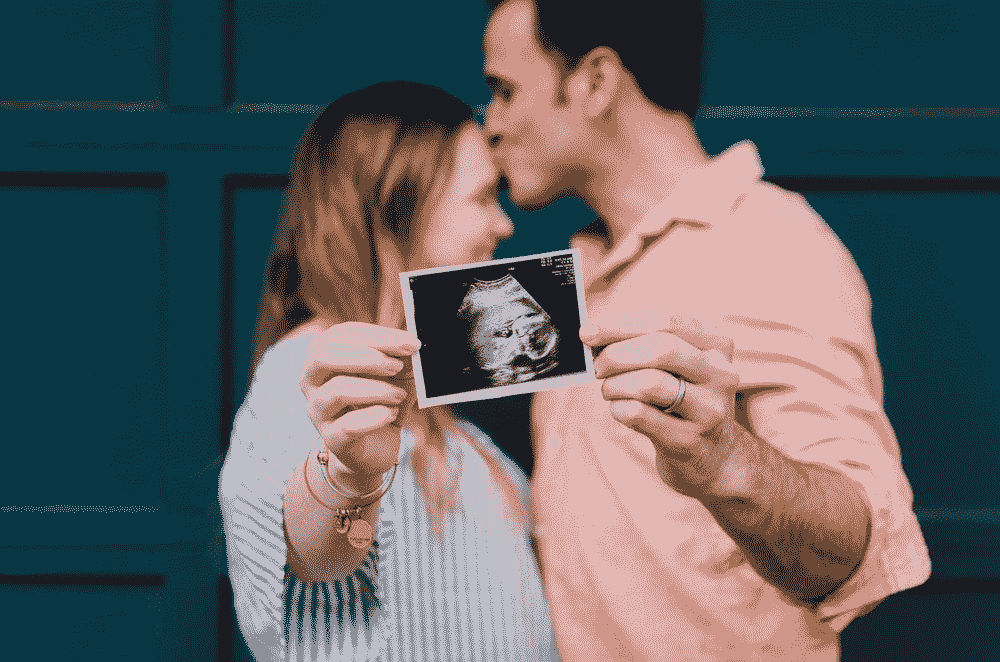

# 你认为奇迹是胡说八道是对的吗？

> 原文：<https://medium.com/swlh/are-you-right-to-think-miracles-are-bullshit-c22c54f09f50>

[Credit](https://unsplash.com/@krisroller?utm_source=medium&utm_medium=referral)

## 奇迹到底是什么？

奇迹的定义是当你生活中发生了一些你无法用任何科学或自然法则解释的事情。

对你来说，什么是奇迹？

也许是一生的慢性疼痛在一瞬间就消失了。

也许这是一生的压力消失时，你认为你不能承受更多。

好吧，让我告诉你一件事，这一切都是**可能的**。

你决定告诉自己一个不同的故事的那一天就是开始。

当你想到治疗可能正在房间里进行的时候，那些症状就会消失。

这与**神**的力量无关。
这只是关于**你、**作为人类的力量。

所以这是真的，这就是奇迹。

你可以称之为**觉知**。我会说:**自我意识**。

> “意识先于选择。选择先于结果。”
> - [罗宾·夏尔马](https://en.wikipedia.org/wiki/Robin_Sharma)

我也可以说，此时此刻，你在这里阅读这篇文章，这是另一个奇迹。

事实是你现在正在阅读这个，而不是你是另一个人，是 DNA 的另一种排列。

你应该意识到这一点。

你存在的机会有多大？

为了让你的父母生下你，你父亲的 12 万亿个精子中的一个必须与你母亲的千分之一的卵子相遇。

那些机会是什么？

意识到这些细节非常重要。

它有助于你正确看待事物。

那只是你父母生了你。

[Credit](https://unsplash.com/photos/IE8KfewAp-w)

我们也可以把它分解开来，从每一代人的几率增加到你 T21 的几率。

不可否认的是，你处在你自己完美的、完整的祖先链的一端，这个链条从你开始，一直追溯到 70 亿年前地球诞生的第一个细胞有机体。

这是一个奇迹。

## 你是一个奇迹

从现在起，你应该珍惜这些事实，保持自我意识。

每当你觉得自己不是很幸运的时候。

每当你觉得自己不够好的时候。

这是给你的唯一的生命和唯一的身体。

开始给自己讲一个不同的故事。

三、二、一…行动！

意识到这一点，它会帮助你变得更友善。

有自我意识，它会帮助你善待自己。因此对其他人也一样，因为我们都在这样做。

我们都在告诉自己那些没有多大帮助的故事。我们每个人在某个时候都会这样做。

这就是为什么你每天都需要保持自我意识。

当然，当你不得不去上学或工作时，或者当你只是想继续你的生活时，你会很难记起你的机会。

这就是为什么把自己交给**积极的人**很重要。
家庭成员、朋友、导师或教练。

身边有人提醒你让时间停止无疑是很重要的。

这样你就可以轻松的**回到现在的时刻。**自我意识到你如何对待自己，意识到你对待周围人的方式。

只有意识到当下，才有力量变得丰富多彩，充满活力，就像这是你的第一次一样。或者是你最后一次。

> “一个不再存在渴望和渴望的人；你怎么能追踪觉醒的人，没有轨迹，没有限制的范围。”
> -佛陀

## 保持警惕，保持警惕。

## 三二一…开拍！

[FREE coaching session HERE](http://nickbnns.com)

 [## 为什么我会免费蔻驰你？

### 当正常价格是 1497 美元。

medium.com](/@nicolasserial/why-do-i-coach-for-free-2073574d383d)  [## 从服务员到赢家

### 我的第一篇媒体文章，献给某个特别的人

medium.com](/@nicolasserial/from-waiter-to-winner-d9d14a7b125f)  [## 癌症杀死了我爸爸

### 我怎么能原谅它呢？

medium.com](/@nicolasserial/have-you-lost-a-close-one-to-cancer-too-df46fe67557c) 

## 这篇文章发表在 [The Startup](https://medium.com/swlh) 上，这是 Medium 最大的创业刊物，有+383，719 人关注。

## 在这里订阅接收[我们的头条新闻](http://growthsupply.com/the-startup-newsletter/)。

