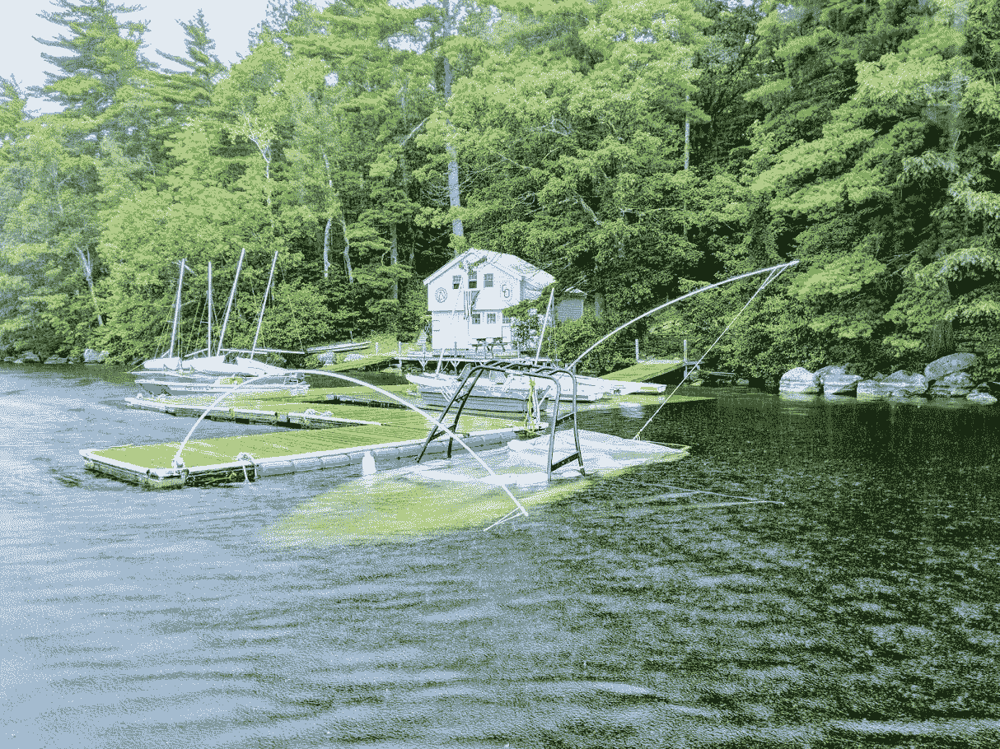
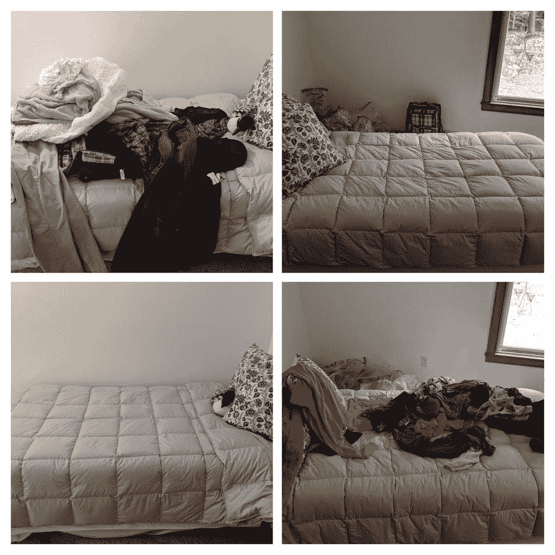
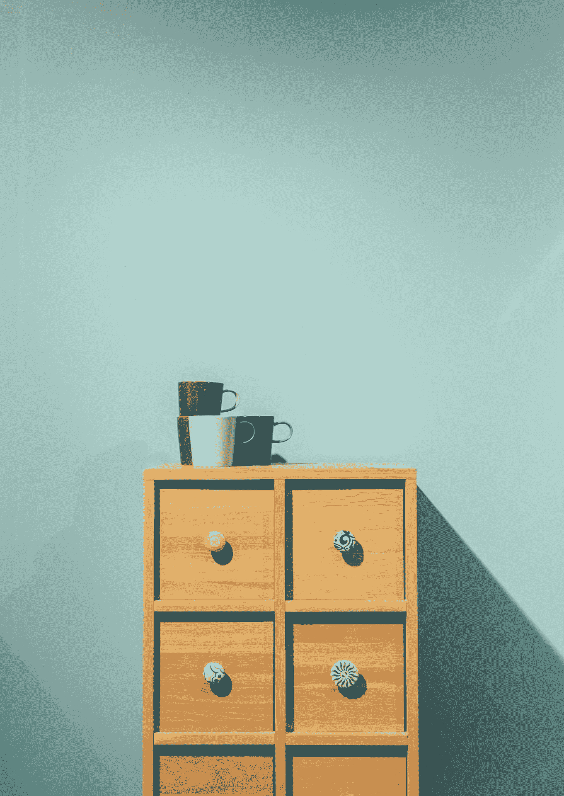

# 你是否跳过了从生活中得到你想要的东西的重要一步？

> 原文：<https://medium.com/swlh/are-you-skipping-this-vital-step-to-getting-what-you-want-from-life-76038f336b78>

能量泄漏会让你的船下沉

更多的快乐，更有利可图的生意，丰富的人际关系，升职，更好的健康…我们几乎总是在寻找某样东西。

宇宙是**丰富的**。我们需要的东西并不缺乏。

那么，为什么我们有时很难从生活中得到我们想要的东西呢？

在这篇文章中，我不打算写目标设定或吸引力法则。你可以通过**链接**阅读这些内容，我将在本文末尾发布

在这篇文章中，我将告诉你一些你可能忽略的事情。一些重要的事情阻碍了你实现自己的愿望。

# 都是你生活中的小能量泄漏。

能量泄漏是小事情，比如一堆需要折叠的衣服，你桌子上的一堆纸，一个有数百封邮件的收件箱，一些需要修理的坏东西。

你明白了。

单个来看，它们似乎都是小事，但是如果你认为一个小漏洞不会弄沉一艘船，那就再想想吧。

一周前，这艘价值 50，000 美元的滑雪船因为两个螺丝从鳍盒中掉出而沉没。两个小螺丝。

# 导致能量泄漏的不仅仅是物理上的东西。**无人问津**情感需求或行为习惯也是泄密。

按下暂停键，避免道歉，欠别人钱，心怀怨恨，进行艰难的谈话，迟到…

所有这些**松散的****导致我们的能量、注意力和情绪的微小流失。**

** [## 了结你的琐事会让你快乐

### 如果你被要做的决定、未完成的项目和未承诺的事情所困扰，就很难放松和快乐…

theascent.pub](https://theascent.pub/tying-up-your-loose-ends-will-make-you-happy-55470de2adb5) 

它们是需要完成的任务，它们不断要求我们的注意力，即使只是在潜意识领域。

人类的大脑一次只能专注于一件事情，杂乱和未完成的事情总是吸引注意力。

> “如果你有债务，我敢打赌，一般杂乱也是你的一个问题。”—苏茜·欧曼

# 你能堵住哪些能量漏洞？

让我们从简单的开始。挑一个你能马上堵住的物理漏洞。它应该只需要大约 10 分钟。

我有一个习惯，就是在最终叠衣服之前，让干净的衣服堆在一起几天。

我没有一张，而是两张铺着衣服的床。

这是我今天做的事情。

是的，这看起来像是一小步，但是还记得那艘因为 2 个小螺丝掉了而导致**沉没**的船吗？

# 是时候把事情搞清楚了。清除物质环境，才能有一个清晰的精神环境。

极简主义很流行，所以清理掉我不需要和不用的东西变得更加容易。

**我用两种方法清理我的环境。**

1.  **压实**
2.  **吹扫**

压缩意味着我用尽所有的东西。办公用品、美容产品、罐装和盒装食品、纸制品……应有尽有。

前提是，如果我不是**越来越多的往我的空间里倒**的话，我的空间会逐渐空出来。

我没有囤积，而是用光了。我不会买更多的东西，直到我用完我所有的东西，我只买我需要的东西。

当我用尽我能使用的东西时，我会清理掉我不需要或不用的东西。

我尽我所能给予他人，这种感觉很好。我宁愿把一些有用的东西传递给可以使用它的人，而不是让自己成为另一个试图卖掉它的待办任务。

如果你对此感到不舒服，卖掉你不用的东西，享受一些意外的收入。

拥有不会溢出的壁橱、橱柜和抽屉让人感觉既轻盈又自由。这是**和平**。

因为我能找到我需要的东西，所以我受挫的机会就少了。

> “当我们清除生活中的物质垃圾时，我们实际上是在为灵感和‘良好、有序的方向’让路。”—朱莉娅·卡梅伦

# 腾出空间来吸引你想要的东西进入你的生活。

猜猜我单身准备去见梦中情人的时候做了什么？

我确保我一半的车库和一半的壁橱里有空间给他。

我在身体上为他进入我的生活创造了空间，他做到了。

这就是你如何向宇宙展示你真正想要的，你所说的你想要的。

# 总结:

未完成的工作和混乱的环境是能量的泄露。

从简单的事情开始，堵住漏洞。

奖金！养成一个小小的习惯会让你达到更大的目标。

在下面的评论区贴上你的前后照片！

在我离开之前，这里有一些我承诺过的关于目标设定和吸引力法则的帖子:

 [## 我第一次测试吸引力法则时，我吓坏了

### 那东西有用

medium.com](/change-your-mind/the-first-time-i-tested-the-law-of-attraction-it-freaked-me-the-h-ll-out-328baeef28e6)  [## 如何不犯和我一样的目标设定错误

### 猜猜谁有时在设定和达成目标上有困难？

medium.com](/swlh/how-to-not-make-the-same-goal-setting-mistakes-i-made-617f6bbb3649) 

***好奇人生教练？*** [***看看跟我单挑是什么感觉***](http://christinebradstreet.com/one-on-one-coaching.html) ***。***

***我做了一个掌握幸福的 5 天指南，免费送给你！*** [***点击此处免费获取指南***](https://app.convertkit.com/landing_pages/402665?v=7) ***。***

## 这个故事发表在 [The Startup](https://medium.com/swlh) 上，这是 Medium 最大的企业家出版物，拥有 358，974+人。

## 在这里订阅接收[我们的头条新闻](http://growthsupply.com/the-startup-newsletter/)。

**