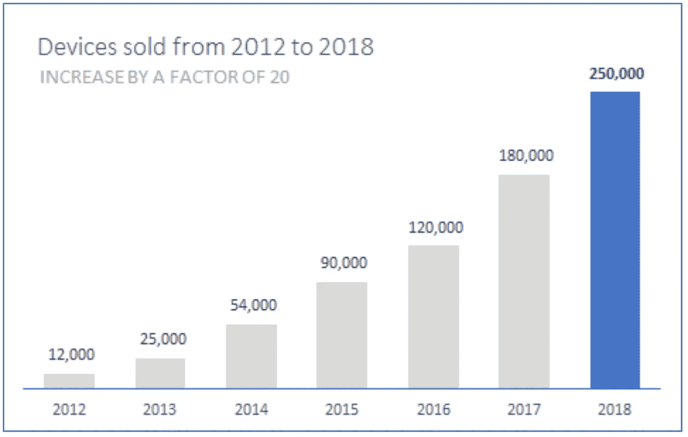

# 你在展示数据时还会犯这 4 个错误吗？

> 原文：<https://medium.com/swlh/are-you-still-making-these-4-mistakes-when-you-are-presenting-data-8644e2ad5fb6>

Photo by [Chris Liverani](https://unsplash.com/@chrisliverani?utm_source=medium&utm_medium=referral) on [Unsplash](https://unsplash.com?utm_source=medium&utm_medium=referral)

可视化您的数据仍然是更有效沟通的最佳方式之一。然而，我们从来没有完全学会如何建立有效的可视化。办公软件正在帮助制作这些图表，但是用户很少知道如何真正地可视化来支持她的陈述。我想分享一些我仍然会遇到的错误。这些没有特定的顺序。

## 第一:在不需要的时候使用数据可视化

你如何决定何时使用可视化？

> 在某些情况下，使用图表或图形将一些数据显示在屏幕上是多余的。阅读任何图表都比阅读一个句子需要更长的时间。

你的眼睛移动得更多，试图获得概述和背景，详细的信息和关系，信息和推断。所有这些都发生在短时间内，但与阅读一个句子相比，需要更多的脑力劳动。但是如果一个句子包含相同的信息呢？

一个典型的公司演示可能包含二十、五十、一百张幻灯片。如果我们可以用简单的句子来代替一些图表，跟随所有幻灯片的努力就会减少。更少的脑力劳动意味着更多的注意力——如果听众不必解读图表，他们就能更好地专注于演讲。

Do you really need a visualization for something simple?

如果您只想分享一些数字，请考虑完全跳过数据可视化。相反，将数字本身作为文本呈现。您可以使用粗体和大字体突出显示语句。

Much more memorable!

## 第二:使用太多数据

您已经收集了大量数据，现在您想要展示这些数据。您可以在一个图表中绘制所有值，将它们堆叠、分层、相加。但这真的是展示数据的最佳方式吗？有时候，我们遗漏了收集数据和交流数据之间的一个关键步骤。我们已经解释了数据并从中得出了结论。现在，我们只想展示这些洞见。这意味着所有对洞察不重要的数据都可以从可视化中删除。

Chart ALL THE DATA! [http://journals.plos.org/plosone/article?id=10.1371/journal.pone.0122624](http://journals.plos.org/plosone/article?id=10.1371/journal.pone.0122624)

一方面突出重要数据，另一方面主动隐瞒非支持性数据，这是一条微妙的界线。

> 理想情况下，您可以通过讲义提供所有数据——不是您展示的幻灯片，而是您在合适的表格或几个可视化视图中收集的其余信息。

讲义非常有用，因为它们与时间无关，读者可以花时间细读和理解所写的内容。在你的陈述中，把重点放在对阐述你的观点重要的数据上。

> 提前筛选，选择，得出结论。

一个比喻可以是一个新闻主播:在你报道的地区有大量的事件发生。你会继续阅读已经发生的所有事情的列表，或者显示所有事件的地图吗？

在你 15 分钟的新闻谈话中，你需要筛选出最重要的事件，并为观众总结出来。你作为数据展示者的工作是一样的:成为你收集的数据的新闻主播。

## 第三:使用不必要的效果

在您选择了适当的数据之后，您正在绘制图表。不幸的是，典型办公软件中的默认图表类型经常充满了“图表垃圾”。有许多视觉元素对图表的信息没有贡献。

深呼吸，把他们踢出去。

It looks professional, but can you really tell what the chart is saying? [https://www.cycloneinteractive.com/our-work/emc-digital-universe/](https://www.cycloneinteractive.com/our-work/emc-digital-universe/)

有些元素本来就不应该出现在图表中。它们会破坏图表的可读性。如果你的图表看起来“无聊”，这是一件好事。

> 制图中最没用的效果就是 3D。不管在哪里使用它，它都会引入额外的图形元素，分散对数据的注意力。

我认为所有的图表背景都应该是完全白色的:不再有颜色渐变或图像。

Image in the background, borders, shadows, no data points. Readablity = 0\. [https://www.flickr.com/photos/norbury/25720739157/in/dateposted-public/](https://www.flickr.com/photos/norbury/25720739157/in/dateposted-public/)

在大多数情况下，您的数据不需要边框-当条形、点和线只有一种颜色时，它们是最好的！

如果可以，总是直接标注你的点，然后减少网格线和轴。他们充其量是向导，不应该在同一个视觉层面上竞争。

Cole Nussbaumer Knaflic 的《用数据讲故事》这本书很棒，里面有很多关于如何整理图表的技巧和教程。

## 4:不突出显示消息

即使你已经复习了你的可视化，并且只在有意义的地方使用它们，你也可能错过了一个关键点:突出一个信息。你可能已经学会了“让数据自己说话”，但这只适用于探索数据。在演示中，数据不能自己说话，你需要给它一个声音。不要害怕强调你的见解或添加评论。毕竟，你是数据方面的专家，你是展示你所发现的东西的人。你的听众看幻灯片的兴趣不是寻找新的见解，他们想听到和看到你发现了什么。

Highlight and emphasize.

这是我在演讲、推销和谈话中遇到的最常见的错误。在我的文章 [***中阅读更多关于制作更好的图表的信息“一个想法将立即改善你的数据可视化”。***](/swlh/the-single-idea-that-will-instantly-improve-your-data-visualizations-66f60067108a)

*感谢阅读。如果您觉得这很有用，请单击鼓掌按钮，这样其他人也可以找到这篇文章。*

## 这篇文章发表在 [The Startup](https://medium.com/swlh) 上，这是 Medium 最大的创业刊物，有 303，461+人关注。

## 在这里订阅接收[我们的头条新闻](http://growthsupply.com/the-startup-newsletter/)。

