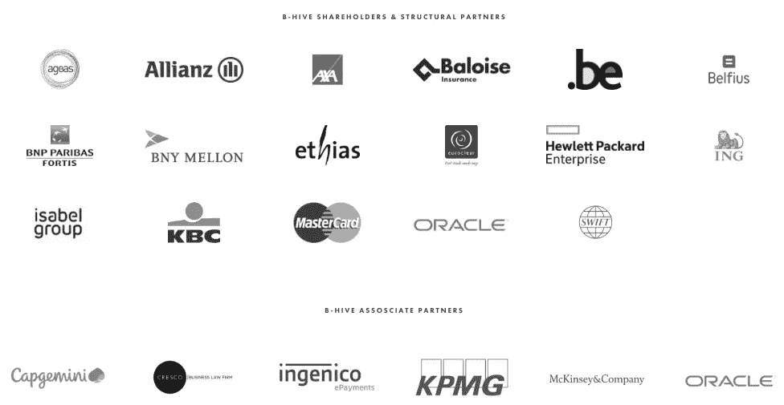
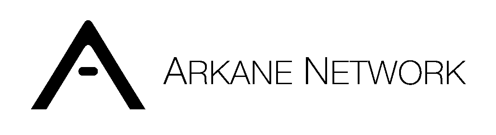

# Arkane 加入 B-Hive 连接金融科技点

> 原文：<https://medium.com/swlh/arkane-joins-b-hive-to-connect-fintech-dots-2cbb4e8f1ffa>

## 加入 B-Hive

我们很自豪地正式宣布我们的 B-Hive 会员资格！

区块链将在金融科技中发挥重要作用，我们的 Arkane APIs 使初创公司、规模扩大公司和企业能够在其当前服务中采用区块链技术，而无需深入了解底层区块链技术。

我们将于 12 月 6 日参加[我们在布鲁塞尔的首次 Fin & Tonic 活动，聆听并学习我们如何为 B-Hive 及其合作伙伴增加价值。](https://b-hive.eu/event/2018/10/25/bxl-fin-and-tonic-cloud)

## 关于 B-Hive

B-Hive 是一个欧洲合作创新金融科技平台，汇集了主要银行、保险公司和市场基础设施参与者。他们致力于[共同创新计划](https://b-hive.eu/programs-overview)，并在[企业合作伙伴](https://b-hive.eu/partners)和[创业和扩大社区成员](https://b-hive.eu/members)之间搭建桥梁。

## 这篇文章发表在 [The Startup](https://medium.com/swlh) 上，这是 Medium 最大的创业刊物，拥有+395，714 名读者。

## 在此订阅接收[我们的头条新闻](http://growthsupply.com/the-startup-newsletter/)。

