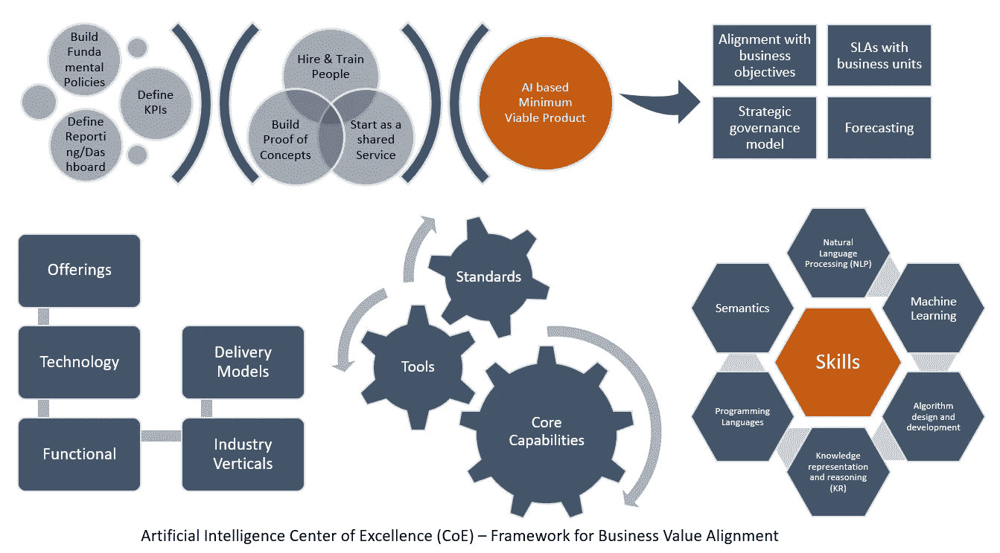
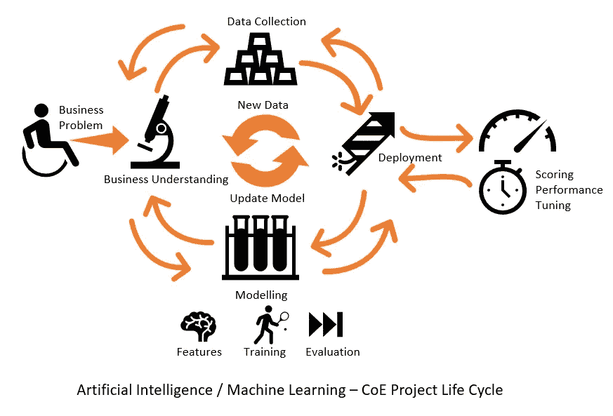

# 如何在你的组织中建立一个人工智能卓越中心？

> 原文：<https://medium.com/swlh/artificial-intelligence-center-of-excellence-aicoe-2fa1800ec83e>

Photo by [Venveo](https://unsplash.com/photos/qY9zgRqmNtA?utm_source=unsplash&utm_medium=referral&utm_content=creditCopyText) on [Unsplash](https://unsplash.com/search/photos/work?utm_source=unsplash&utm_medium=referral&utm_content=creditCopyText)

利用人工智能的潜力作为数字化转型战略的一部分，将是创造未来智能企业的关键组成部分。人工智能已经开始在帮助企业重新想象其产品和服务、推动收入、实现业务效率和丰富客户体验方面发挥重要作用。

吴恩达是人工智能界最知名的名字之一。他是百度的首席科学家。安德鲁在山景城时组建了谷歌大脑深度学习人工智能系统。有一次他[表示](http://fortune.com/2016/10/05/ai-artificial-intelligence-deep-learning-employers/) : -

> 过去，许多标准普尔 500 的首席执行官希望他们能比他们更早开始思考他们的互联网战略。我认为五年后会有很多标准普尔 500 的首席执行官希望他们能早点开始思考他们的人工智能战略。

但是你如何在你的组织中开始人工智能相关的计划呢？会解决什么问题？请继续关注我，因为在本文中，我们将讨论这些内容。

# 为什么您的组织需要一个人工智能 COE？

在你的组织中使用人工智能似乎没有立竿见影的优势，你可能会犹豫并问，“是否有一个人工智能解决方案来解决每个商业问题？”。就像十年前的互联网革命一样，人工智能不再是可有可无的了。任何延迟都是危险的，如果你想让你的组织再生存十年，你需要从今天开始拥抱人工智能。我们已经知道算法正在统治世界— [从分拣黄瓜到治疗癌症](https://chatbotslife.com/from-sorting-cucumbers-to-curing-cancer-machine-learning-algorithms-will-do-everything-689161cbd4fb)基于人工智能的算法正在做任何事情

考虑到这一点，让我们把注意力转向今天的组织如何在一个可以扩展到整个组织的小团队中启动人工智能计划。但是，有没有适合所有解决方案的尺寸？中小型公司——他们能忽视人工智能吗？如果不是，那么他们如何启动人工智能卓越中心？无论你如何看待人工智能，但与全球化新模式相关的最新技术发展正威胁着创造一个新的明天——迫使企业重新想象他们的产品和服务，实现商业效率，并将客户体验提升到一个完全不同的水平。

你需要发展一个有灵感、有才华的团队，在你的组织中主动开发人工智能系统。这将需要高管的支持，捕捉可以展示价值观的基准——所有这些都专注于组织的需求，让你推动人工智能倡议从概念化到实施

# 人工智能卓越中心战略

你需要引入以研究为导向的技术专业知识，并建立一个能够催化深度技术生态系统增长的平台，并为数据科学和人工智能领域的创新提供刺激。

这个新团队应该像外部单位的扩展团队一样运作，通过扩大围绕人工智能技术构建的现有/新产品/项目活动来实现卓越。

从价值创造到价值实现，这个新的 AI COE 应该通过试验新兴技术，交付具有原创思想的最小可行产品( **MVP** )。让 COE 为其在组织中的成功做好准备的一个关键步骤是构建具有长远观点的原型，并增强生态系统和合作伙伴关系，以促进有目的的人工智能

任何新企业都必须协调好**人员**、**流程**和**技术**才能胜任和全面。这三个组成部分是成功实现组织转型的关键步骤

高管支持:高级管理人员在组织中发挥着重要作用，需要他们的有效支持，这样你才能改善整个组织的协作。这将有利于你在战略重点上保持一致。一旦你获得了他们的承诺，赞助商就可以作为一个升级点——但要明确你不会让他们参与日常的战术问题

**找到合适的团队**:这可能是你最大的麻烦。让员工掌握正确的技能可能会成就或破坏您的卓越中心战略计划。你如何找到这些人？内部招聘或外部招聘，您所在 COE 区域的本地员工或来自其他国家办事处的移动/远程员工

**捕捉可以展示价值的基准:**如果你不能衡量它，你就不能管理它。您的领导层希望看到可衡量的进展，您需要一个仪表板来表示内部绩效。使其透明和全面。

**找到正确的问题**:无论是您的组织内部问题还是客户使用案例，您都需要研究多次发布。在你着手建立一个人工智能平台之前，你需要一个设计思维。与销售人员交谈，采访客户，了解他们的业务痛点，这些痛点可以通过采用人工智能来解决。需要彻底调查问题，以便您可以应用正确的人工智能工具来解决问题，并提出 COE 价值主张，即使是在早期试点项目中。

**利用数据解决 it 问题**:数据可用性和数据质量非常重要。人工智能为数据的重要性提供了完全不同的含义。因此，数据的收集、分发和验证是制定涉及人工智能的解决方案的重要问题

**建立一个可重复的人工智能解决方案**:一个可重复的解决方案，可以提供给公司的其他人，也可以营销给客户，为企业带来价值。适用于不同情况的模板方法总是受欢迎的。卓越中心的领导者需要与众多产品所有者、设计师、业务分析师合作，构建横向或行业特定的解决方案

# 挑战 1:建立团队

找到拥有合适技能的合适人才可能是你最突出和最严峻的挑战。您当前的技术领导者和团队成员可能会发现自己处于困境。你从哪里开始？你如何获得人工智能技能？

人工智能、机器学习、数据科学和编程，拥有这些技能的人需要与领域/行业专家一起工作，因为人工智能方法不仅仅是技术功能。招募和留住人工智能人才可能是一场噩梦，这种情况可能会持续数月。你需要让人力资源部门参与寻找拥有人工智能技能的人，并说服执行发起人，否则你的业务将面临被落在后面的风险。

你可能会发现，对你目前思想开放的技术团队进行[再培训](https://futuremonger.com/artificial-intelligence-career-transtion-strategy-65de81fabc4b)可能是一个有价值的选择，所以鼓励他们[参加各种关于人工智能和机器学习的课程](https://futuremonger.com/artificial-intelligence-learning-phd-or-mooc-selflearning-458059725421)。为您的内部 COE 成员提供学习和研究平台，为现有和新项目提供新的 AI 工具和测试平台，所有这些都需要在研究工作和运营/组织技能方面进行相当认真的思考。

选择那些拥有交叉技能、多种技能以及沟通、创造力和多面性等非技术技能的人。如果你想将你的人工智能组合扩展到概念验证和沙盒实现之外，你将需要真正的人工智能专家，而这些技能是有代价的。

不仅需要新的人工智能技能，还需要组织层面的行为变化，不仅需要商业知识和技术创新，还需要人类的洞察力来引入产品和功能，以制定高度成功的长期战略

# 挑战 2:让数据具有可操作性

许多公司没有意识到，如果管理得当，他们坐在一堆数据上可能是一座虚拟的金矿。另一方面，缺乏高质量的数据可能会让你花一大笔钱，如果你想得到它固定。但是，您的组织拥有的大部分数据可能并不都是坏的，但是它无法解决您的问题。拥有高质量的数据需要构建高效的数据策略和强大的数据管理基础设施。您的客户、合作伙伴、员工和品牌大使—数据无处不在。如何从数据中获取见解和情报，从而使数据具有可操作性，这取决于您。

缺乏高质量的数据可能会阻碍你的人工智能项目，因为机器学习算法需要大量的数据。因此，如果您想为您的组织编写一个全新的数据策略，请毫不犹豫地投入必要的努力。

AI-COE Project Lifecycle

*   确定各种类型的可用数据；它的意义，位置，起源和结构。
*   如何存储、分析、处理和保护数据。
*   如何将各种数据打包以便重用？实施什么策略来实现有效的数据治理？

一旦做了，就不要认为已经做了。使数据审查和测量成为一个持续的过程。你的数据策略是你的人工智能项目的路线图和关键组成部分。与以往任何时候相比，您管理数据的能力可能是公司成功的一个更重要的因素。

# 现在交给你了

从你所拥有的开始。创建构建最佳实践，让您的团队接受人工智能技能培训，并与他人合作，在给定正确数据集的情况下，为试点问题构建最小可行的产品。如果你不想投资硬件和许可证，请使用 AWS，Google 或 Azure 基于云的 AI 堆栈。你需要投入时间和金钱雇佣有技能的资源，并让你当前的团队继续学习新技能。

因此，尝试旧的管理建议启动 COE 不会削减它，你的方法必须是独特的和人工智能计划的战略。建立“人工智能优先”的文化或“人工智能优先”的政策可能非常具有挑战性，但你需要立即开始通过人工智能的镜头来审视你组织的现有产品和服务。你需要开始建立良好的数据策略，创建独特的数据集，这样你就为一个防失败的人工智能卓越中心做好了准备。

## 这篇文章发表在《创业公司》杂志上，这是 Medium 最大的创业刊物，有 320，131+人关注。

## 订阅接收[我们的头条](http://growthsupply.com/the-startup-newsletter/)。

