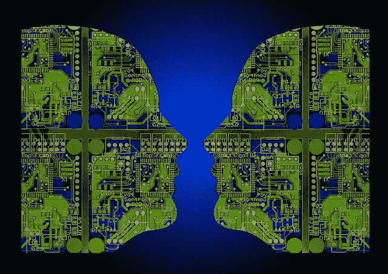

# 人工智能&巴别塔

> 原文：<https://medium.com/swlh/artificial-intelligence-the-tower-of-babel-97f7056d355>

Picture Source: Many Wonderful Artists via Creative Commons

在 20 世纪 80 年代，有一个叫《霹雳游侠》的节目。简直酷毙了。这场秀的大明星是这辆车，凯特，我对大卫·哈塞尔霍夫表示敬意。一台有自我意识的超级计算机，开着一辆时髦的黑色 trans-am。还有一块手表，车主迈克尔·奈特可以通过它与汽车通话。

2017 年，我们有了一块可以说话、发送信息的手表，它可以读取我们的血压和每天的步数。我们正处于人工智能自动驾驶汽车的边缘。

数字革命正在飞速发展。

令人惊讶的是，我们使用的智能手机比 20 世纪 60 年代用来载人登月的电脑还要强大。例如，普通的 iPhone 比第一台家用电脑快一百万倍。

社交媒体已经让世界变得更小、更快，改变了我们的生活方式。下一个重大进展可能是对人工智能的追求，以及对如何将人类意识转移到超级计算机上的研究。一项可能只需 20 年的技术。

但是许多人说技术正在毁灭我们。他们说我们需要停止技术进步，缩小规模，回到事情“过去”的样子。根据他们的观点，技术是我们世界许多问题的原因，并最终伤害我们。他们说我们需要限制和控制它，停止前进。

但是，这是从根本上误解了技术和人性。为了进一步理解这个问题，我们需要回到过去。

砖，和巴别塔。正如《创世纪》中所说，巴别塔的故事是关于一群人试图建造一座高耸入云的城市的故事。但不止于此。

这是一个关于**技术的故事。**

有人发明了新的东西——砖块和砂浆——这使得人们能够制造和做他们以前不能做的事情。

听起来熟悉吗？

一个强有力的领导者，尼姆罗德，本质上是在建立一个帝国，他得到了新技术，并开始用它来把自己树立为神，摧毁他所经过的每一个人和每一样东西。

同样，这可能很熟悉。

你看，技术本身没什么问题。砖块曾经是并将继续是一项伟大的发明，它以革命性的方式推动人类向前发展。没有人会否认砖块的发明是一件坏事。

但是在坏人手里呢？它开始成为一种武器。一种建立帝国的手段。伤人的工具。一种实现许多人认为从一开始就是人类目标的手段…

…努力让自己成为神。

但关键点在这里。缺陷不在于技术。

它和使用它的人在一起。

或者说，滥用它。

# 问题的核心

很明显，这方面最伟大的现代例子是互联网。它的到来让人们以一种前所未有的方式联系在一起。这为我们带来了从未有过的机会。

但是它很容易被滥用。网络流氓，在网上培养年轻人的人。骗子骗走了人们大量的钱。

所有这些弊端都有一个共同点。

它们是人类决定的结果。

不是技术。人类的决定。

虐待某人的决定是人类的决定。在推特上辱骂或培养一个年轻人是人类的决定。诈骗某人是一个人决定骗取某人钱财的行为。

人类的行为，人类的决定给其他人带来痛苦和折磨。

技术仅仅是工具。

在我们将世界上这么多的问题归咎于技术，说它正在毁灭我们的世界之前，我们必须非常小心。

毕竟，想象一下，如果砖块的发明者这么说了会怎么样？

没有建筑。没有房子。没有医院。

你看，在最好的情况下，技术推动了世界。这让它变得更好。它让我们更好、更健康、联系更紧密、受教育程度更高、拥有更多的自由和知识。它改变了我们的生活。

它给我们带来了像《霹雳游侠》这样很酷的电视节目，以及像智能手机、智能手表这样很棒的小玩意，很快还有无人驾驶汽车。

这是人类对科技的**滥用**，这是如此的灾难性。不仅仅是罪犯滥用它。是帝国建设者。

男人和女人，想让自己成为神的组织。他们想要统治、压迫和控制人民，这样他们的帝国才能繁荣昌盛。

我们都知道这些人是谁。

但事实是我们不是神。我们都没有。任何技术进步、成就或力量都不会让我们如此。

新技术的滥用最终暴露了人性的不完美。

希望，我们将开始看到这种破碎摆在我们面前。然后看到我们对恩典、怜悯、宽恕和无条件的爱和接纳的需求有多深。做技术的负责任的管理者，而不是滥用者。

我希望我们开始吸取这个教训。

在对我们任何人来说都太晚之前。

*****

如果你想要一对一的支持来帮助你创造你被创造出来的真实生活，并找到你真正的呼唤，给我发电子邮件到***james@jamesprescott.co.uk****或者去*[***www.jamesprescott.co.uk/coaching***](http://www.jamesprescott.co.uk/coaching)*我们可以安排一次聊天。*

*****

你可以在亚马逊 [**这里**](https://www.amazon.com/Mosaic-Grace-Beautiful-Reshaping-Broken/dp/0988727145/ref=sr_1_1?ie=UTF8&qid=1509840052&sr=8-1&keywords=mosaic+of+grace) 购买我的书*《恩典的马赛克:上帝对我们破碎生命的美丽重塑】*。(Kindle 或硬拷贝)

*你可以免费获得我的电子书，* ***《作家之舞:地道写作入门指南》****——在这里* *报名* [*。*](http://www.jamesprescott.co.uk)

*****

## 这个故事发表在 [The Startup](https://medium.com/swlh) 上，这里有 258，400 多人聚集在一起阅读 Medium 关于创业的主要故事。

## 在这里订阅接收[我们的头条新闻](http://growthsupply.com/the-startup-newsletter/)。

