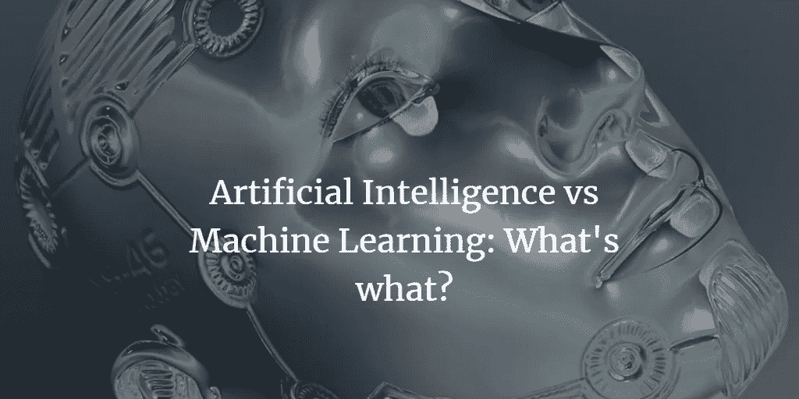
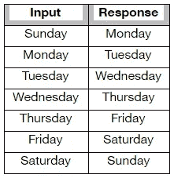

# 人工智能 vs 机器学习:什么是什么？

> 原文：<https://medium.com/swlh/artificial-intelligence-vs-machine-learning-is-it-confusing-3ace59aa0d19>

你可能听过很多人工智能(AI)和机器学习(ML)这两个词。作为一个行业人士，我也听到这些话。大多数时候，这些术语可以互换使用。虽然这两个概念不同，但它们之间有一些共同点。

在这篇文章中，我希望为你分解一下:

我们先从理解人工智能中的“人工”到底是什么意思开始。“人造的”指的是制造或生产的东西，而不是自然产生的。好吧，这是一个开始，但是“自然”指的是什么？在这个上下文中，“自然”指的是一个“人”——你和我。计算机科学领域对人类非常着迷。为什么？因为在机器内部理解和复制类似人类的智能是一项巨大的任务。几十年来，科学家们一直致力于推进这一领域的研究和实施。机器人和无人驾驶汽车是类似人类智能的一些例子，但你没有机器人打扫你的房子或为你洗衣服是有原因的(目前还没有！);至于在日常生活中使用类似人类的物体，还有很长的路要走。

所以现在我们知道机器不是人类，我们可以有把握地说:没有任何类型的智能或逻辑指令，机器是非常愚蠢的。但是他们在智力上的不足，在巨大的计算能力上得到弥补。可能需要一秒钟才能完成的计算，一台机器可以在几分之一的时间内完成 1000 次。

此外，这些机器会完全按照我们的指示去做。不多不少。除了他们被指示做的，他们不能改变行动的过程。如果我给人和机器一套 10 步指令，机器将准确地遵循这 10 步*，而如果提供的 10 步不足以产生预期的结果，人有能力通过额外的步骤进行修正。本质上，我们需要为机器提供指令，告诉它们在人类在给定环境中可能思考和行动的每一种*情况下该做什么。听起来很难？是的，你打赌它是。**

*为了理解人工智能，我们需要尝试理解人类智能是如何工作的。简而言之，人类智能如何工作有三个基本组成部分(还有其他生物和科学现象也推动人类智能的工作，但我们应该让神经科学家来解释！)*

1.  ***通过多维数据源感知***

*如果我给你一个小东西，问你它是什么，你会用眼睛去看，用手去感觉，用鼻子去闻，用耳朵去听来回忆你可能拥有的关于那个东西的任何信息。*

***2。上述步骤 1 中提到的数据集内的模式识别***

*你以前可能见过也可能没见过这个东西。你的大脑已经构建了模式，以便对你一生中遇到的成千上万的物体进行分类。如果你以前见过这个物体，模式识别技术将帮助你*识别/预测*这个物体是什么。如果您以前从未见过这种类型的对象，您可能根本无法识别它，或者可能会识别错误。*

***3。在给定背景下做出决策***

*当你回忆起你在上面第二步的记忆中的学习(理解)时，逻辑论证和评估过程就开始了。作为人类，我们倾向于将事情合理化(不要告诉我的妻子！)并用我们称之为“直觉”的东西在情感上做决定*

*花一点时间，想想上面的哪些组件可以复制给 AI。事实证明，它们都很难，但第一个和第三个组件是最难复制的。在高层次上，如果所有三个组件都可以在机器中复制或接近复制，那么我们就有了一个人工智能系统，它几乎可以像人一样思考、行为和行动，这取决于所有三个组件的实现程度。作为一个思考练习，上面阐述的三个组成部分如何应用于一辆必须驶出车库、驶出车道、驶上街道的无人驾驶汽车？？请在下面分享您的回答。*

***机器学习:***

*让我声明，机器学习并不等同于人工智能，而是人工智能的一个重要组成部分。为此，机器学习实际上是围绕上一节的第二个组成部分:模式识别。机器学习有助于识别数据集内的模式，并因此尝试基于它已学习的现有数据进行预测。*

*在我们深入研究机器学习之前，让我们回顾一下什么是人类学习，以便将其与机器学习恰当地联系起来。*

*假设我问你，“明天是星期几？”你的回答是，比如说，“周日。”花点时间思考一下从学习到获取你的回答的过程。*

*你一定在幼儿园的时候就知道一周有七天(周日-周六)。我的朋友们，那是习得的数据，储存在你们记忆的某个地方。*

*除了这些数据，你的记忆中还储存着一种模式(学习)。在这种情况下，学习是指给定的一天(输入)如何与第二天(响应)相关联。*

**

*在上表中，学习被存储为输入和响应。请注意，这种学习是非常具体的协会当天到第二天。对同一组数据可以有不同的学习来回答不同类型的问题，例如“昨天是什么日子？”*

*所以，当有人问你“明天是星期几？”您将使用当天(今天)作为输入，参考上面的学习表并找到答案。最初，你可能没有意识到你正在遵循这些步骤，但是相信我，这就是幕后发生的事情。*

*请注意，这是对人类学习的非常简化的解释，并且处理非常小的一组数据(1 个输入、1 个响应和 7 行)。在真实的业务问题中，可能有数千个输入列和数百万/数十亿行来获得响应(输出)。随着数据集的规模随着更多的输入和行(观察)而扩大，逻辑(学习)变得越来越复杂。这是对人类的挑战，也是一些好的机器学习的基础。机器学习是由数据科学家和/或机器学习工程师开发算法/模型，使计算机学习、识别模式并做出预测。*

*亚马逊的产品推荐和脸书的新闻订阅是机器学习的两个很好的例子。在脸书的例子中，当某人经常阅读或喜欢某个帖子时，他/她会在未来看到这个特定朋友的更多活动。在幕后，您的导航数据被捕获和存储。机器学习算法能够从人类提供的这些模式或人类信号中学习。发现模式的技术被称为算法或模型。为了简单起见，我们将这个讨论集中在模式识别上，但是机器学习不仅仅局限于模式识别；它还可以基于几个输入和响应(输出)变量之间关系的自动发现来预测(预报)输出值。*

*在以后的文章中，希望能讲解更多人工智能和机器学习方面的技术概念。*

**

## *这个故事发表在 [The Startup](https://medium.com/swlh) 上，这是 Medium 最大的创业刊物，有 295，232+人关注。*

## *订阅接收[我们的头条](http://growthsupply.com/the-startup-newsletter/)。*

**