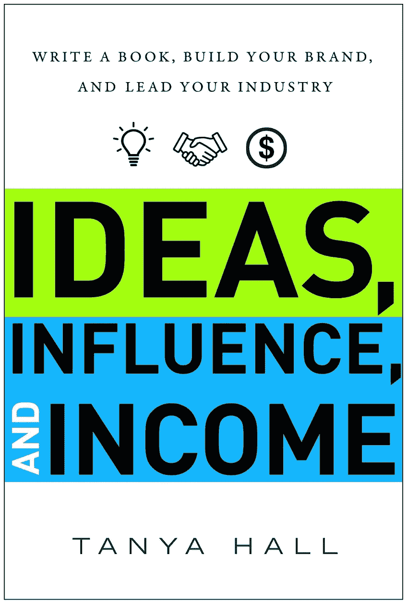

# 作为首席执行官，你不必——也不应该——成为所有方面的专家:塔尼娅·霍尔的创业课程

> 原文：<https://medium.com/swlh/as-ceo-you-dont-have-to-be-and-you-shouldn-t-be-the-expert-at-everything-startup-lessons-d7aa8c899904>

> 我有幸采访了坦尼娅·霍尔。自 2004 年加入格林立夫图书集团以来，Tanya 一直致力于让作者讲述他们的故事。作为公司的首席执行官，Tanya 培养了一种以创造新机会更好地为作者服务为中心的创新文化。
> 
> 作为第一家混合出版商，green leaf Book Group 20 年来一直处于创新出版的前沿，并在满足作者需求方面继续发展，从一家图书分销商转变为一家提供全方位服务的出版社，现在包括一个作者品牌部门。
> 
> 坦尼娅亲身经历了一本书的力量如何通过强大的作者品牌而被放大——反过来，品牌又如何被一本书放大。她定期为[Inc.com](http://inc.com/)撰写关于个人品牌、领导力和出版业的文章，并主持播客*出版*，引导作者了解出版的所有领域。她经常在出版行业发表演讲和写作，这样潜在的作者将对这个行业以及如何在这个行业取得成功有一个清晰的了解。
> 
> 在加入出版业之前，Tanya 从事数字媒体工作，并担任 *Extra* 的电视制作人！还有 E！娱乐电视。她和两个女儿以及一屋子的动物住在奥斯汀。

## 你能分享一下你开始领导公司以来，发生在你身上最搞笑或最有趣的故事吗？

成为首席执行官以来，最有趣的事情是接受我自己的领导风格，而不是总是指责自己不是其他“类型”的首席执行官。我在队伍中一路向上，所以我很幸运从一开始就得到团队的认可…但一开始我觉得自己有点像个骗子。一旦我年复一年地为我们公司创造记录，这种感觉就消失了。

## 你认为是什么让你的公司脱颖而出？可以分享一个故事吗？

格林立夫图书集团是第一家混合出版商，我们是我所知道的唯一一家内部发行的混合出版商。我们介于自助出版和传统出版之间，为想要自助出版的所有权、控制权和版税收益以及传统纽约出版社的质量和发行实力的作者带来了一个急需的选择。

精明的作者明白他们的书是一个更大的品牌的一部分，所以他们有最大的灵活性来货币化他们的知识产权。例如，乔·克罗斯拍摄了突破性的纪录片*肥胖、患病和濒临死亡*……然后(聪明地)想通过书籍、演讲、产品合作等方式迅速利用这部电影的成功。他放弃了传统的出版交易，与我们签约，因为我们的模式将版权的所有权转移回作者，并更容易通过多种形式为读者服务，而无需跳过漏洞或合同障碍。他的书**用乔汁饮食*重新启动成为我们*纽约时报*的畅销书之一。*

## *你会给其他首席执行官或创始人什么建议来帮助他们的员工茁壮成长？*

*让您的愿景与运营保持一致。太多时候，员工听到 CEO 在演讲台上谈论愿景，但他们不知道他们的工作如何有助于实现这一愿景。作为首席执行官，我做的第一件事就是与每个部门合作，使他们与我的业务优先事项保持一致，将这些优先事项分为四个主要关注领域，并让各部门制定季度计划，说明他们如何为每个领域做出贡献。这有助于在公司的各个层面建立责任感和使命感。*

## *没有人能够在前进的道路上获得成功。有没有一个特别让你感激的人帮助你走到了今天？*

*我的父母。他们教育我强调强烈的职业道德，总是付出 100%的努力，同时也知道何时止损出局。*

## *你如何利用你的成功为世界带来好处？*

*我工作中最棒的一点是，我们公司每天都致力于将作者的信息和故事传播给全世界。这是一项非常值得的工作，尤其是当你能够为那些毕生致力于支持充满激情的事业的被忽视的声音辩护时。*

## *你的“我希望在成为 CEO 之前有人告诉我的 5 件事”是什么，为什么？*

***1。当你成为 CEO 的那一刻，你的笑话突然变得 100%有趣。***

*也就是说，你冒着生活在象牙塔里的风险，因为无论你多么平易近人，有些人都会以某种方式回应那些有权有势的人。*

*采取让所有员工都有机会提出创新、挫折和挑战的做法，对于确保与公司各个层面建立强大、开放的联系至关重要。*

***2。你不必——也不应该——成为所有事情的专家。发挥你的优势，雇佣一个优秀的团队来填补你的空白。***

*由于我没有接受过正式的金融培训，我想我可能需要攻读一个额外的学位来巩固我在这个领域的资历。说真的，我是电影专业的。后来我意识到，我只需要上几堂课，熟悉基本的财务报告，就能跟上这些对话。我给公司带来的真正价值是促进增长，这应该是我的主要关注点。*

***3。高处不胜寒是真的。和支持你的同龄人在一起。***

*一旦你成为首席执行官，与你的同事一起同情公司无能管理的日子就结束了。有很多事情你不能和你的团队讨论。在你的人际关系中，总是抱怨工作也是一种负担。YPO(青年专业人员组织)在这方面给了我很大的帮助，因为它让我有机会接触一群同龄人，他们可以联系我并就我的挑战提出建议，对保密性有共同的理解。*

***4。作为首席执行官，你真的必须对你的公司和工作有不懈的奉献，否则你会累垮的。***

*我意识到我很幸运能经营一家出版公司——在工作中很容易找到目的和意义，以支持作者为世界带来新的想法。即便如此，作为首席执行官，通常没有人会在你之上鼓励你，拍拍你的背，鼓励你的下一个重大创新，等等。它必须来自内心深处。*

*作为首席执行官，你要对所有事情负责……好的，坏的，在你任期前所做决定的结果，你的供应商所做的影响你但不在你控制范围内的事情——所有的事情。如果你真的不在乎你的工作，完全掌控自己的角色会耗尽你的生命。*

***5。给自己留点时间。你需要保持专注和精力充沛，不管是什么情况。***

*当我开始担任首席执行官时，我认为我必须立即把我的午餐时间塞满会议和社交活动。我这样做了一段时间，很快就对错过我通常的午餐时间锻炼感到不满和沮丧，这是我保持专注和精力充沛的方式。*

*我很快改变了方向，选择在我的日历上永久取消我的午餐时间，以便腾出时间来进行我的中午锻炼。现在，我会参加下午的咖啡会议或早间早餐会议——但我把中午锻炼作为个人优先事项。就我的幸福和生产力而言，回报是非常值得的。*

## *你最喜欢的人生格言是什么？*

*“假设最佳意图。”*

*假设最佳意图仅仅意味着你选择给人们带来好处，而不是假设他们是来抓你的。如果有人发送了一封看似粗鲁的电子邮件，我们可以假设他们想在被复制的人面前让我们难堪，或者我们可以假设他们急于发送电子邮件，没有意识到负面的语气。如何看待他人的行为是你自己的选择。选择以个人为中心，你将生活在偏执和不信任的地狱般的生活中。选择假设最佳意图，你将专注于你能控制的事情(你自己的反应和行为)，而不是纠结于别人做了什么。也就是说，以这种方式思考需要实践，而且在假设最佳意图和“信任但核实”的原则之间肯定有一个平衡。*

## *世界上有没有一个人是你愿意与之共进私人早餐或午餐的，为什么？*

*瑟琳娜.威廉姆斯。她不符合任何模式，拥抱自己的个性。她精神上和身体上都很强大(为此她有时会受到攻击),而且从不道歉。她精明、热情，并被无情地驱使着。形势对她不利，但她克服了一切困难。她是一个真正的灵感。*

**

## *这篇文章发表在《创业公司》杂志上，这是 Medium 最大的创业刊物，有 330，853 人关注。*

## *订阅接收[我们的头条](http://growthsupply.com/the-startup-newsletter/)。*

**