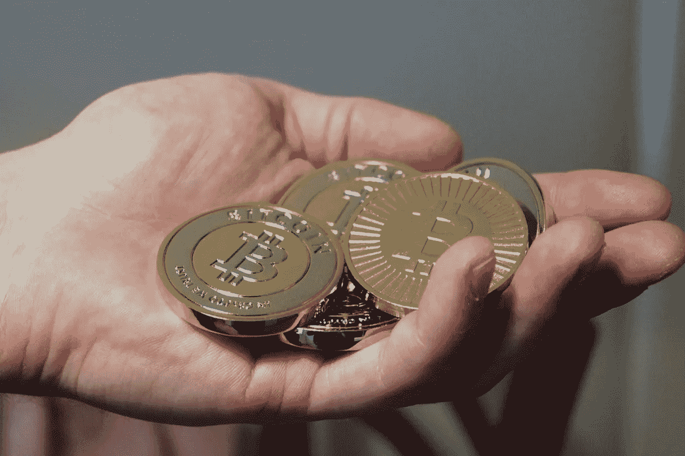

# 随着加密众筹开始反映传统筹资，很明显:筹资就是筹资

> 原文：<https://medium.com/swlh/as-crypto-crowdfunding-begins-to-mirrors-traditional-fundraising-its-clear-fundraising-is-e5ed7fc4efa4>

抓住每个科技企业家注意力的一个万全之策是:开始刊登头条新闻，比如[初创公司通过提供加密货币](http://fortune.com/2017/06/01/startup-crypto-currency/)在 30 秒内筹集了 3500 万美元。这不仅仅是点击诱饵。在 2016 年和 2017 年，这样的头条新闻变得难以避免。

**最初的硬币发行热潮正如火如荼地进行着，初创公司基于一个餐巾阶段的想法突然筹集了数千万(或数亿)的资金。**机会主义创始人蜂拥而至。有一些伟大的项目得到了资助，一些不伟大的项目得到了资助，许多人第一次关注 crypto。

甚至比 ICO 热潮来得更快，它已经基本消失了。

发生了什么事？

## 糟糕的项目被曝光

彭博发表了一项[研究](https://research.bloomberg.com/pub/res/d28giW28tf6G7T_Wr77aU0gDgFQ)，揭示了 2017 年进行的 80%以上的代币销售是骗局，约占 13.4 亿美元的资金。像 Pincoin(6.6 亿美元)、arise bank(6 亿美元)和 save droid(5000 万美元)这样的项目走在了前面。

由于这些项目中的大多数是真正的众筹——而不是天使投资人或风险投资公司——这些骗局依赖于传播炒作、错误信息和部署其他大众影响力技术来让数百(或数千)人进行小额投资。成功了。人们被骗了，损失了钱。

自然地，美国证券交易委员会开始四处打探并提出问题。

## 大人们出现了，开始问问题

当第一批不良代币销售项目被曝光时，成年人开始出现了。风投和天使投资集团开始推出新的基金，旨在参与最佳代币销售项目。

有趣的是:这些风投和天使投资集团开始像对待任何(标准股权)交易一样对待交易。他们要求与团队和创始人举行多次会议，询问有关技术的问题，仔细评估市场，并一如既往地进行尽职调查。

你知道，人们没有做的事情。

## 成年人改变了市场

随着如此多的大众资金流向不太好的项目，以及所有来自风险投资和天使投资的新资金，加密项目被迫开始按照传统的筹资规则进行。

这意味着几件事，但最值得注意的是:项目通常需要在寻求资金之前建立一些东西。

## 2018 年象征性筹款

这意味着融资市场已经发生了巨大变化——营销炒作机器已经消亡，代币销售广告受到严格限制，大多数交易都走上了传统股权融资的道路。

***无聊*对吧？**但这是对代币筹资的未来最好的选择。

我们现在看到像 [PlayChip](https://www.playchip.global/) 这样的项目，这是一个游戏平台，正在将它的令牌带到一个现有的业务中，该业务在七十个不同国家的九个不同的游戏平台上拥有数十万活跃用户。他们在监管机构注册，获得 Draper Hero's Choice 奖，是澳大利亚一个主要运动队(NRL 的南悉尼兔子队)的官方赞助商，并遵守“了解你的客户”( KYC)法规。这与我们在 2016 年和 2017 年的项目中看到的完全不同。他们将他们现有的平台带到区块链以太坊，而不是从零开始。

有了这些，PlayChip 仅用了两周时间就筹集了超过 1000 万美元。不到 30 秒 3500 万美元，但大约是 2018 年的最好成绩。

同样， [Mortgage Blockchain Labs](https://morlabs.io/) 也进行了巡回演出，在它努力完成筹资的同时，与世界各地的风投和天使投资者分享了它的项目。在空中记录数千英里的距离与 2016 年相去甚远，当时只需在一个下午打出一张白皮书并推出一个令牌，就可以筹集数百万美元的资金。

**简而言之:见新老板，和老老板一样。代币销售聚会结束了，这对每个人都有好处。**

*Andrew J. Chapin 是*[*Benja*](http://benja.co)*的联合创始人&首席执行官，*[*Benja Coin*](http://benjacoin.com)*token 项目负责人，著有*[*Art of the Initial Coin Offering*](https://www.amazon.com/Art-Initial-Coin-Offering-Crypto-Token-ebook/dp/B075RRWGT1/ref=as_li_ss_tl?ie=UTF8&qid=1510782200&sr=8-1&keywords=art+of+the+initial+coin+offering&linkCode=sl1&tag=p02bbf-20&linkId=c4fe0973e4335f975fcab74b1f62ad7e)*，并担任多个项目的 token 顾问。*

## 这篇文章发表在 [The Startup](https://medium.com/swlh) 上，这是 Medium 最大的创业刊物，有+ 382，862 人关注。

## 在这里订阅接收[我们的头条新闻](http://growthsupply.com/the-startup-newsletter/)。

