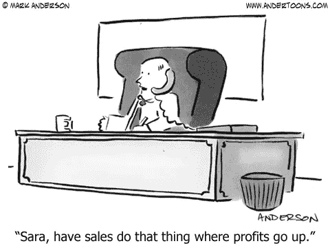

# 在早期阶段，关注单位经济盈利能力，而不是公司盈利能力

> 原文：<https://medium.com/swlh/at-the-early-stage-focus-on-unit-economic-profitability-not-corporate-profitability-1a8d19857206>

当我问种子前期公司未来 12 个月的预期烧钱率和现金支出时，我经常得到一个自吹自擂的回答，“嗯，我们现在盈利了，只是我们想花多少钱的问题”。这很好，我为那些发现盈利的种子前或自举公司鼓掌，但这并不意味着什么。事实上，我宁愿公司不盈利。在 pre-seed 阶段，一家公司可能每月赚 1.5 万美元，有三名员工，盈利并不难。这些收入包括三份微薄的薪水和一些服务器空间。

早期公司(种子前到种子后，Corigin 开出初始支票)需要解决的是单位经济盈利能力，而不是公司盈利能力。这有很多原因，我会解释的。但首先，我想清楚地定义我在这篇文章中指的是谁。我的目标受众是高增长、有潜力的独角兽。

财务健康是很重要的，所以请不要误解这篇文章，以为可以忽略它。早期盈利也非常值得称赞，但通常不会产生快速增长的公司。不是每个人都想建立一个快速增长的科技创业公司，这没关系，但这篇文章是为那些创业者准备的。

## 为什么不是企业盈利？

**成长**

盈利通常是以牺牲增长为代价的。为了使业务大幅增长，今天需要相当数量的投资。由于与费用相比，收入通常是一个落后因素，收入需要一段时间才能赶上甚至超过费用。说明这一点的最佳方式是通过人才:在建立一家初创公司的过程中，许多公司在一年内从几个联合创始人发展成为一家大约 10 到 15 人的公司。如果每个员工都需要几个月的时间来提升，那么他们的收入潜力就会大大滞后。在短时间内雇佣了如此多的员工，而收入却相对较少的情况下，很容易理解为什么盈利非常困难。

**毫无意义**

早期盈利一般没有意义。盈利通常是通过不可持续的削减开支来实现的，而不是爆炸性的收入。我在开篇提到的那家初创公司可以吹嘘自己的盈利能力，但它的创始人可能以后不会想拿远低于市场水平的薪水，他们肯定也不会想继续吃拉面！换句话说，这种早期盈利能力实际上是不可扩展的。为了进一步说明这一点，如果他们决定雇佣额外的员工，他们可能会在接下来的几个月里赔钱。

**这可能会产生误导，让创始人“追逐”错误的事情**

创始人往往以建立健康的客户群为代价来实现爆炸性增长。有许多追求三位数增长的初创公司通过在获取客户上花费大量资金来实现这一目标，但他们通常不会将这归因于客户获取。他们可能会想当然地认为，朝着这种快速上升的方向发展会让他们确信，几年后他们就会盈利，因为他们的增长如此之快，收入将很快超过支出。然而，这些客户往往最容易流失，留住他们的成本也最高，这使得他们创造收入的长尾效应变得稀缺。

**这并不代表长期的成功**

如前所述，当员工非常精干，并且公司与第一个客户达成了一个试点项目时，做一个有利可图的生意并不困难。但是，这并不能真正解释或提供任何长期成功的指标。一家公司在成为一家成熟的、可持续发展的公司之前必须经历的增长是巨大的。在 1.5 万美元的收入上实现盈利并没有给我任何他们成熟时会在哪里的暗示。当然不疼，但同样，也证明不了什么。

## **什么是单位经济盈利能力，你为什么关心？**

**单位经济盈利能力的定义**

单位经济盈利能力是基于单位或客户的盈利能力的度量。用最简单的话来说，这就是收入减去任何与销售相关的成本，通常包括商品销售和营销成本，或客户获取成本。每个客户的收入和 COGS 相对容易理解，所以我想解释一下营销支出。很多时候，与获得客户相关的许多成本被遗忘了，包括营销和销售人员的工资、品牌支出甚至销售佣金。更明显的来源是直接获取成本，如付费广告或合作伙伴关系。

**为什么这更重要？**

我经常遇到每个客户都在赔钱的创始人，并认为他们以后会明白的。虽然在创建公司的早期阶段需要进行大量的“测试”,但如果不立即进行，单位经济盈利能力是很难实现的。换句话说，我(作为投资人)不想补贴你的客户购买。与企业盈利能力不同，单位经济盈利能力是衡量你所销售产品健康程度的真实指标。在有建立成本和重大投资的地方，销售你的产品不应该花钱。

在健康的企业中，单位经济盈利能力可以很早就达到。企业盈利能力不是。作为一名投资者，我知道当单位经济盈利能力存在时，我看到的是一个健康的企业，一个可扩展的企业。如果一个创始人已经证明了对一种产品有需求，并且可以从每个客户身上赚钱，我知道生意是可以规模化的。之后，就是增加营销支出来吸引那些“健康”的顾客。

为了进一步说明这一点，我写了一篇关于理解群组分析及其重要性的更为充实的文章。这就更深入地了解了客户群，并进入了为什么 LTV:CAC 是一个重要的措施。比率增加得越多，每个客户可以用更少的钱获得更多的价值。“投资者标准”似乎是 3:1 的最低比例，但这可能在很大程度上因商业模式而异。为了实现盈利，最低需要 1:1。

一家公司“最健康”的客户往往是维护成本最低的。显著的前期折扣通常会带来快速销售，但也会带来高流失率。因为顾客喜欢产品而获得顾客比通过“交易”获得顾客要难得多。通过专注于理解单位销售额以及如何让它们盈利，获得客户并让他们以相对较低的成本持续贡献收入就容易得多。相比之下，如果只关注顶线收入，这些廉价客户通常不会持续很长时间，需要花很多时间才能回来，随着时间的推移，成本会上升。

## **那么现在怎么办？**

创始人:我经常听到关于早期盈利能力的自吹自擂，我为你的财务警觉性感到骄傲，但我不感兴趣。不要告诉我为什么适度的收入可以创造一个有利可图的业务，而是告诉我你是如何建立一个真正健康、强大、有粘性的客户群，其中你了解单位经济学。这就是我需要知道你可以建立一个独角兽。

[*cori gin Ventures*](http://coriginventures.com)*是一家位于纽约市的种子期基金，投资于定义未来日常生活的创始人。我们从种子前期到种子后期都很活跃。*

## 这篇文章发表在《创业》[上，258，400 多人聚集在一起阅读 Medium 关于创业的主要报道。](https://medium.com/swlh)

## 在此订阅接收[我们的头条新闻](http://growthsupply.com/the-startup-newsletter/)。

