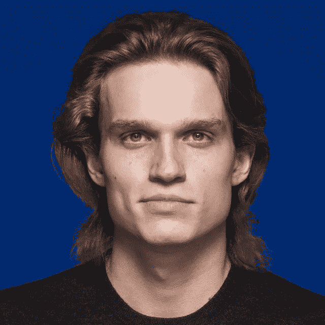
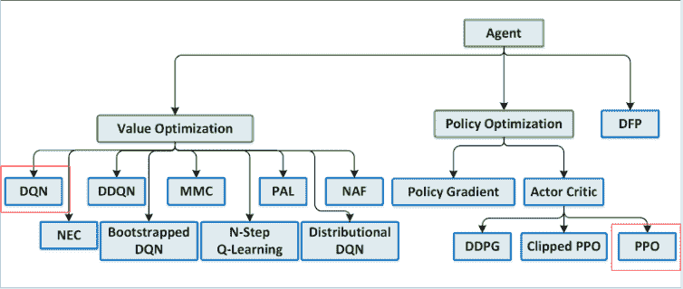
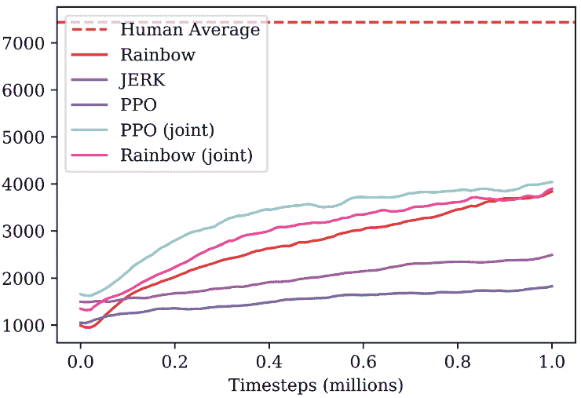
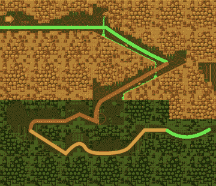
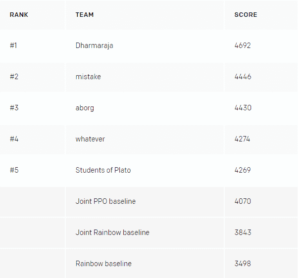

# 强化学习的速度:一个开放人工智能竞赛的故事

> 原文：<https://medium.com/swlh/at-the-speed-of-reinforcement-learning-an-openai-contest-story-6ed34fe7a3bb>

*您好！我是谢尔盖·科列斯尼科夫，Dbrain 的高级数据科学家，是***和* [*HSE*](https://www.coursera.org/learn/practical-rl) *和* [*开源*](https://github.com/Scitator/catalyst) *开发者的讲师。主要是对 RL (* [*NIPS 学习跑第三名*](https://github.com/Scitator/Run-Skeleton-Run) *)，顺序决策和规划感兴趣。**

*Open AI 今年春天举办了一场强化学习比赛——复古大赛。主要目标是提出一种元学习算法，可以将知识从“刺猬索尼克”的一组训练水平转移到 OpenAI 专门制定的一组以前看不到的测试水平。我们的团队在 900 多个团队中名列第四。强化学习不同于典型的机器学习，这次比赛从其他 RL 比赛中脱颖而出。你可以阅读下面的详细内容。*

# *组*

*谢尔盖·科列斯尼科夫([剪辑师](https://github.com/Scitator) )
RL 爱好者。高级数据科学家@ [Dbrain](https://dbrain.io/) 。竞赛期间在 [MIPT](https://mipt.ru/english/) 答辩过硕士论文。*

*米哈伊尔·巴甫洛夫( [fgvbrt](https://github.com/fgvbrt) )
高级研究工程师@ [理由 8](https://reason8.ai/) 。定期 RL 竞赛/黑客马拉松参与者和奖金获得者。*

*伊利亚·谢尔盖耶夫([谢尔盖耶维奇 123](https://github.com/sergeevii123) )
数据科学家@[avito . ru](https://www.avito.ru/)——不同内部项目的计算机视觉。在 [Deephack 开始 RL。2015 年游戏](http://game.deephack.me)。*

*Ivan Soro kin([1 lytic](https://github.com/1ytic))
在 [speechpro.ru](https://www.speechpro.ru/) 处理语音识别。*

# ***强化学习和音波***

**

*强化学习是一个理论和算法的集合体，它结合了机器学习和最优控制理论中的时间差分(TD)方法领域。在实践中，强化学习算法被用来识别难以数学定义的最优控制问题的解决方案。他们通过一个通过与环境互动从经验中学习的代理来实现这个目标。环境为代理人提供基于其行为的奖励；代理人的行为越好，得到的回报就越高。因此，好的控制者是通过让代理人学会通过执行最佳行动来最大化所收到的回报而获得的。*

**

*在声音比赛中，RGB 图像充当环境，作为一个可用的动作，代理必须选择虚拟控制器上的按钮。类似于原来的游戏，奖励增加了戒指收集和水平通过速度。基本上，我们有了以我们的代理人为主角的原始索尼克游戏。*

# ***基线***

*作为基线，我们为[彩虹](https://arxiv.org/abs/1710.02298) (DQN 方法)和 [PPO](https://arxiv.org/abs/1707.06347) (政策梯度方法)代理提供了完整的指南，指导他们在一个可能的声波水平上进行培训，并最终提交代理。Rainbow 版本基于一个 anyrl 项目，而 PPO 使用了众所周知的 OpenAI 基线。公布的基线不同于[文章](https://arxiv.org/abs/1804.03720)中描述的基线——它们更简单，学习加速的次数也更少。*

**

***结果评估功能***

*算法在与它们在典型的 RL 竞赛中学习到的环境相同的环境中被测试。这有利于擅长记忆和具有许多超参数的算法。在这场比赛中，代理人在新索尼克的水平上进行测试，这些水平是由开放 AI 团队为比赛设计的。此外，代理可以在测试时获得奖励，这使得微调成为可能。然而，要记住测试的时间限制:我们有 24 小时和最多 100 万次滴答。*

*在这次比赛中，团队以 docker 图像和组装的 API 提供结果。这种策略解决方案检索更公平，因为资源和时间受到 docker 映像的限制。我真的很欣赏这种方法，因为它让那些缺乏“DGX 和 AWS 家庭集群”的研究人员处于与最后一批 9000 多名模特爱好者相同的条件下。*

*顺便说一下，在 [Dbrain](https://dbrain.io/) 使用了相同的竞争策略。我们试图实现的主要目标是有洞察力的模型开发。从我们的竞赛参与者那里获得的解决方案保存在带有集成 API 的 docker image 中。多亏了它，我们可以得到预测和求解过程。真的希望以后能看到更多这样的比赛。*

# ***方法和结果***

*在快速回顾了建议的基线后，我们选择了 OpenAI 的 PPO 方法，作为我们未来解决方案的一种更正式和有趣的方式。通过 OpenAI [技术报告](https://arxiv.org/abs/1804.03720)PPO 代理更好地处理了任务。所以，我们的主要特点:*

## *1.PPO 联合培训*

**

*我们得到的基线只能学习 27 个音速等级中的一个。但是我们修改了学习过程，将它平行应用于所有 27 个级别。因此该智能体具有更高的泛化能力和更好的声音世界定向能力。*

## *2.测试过程中的微调*

*我们必须根据竞赛的主旨找到最具概括性的方法。这需要代理人微调其测试水平的政策，通常这就是我们所做的——在每一集/游戏结束时，代理人估计奖励并进一步改进其政策以最大化奖励预期。*

## *3.探险奖金*

*现在让我们深入了解等级奖励条件。代理获得了 x 坐标进度的奖励，因此在需要前进和后退时可能会被卡住。因此，我们设立了一个名为[基于计数的探索](https://arxiv.org/abs/1606.01868)的额外奖励，给出了代理可能进入的新状态。*

**

*探索奖励以两种形式实现:基于像素相似性的图像，以及基于特定位置的状态频率的 x 坐标。这两者都是与代理人访问的条件的单一性相反地形成的。*

## *4.最佳初始策略搜索*

*这一改进大大有助于结果。这个想法非常简单:我们用不同的超参数训练了几个策略。在测试的时候，每个策略都在前几集进行了测试。然后我们选择最好的一个做进一步的微调。*

# *失误*

*什么没玩好:*

1.  *NN 架构变化: [SELU 激活](https://arxiv.org/abs/1706.02515)，自我关注， [SE 屏蔽](https://arxiv.org/abs/1709.01507)*
2.  *[神经进化](https://arxiv.org/abs/1712.06567)*
3.  *个人声波的水平创造-我们已经准备了整个管道，但没有足够的时间来实现它*
4.  *像 [MAML](https://arxiv.org/abs/1703.03400) 和[爬虫](https://arxiv.org/abs/1803.02999)这样的元学习算法*
5.  *基于重要抽样的模型集成*

# ***结果***

*OpenAI 在比赛结束三周后公布了[结果](https://blog.openai.com/first-retro-contest-retrospective/)。我们的团队在 11 个附加级别中获得了第 4 名，在公开测试中从第 8 名跃升，并超过了调整后的 OpenAI 基线。*

**

*来自三大解决方案的超酷功能:*

1.  *更常见的按钮组合增加了操作空间*
2.  *基于屏幕感知哈希的探索奖励*
3.  *来自游戏男孩高级和主系统声波游戏的更多训练水平*

*你可以得到更详细的描述[这里](https://blog.openai.com/first-retro-contest-retrospective/)里面有排名前三的源代码。根据竞赛的最佳实践，全部代码可在 [GitHub 上获得。](https://github.com/fgvbrt/retro_contest)*

*顺便说一下，我很感激 OpenAI 也鼓励了[最佳报道](/@olegmrk/openai-retro-contest-report-b870bfd014e0)音轨。*

*欢迎随时评论提问！*

*[dbrain.io](https://dbrain.io)*

***加入** [**电报**](https://t.me/Dbrainchat) **聊天，关注我们上** [**推特**](https://twitter.com/dbrainio) **，喜欢我们上** [**脸书**](https://www.facebook.com/dbrainio/)*

**

## *这篇文章发表在 [The Startup](https://medium.com/swlh) 上，这是 Medium 最大的创业刊物，拥有+ 374，357 名读者。*

## *在这里订阅接收[我们的头条新闻](http://growthsupply.com/the-startup-newsletter/)。*

**