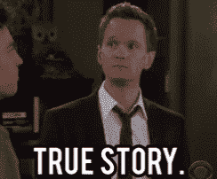
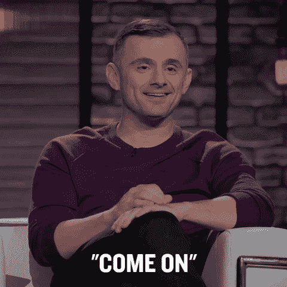

# 初创公司注意:没人会在意你的内容。

> 原文：<https://medium.com/swlh/attention-startups-nobody-gives-a-sh-t-about-your-content-1ca3e1b30567>

## 但这就是为什么你仍然应该继续创作。

Photo by [Mpumelelo Macu](https://unsplash.com/photos/l_YNobbDYJk?utm_source=unsplash&utm_medium=referral&utm_content=creditCopyText) on [Unsplash](https://unsplash.com/?utm_source=unsplash&utm_medium=referral&utm_content=creditCopyText)

如果你是一家初创企业，除非你的目标客户是精于钩针编织技术的老奶奶，否则我要告诉你一个坏消息。

没人在乎你在网上的内容。哦，你直接和迪士尼争夺观众的注意力。

是的，所有消费品牌之母，以 20 亿美元的预算生产温暖人心的内容。迪士尼。

Reddit、Quora、Linkedin 和脸书(世界第二大访问量网站)也是你的竞争对手。

而你们只是一群靠拉面和免费披萨生活的创业公司创始人。你将如何让你的内容在竞争的海洋中畅游？

# 注意力经济的兴起

首先，承认过去 10 年中最大的结构性转变。世界上的普通消费者变得越来越“忙碌”，因此这个星球上新的稀缺资源是注意力。

众所周知注意力不集中的金鱼的**平均注意力持续时间**是 9 秒，但根据微软公司的一项新研究，人们现在通常在 8 秒钟后就会失去注意力，这凸显了日益数字化的生活方式对大脑的影响。

所以，如果读者不得不给予你他极其稀缺的注意力，你必须回报他一些令人惊讶的东西。

## **您今天在互联网上的内容是一项商业交易。**

但是没有预算也有办法做到这一点。从不同的角度来看这个问题。

忘记营销宣传吧。抵制销售术语。不要把你的博客内容当成新闻稿。

忘掉拼命获得关注的欲望，努力建立联系。旨在建立真实的人际关系。

与人交流最可靠的方式是讲故事。迎合人脑最苛刻的需求。故事。正如这篇《快速公司》的文章所暗示的，人类的大脑天生对故事极度贪婪。

[在 Medium 的这篇强有力的文章](/@garyvee/how-to-tell-a-story-on-social-media-7baa8ad7fbf6)中，加里·维纳查克分享了他的 2 美分:

> 对我来说，我只对一件事感兴趣。将我们联系在一起的东西。不管你是谁，你的职业是什么——不管你是企业家、销售人员、设计师还是开发者——不管你做什么，你的工作就是讲述一个故事。—加里·维纳查克

# 表现真实，打开所有的门

尽管他们有数十亿美元的预算，大多数 B2B 品牌并没有保留他们的客户的信任和关注，因为它似乎不真实。这也与他们如何公开分享他们的内容有关。高管们被禁锢在这种企业思维模式中，伟大的内容必须受到限制。错了。

任何对读者的干扰，无论是引导表单还是帐户注册，都会适得其反，让你的读者离开。

[大卫·卡塞](http://www.twitter.com/dcancel)在[漂流](http://www.drift.com)是一家 5x 产品驱动型公司的创始人。他给现代创业营销人员的主要信息之一是:

> "取消你的内容。"

漂移是满足我们人类对故事需求的一个惊人的例子。他们的整个营销感觉真实而人性化。它不止于此。他们通过分享[他们撰写的每一封营销电子邮件](https://blog.drift.com/all-the-emails-at-drift/)来为他们的观众辩护，真正倡导“取消门运动”的精神。

# 你如何完善联系的艺术？

一致性和实践。

尽管残酷的现实是没人关心你的内容，但令人欣慰的是，如果你确定了如何与他们联系，他们有一天会开始关心你。你能做到的唯一方法就是日复一日地练习。这条路没有捷径可以帮你。你必须弄清楚哪些内容吸引了你的观众，然后制造出更多的内容来建立联系。伟大的企业过去需要大量的预算来试验娱乐产业，但是互联网的力量允许你在没有任何投资的情况下成为一家媒体公司。

去吧。目标是与你的观众保持一致的联系。围绕你的品牌展开对话。做一个地道的说书人。

> “世界上最有力量的人是讲故事的人。讲故事的人设定了未来整整一代人的愿景、价值观和议程。” *—史蒂夫·乔布斯*

还有什么？你有什么吸引观众注意力的方法？请随意分享你的想法。

## 这篇文章发表在 [The Startup](https://medium.com/swlh) 上，这是 Medium 最大的创业刊物，拥有 283，454+人关注。

## 在此订阅接收[我们的头条新闻](http://growthsupply.com/the-startup-newsletter/)。

