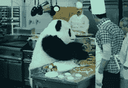
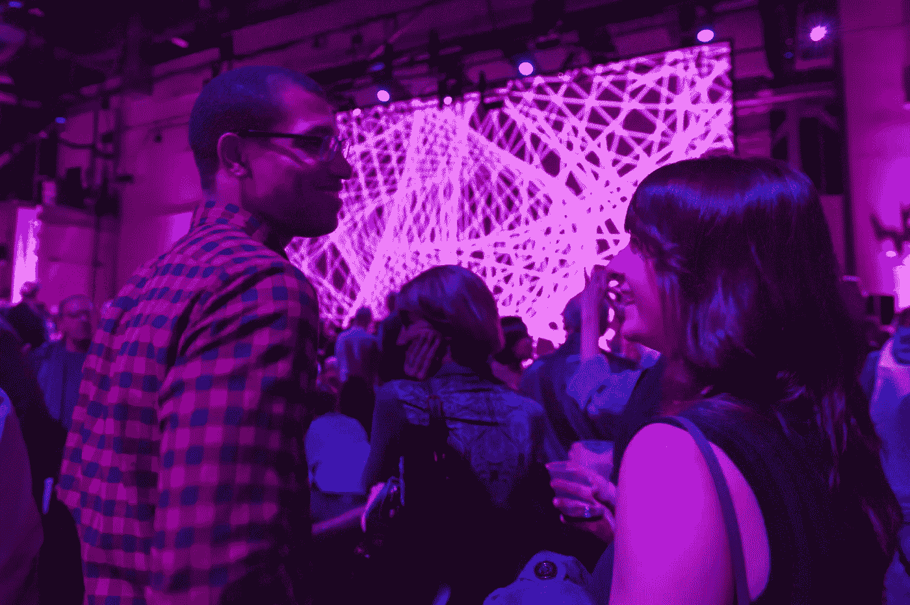

# 表演艺术中的观众体验创新，第一部分:从移情开始

> 原文：<https://medium.com/swlh/audience-experience-innovation-in-the-performing-arts-part-1-start-with-empathy-e04f3b5ced4a>

## 在你创作之前，先了解你为之创作的人

Photo by [Tim Marshall](https://unsplash.com/photos/cAtzHUz7Z8g?utm_source=unsplash&utm_medium=referral&utm_content=creditCopyText) on [Unsplash](https://unsplash.com/search/photos/people?utm_source=unsplash&utm_medium=referral&utm_content=creditCopyText)

这是对我去年在一篇名为[的文章中所写的一些想法的扩展，这篇文章的主题是乐队需要向 Airbnb 和苹果学习什么。从那以后，我研究了几家成功公司的创新战略，并与正在实施这种战略的人进行了交谈，包括盈利和非盈利部门。这是以创新观众体验为主题的系列文章的第一篇。](/@zachmanzi/what-orchestras-could-stand-to-learn-from-airbnb-and-apple-3ad3db7f8b29)

背景:根据美国国家艺术基金会提供的[统计数据，美国表演艺术的现场观众已经减少了一段时间。这个话题经常在表演艺术领域制造焦虑和不确定性——我们实际上能做些什么呢？显然，这是该领域未来的一个紧迫问题，但它也会对我们整个经济产生负面影响](https://www.arts.gov/publications/decade-arts-engagement-findings-survey-public-participation-arts-2002-2012)。最重要的是，艺术之所以重要，是因为它有能力对人类生活质量产生积极影响。

许多在表演艺术中尝试新事物的组织称自己是“创新的”，但是我们怎么知道我们是否真的在创新，更不用说以一种服务于观众需求的方式？我想建议我们把眼光放远一点，从我们的领域之外去了解它可能是什么样子。

## 接替他人的位置

首先，想想你最近一次糟糕的餐馆经历。是你坐下后服务员不理你 45 分钟的问题吗？这地方不干净吗？食物质量是否低于你对价格的预期？你会回去吗？希望不会！但是你应该给他们差评。餐馆老板显然没有付出必要的努力来理解在他们的餐馆吃饭是什么样的，并为顾客提供令人难以置信的体验。这个人对你没有同情心。

[panda has no empathy for you](https://giphy.com/gifs/funny-lol-wtf-4gdveTpNzr9ok)

现在想想你一生中最美妙的餐厅经历。在这种情况下，你肯定在幕后有一个精明的餐馆老板。这个人明白，客户的体验就是产品，设计一个好的客户体验需要通过尽可能接近客户来理解客户**在整个过程中的感受。也许这位老板经常在他们的餐厅用餐，以获得一种感觉。也许他们会与客户深入交谈，或者观察人们在整个体验过程中的情绪反应。无论他们如何感同身受，他们都会根据自己的发现不断改善餐厅体验。这项工作远远超出了调查和数字…他们正在了解餐厅体验如何影响人们的心情、日子和生活。**

## **着迷的观众**

**出于对顾客的同情而进行的创新在餐饮业已经持续了很长时间，事实证明，世界上最具创新性的公司都意识到，为了在本世纪生存，他们的优先事项必须向类似的方向转变。在最近的文章中，当被问及如何成为一家 21 世纪的公司时，Airbnb 的设计副总裁说:**

> **“20 世纪公司的结构是为了股东利益，并做出支持股东利益的决策。这在过去的 100 年里为公司提供了很好的服务，但我们认为 21 世纪的公司需要拓宽他们对利益相关者的定义。在我们的案例中，我们服务的是一个有数百万人的社区，我们邀请他们来和我们一起建立这个企业。这是一种全新的组织类型，拥有全新的、由社区驱动的行为和价值观。”**
> 
> **Airbnb 设计副总裁亚历克斯·施莱弗**

**施莱弗认为，在 21 世纪，Airbnb 的客户正变得和投资者一样重要，这是一个在表演艺术领域听起来如此真实的事实。我们的捐助者非常重要，就像我们自己的艺术愿景一样，但是如果我们没有观众来表演，那么我们如何继续成为表演艺术？也许如果我们都同意受众发展是我们的主要关注点，我们将找到可持续的方式来协调每个人的价值观。**

## **艺术，不仅仅是为了艺术**

**在表演艺术中有一些精明的领导者正在像伟大的餐馆老板一样工作——**通过*观众*共鸣**创新。旧金山歌剧院艺术策划经理肖恩·沃夫(Sean Waugh)与创新中心斯坦福大学的设计学院(d.school)合作，领导了为新观众创造歌剧体验的项目。他们一起为目标观众创造了“弹出式”歌剧体验。看一看《哈佛商业评论》的这篇文章，这篇文章记录了创造非常成功的“勉强歌剧”的旅程，副标题是“这不是你祖母的歌剧”这种体验旨在通过将艺术形式从歌剧院正常、僵硬的背景中分离出来，“向更年轻、更时尚的观众介绍歌剧”。歌剧上演的那天，数百人在街上排队入场。旧金山交响乐团为类似的观众创造了音箱，每次演出都在一天内销售一空。这种对歌剧或器乐古典音乐的需求在 2018 年基本上是前所未有的，但通过把观众放在第一位，它正在被创造。那么背后的过程是怎样的呢？**

****

**SoundBox in action, [from SF Symphony](https://www.sfsymphony.org/SanFranciscoSymphony/media/Press-Releases/SoundBox/New%20Images%20Feb%202015/soundbox_stefancohen_008.jpg?width=1800&height=1198&ext=.jpg)**

**歌剧的团队使用了[设计思维](https://www.ideou.com/pages/design-thinking)，一种根植于观众同理心的解决问题的创造性过程，来创作勉强的歌剧。首先，他们的团队在想出任何体验的想法之前，通过观察和采访的结合，了解了更年轻、更时尚的目标受众。所有的想法都是他们从观众那里获得的同理心的产物，按照设计思维方式，该团队设计了原型，在将完整的产品投入使用之前，他们在观众身上进行了测试(查看上面 HBR 的文章，了解更多关于如何做到这一点的细节)。虽然交响乐没有明确使用设计思维，但他们在创造创新体验时肯定会考虑到他们的观众。观看[这个来自 Tessitura 创新者系列的主题演讲](https://www.youtube.com/watch?v=VcHi96kYLYw)，听一听创造音箱背后的过程。我还想指出的是，无论是歌剧还是交响乐都没有牺牲节目——他们演奏的音乐适合在他们的主场举行的传统音乐会。**

**Airbnb(并非巧合，它是由两名设计师和一名工程师创建的)用设计思维活了过来。通过采取完全以客户为中心的方法，该公司为寻求实惠、个性化体验的旅行者彻底改革了住宿业。在 Airbnb 和 SF Opera 的案例中， ***一个根植于同理心的可重复过程*** 带来了成功吸引目标客户/观众的创新。**

**需要澄清的是:这并不是说我们要为观众量身打造艺术。一份珍贵的厨师菜单不受顾客要求的影响。餐馆老板支持厨师的艺术，同时精心打造满足顾客需求和愿望的体验。这种体验提升了食物的品位，让顾客感受到厨师工作的启发。**

## **不应该是任何人的猜测**

****

**[but actully idk](https://tenor.com/view/idkmybffjill-idk-idkwho-gif-7516443)**

**IDEO 是一家设计和创新公司，本质上创造了设计思维(他们从斯坦福的 d.school 发展而来)。要了解他们的过程，请查看他们著名的“深度潜水”马拉松设计挑战，在视频[中创建一个新的杂货店购物车](https://www.youtube.com/watch?v=M66ZU2PCIcM&t=243s)。**

**我从 IDEO 学到的最大的一个教训是，在创作过程的开始，应该尽可能少猜测。在这段视频中，该团队与许多在真实环境中使用购物车的人进行了交谈和观察，甚至在他们讨论产品改进的想法之前。就像精明的餐馆老板一样，他们通过他人的视角感受使用购物车的体验。这些见解贯穿了他们所有的工作。如果他们不知道他们努力创造的人的需求，就没有办法知道是否有人会发现产品有价值。**

**几个月前，我参观了斯坦福大学校园里一个名为 [LaunchPad](https://dschool.stanford.edu/classes/launchpad) 的 d.school 班级。作为课程的一部分，在观看了研究生团队为他们正在创建的公司进行令人信服的推介后，我有机会与其中一位老师交谈。我告诉他，有时很难知道艺术在这个世界上的目的是什么，即使对艺术家来说也是如此，所以很难为它创造一个令人信服的“音高”。他告诉我，“你必须像企业家一样思考……找到痛处。”他进一步解释说，创办和建立成功公司的企业家是那些为特定人群发现问题并解决问题的人。他们的全部努力是理解和创造人们需要的东西。**

**比方说，一个艺术团队的任务是在两个小时内提出一个新的音乐会想法，事先没有任何准备。我是会议主持人，他们各自想出自己最好的想法，并与小组成员分享。最后，创造机会声明:*大学生喜欢晚出去，所以我们应该创造一个深夜音乐会。没有那么糟糕，甚至可能会成功！然而，他们得出这一结论时并没有获得目标受众的任何同情。***

**真正的大学生，而不是团队想象的刻板的大学生，可能不会从任何类型的音乐会中受益，但会从一场不同性质的音乐活动中受益，这种音乐活动以前从未被创造过。在这个项目中获得同理心的良好开端可能看起来像是与五名大学生交谈，并参加大学生已经喜欢的活动。这种最小的投资可以为团队提供洞察力，通过提供由目标受众成员告知的起点，指导他们的工作取得更大的成功。它还能分散团队中的紧张情绪——你不能否认客户的需求。该团队可能会发现，通过采访和观察的方法收集观众数据所花费的资源要少于根据猜测制造事件所浪费的资源。**

## **你改变了人生。你改变了人们的生活。**

****

**[‘tis](https://giphy.com/gifs/filmeditor-movie-mean-girls-26uTsgxxplCBOasmc)**

**当我在茱莉亚音乐学院学习时，一位睿智的女士曾经告诉我，我们艺术家“从事改变人们生活的事业。”这难道不是真的吗？我们不只是跳舞、唱歌、玩耍或表演。我们努力通过艺术启发人们以不同的眼光看待自己和世界。如果我们想要维持和发展观众，那么我们应该只为那些了解他们需求的观众 创造**改变生活的体验*。*****

## **我们在和每个人竞争**

> **有些公司不明白为什么要担心客户体验。其他人收集并量化相关数据，但不传播研究结果。还有一些人进行测量和分配，但没有让任何人负责将信息付诸使用。**
> 
> **…但这种需求是迫切的:如今，消费者比以往任何时候都有更多的选择，更复杂的选择，以及更多追求这些选择的渠道。在这样的环境下，简单、完整的问题解决方案——而不是零散、繁琐的解决方案——将赢得时间紧迫的消费者的忠诚。**
> 
> **-Christopher Meyer 和 Andre Schwager，[理解客户体验](https://hbr.org/2007/02/understanding-customer-experience)，哈佛商业评论，2007 年 2 月**

**在阅读我一年前的帖子时，我看到我的研究仍然支持这一观察——**表演艺术机构是争夺** **人的时间、金钱和注意力的企业，这些人越来越习惯于为他们量身定制的难以置信的体验**。所以让我们开始一场关于共情的对话，创造一个表演艺术蓬勃发展的美好世界。**

**这是多篇文章系列的第一篇。当我开始写其他的时候，我会在这里贴上链接。和往常一样，请给我留言或发邮件(在我的网站上),告诉我你的想法或问题。感谢阅读！**

**–––––**

**[扎克·曼兹](http://www.zachmanzi.com)是单簧管演奏家，也是[导管](http://www.con-duit.org/)的联合艺术总监。他在范德比尔特、茱莉亚音乐学院和新世界交响乐团受训。扎克的工作围绕着表演艺术的创新，特别关注观众的体验。他最近做了一个关于现场古典音乐体验的 TEDx 演讲。**

****

## **这篇文章发表在 [The Startup](https://medium.com/swlh) 上，这是 Medium 最大的创业刊物，拥有 343，876+读者。**

## **在这里订阅接收[我们的头条新闻](http://growthsupply.com/the-startup-newsletter/)。**

****