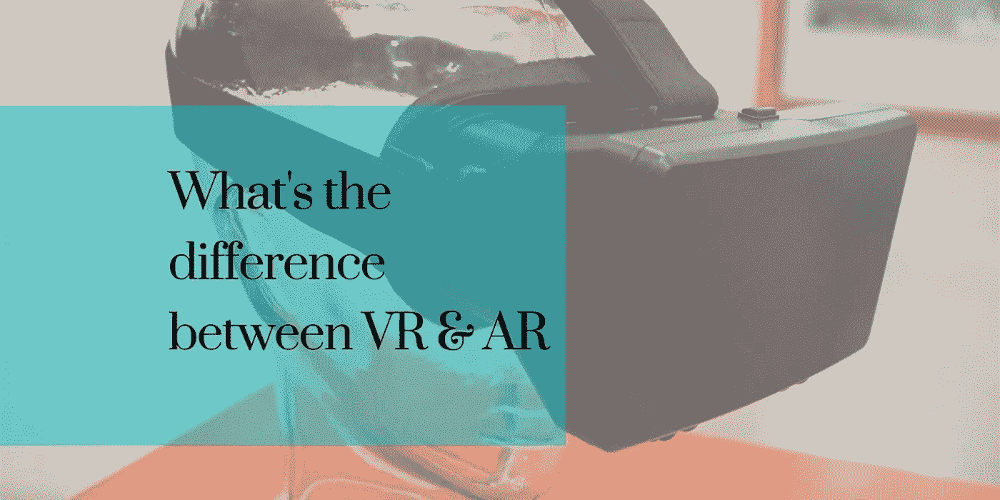
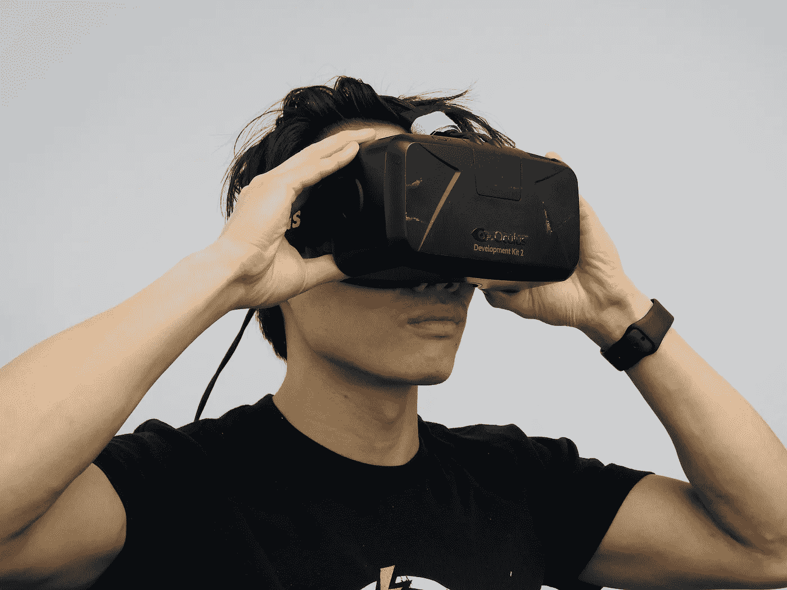

# 增强现实(AR)和虚拟现实(VR):有什么区别？

> 原文：<https://medium.com/swlh/augmented-reality-ar-and-virtual-reality-vr-what-are-the-differences-bd650f9c7859>

昨天的任何不可能，今天都有可能。今天的不可能，集中在[增强现实(AR)和虚拟现实(VR)](https://www.cognitiveclouds.com/custom-software-development-services/virtual-augmented-reality-app-development-company) 将很快成为可能。你看，不可能性不在于它们是否有效，而在于让它们成为主流。所以真正的问题是，在主流社会将它融入日常生活之前，它必须有多好？

# 什么是增强现实？

增强现实增强了我们的体验，通过我们与计算机生成的增强功能进行交互的能力，使我们的体验更有意义。简而言之，计算机生成的图形用于增强您的环境。想象一下，你的墙变成了一个电脑生成的大屏幕，或者你的咖啡桌变成了一块垄断板。通过这种方式，该技术使用您的现实生活环境作为其平台，并在此基础上构建。

AR 技术正在迅速成为主流。Pokémon Go 是 AR 以非常主流的方式使用的一个例子，Snapchat 中的滤镜也是如此。它还被用于在电视转播的体育比赛上显示比分覆盖图，并在智能手机上弹出照片、3D 电子邮件或短信。科技行业的领导者也在使用 AR 通过动作激活命令和全息图来做令人惊叹的事情。

# 什么是虚拟现实？

在虚拟现实中，技术被用来建立一个用户可以与之互动的虚拟世界。虚拟现实通常是通过佩戴虚拟现实头盔或护目镜来实现的，这很像 Oculus Rift。有了虚拟现实，你不再在你的世界或环境中，你完全被传送到别处。它主要是通过刺激用户的视觉和听觉，让他们相信他们是生活在第一手的模拟现实中，从而让用户沉浸其中。

虚拟现实耳机通常使用一个或两个屏幕，必须靠近你的脸，并通过镜头观看。然后，当用户在空间中移动时，它使用各种传感器来跟踪用户的头部和潜在的身体。有了这些信息，它就会呈现正确的图像，让用户产生一种在一个完全陌生的环境中导航的错觉。

# 增强现实和虚拟现实有什么相似之处？

增强现实和虚拟现实都利用了许多相同类型的技术，它们都是为了给客户提供增强的体验而存在的。两者通常都使用头部跟踪来跟踪用户的运动。然而，与 VR 相比，AR 通常需要更少的处理能力，因为它不需要渲染一个全新的环境。此外，增强现实和虚拟现实都有巨大的潜力，通过使远程手术等事情成为现实，改变医学等许多实践领域的前景。这些技术已经被用于治疗不同的心理疾病。

# 增强现实和虚拟现实有什么不同？

增强现实通过在图像和图形等虚拟组件上分层，作为真实世界的一个新的交互层，增强了我们的体验。另一方面，虚拟现实建立自己的计算机生成的现实。虚拟现实通常通过手持或头戴式控制器交付给用户。这种设备将用户连接到虚拟现实，允许他们在模拟现实世界的环境中控制和导航他们的行为。虽然增强现实越来越多地用于笔记本电脑、平板电脑和智能手机等移动设备，以影响现实世界和数字世界的互动方式。

# 增强现实与虚拟现实

迄今为止，与虚拟现实相比，增强现实在消费者领域取得了更多成功。除了视频游戏和硬件设备，如谷歌眼镜，已经有几个 AR 应用程序。说到虚拟现实，技术才刚刚起步。对于虚拟世界中的社交活动来说，这还远远不够，但随着 Oculus Rift 的崛起，这一目标正在实现。

AR 和 VR 在市场上都有一席之地。然而，AR 将更容易获得商业成功，因为它没有完全将人们带出现实世界。还有，不一定是虚拟现实 vs 增强现实。它们并不总是相互独立地运行。事实上，它们经常融合在一起，以产生一种更加身临其境的体验。但现在，AR 正在为下一批走向你的手机的魔术提供动力。

# 结论:

> *虚拟现实和增强现实是一个对另一个的逆向反映，关于每种技术想要完成什么。增强现实覆盖了现实世界中的虚拟元素，而虚拟现实以数字方式重建了现实生活中的场景。*

虚拟现实和增强现实都将很快成为主流。事情已经在发生变化，在我们知道之前，我们将生活在一个虚拟的世界里，而不是真实的世界里。

*原载于* [*CognitiveClouds 产品洞察博客*](https://www.cognitiveclouds.com/insights/augmented-reality-ar-and-virtual-reality-vr-what-are-the-differences/)

## 这篇文章发表在 [The Startup](https://medium.com/swlh) 上，这是 Medium 最大的创业刊物，有 292，582+人关注。

## 订阅接收[我们的头条新闻](http://growthsupply.com/the-startup-newsletter/)。

