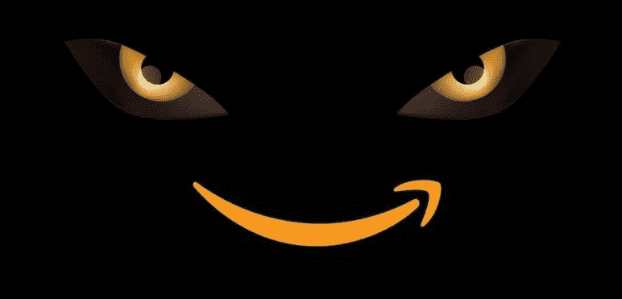
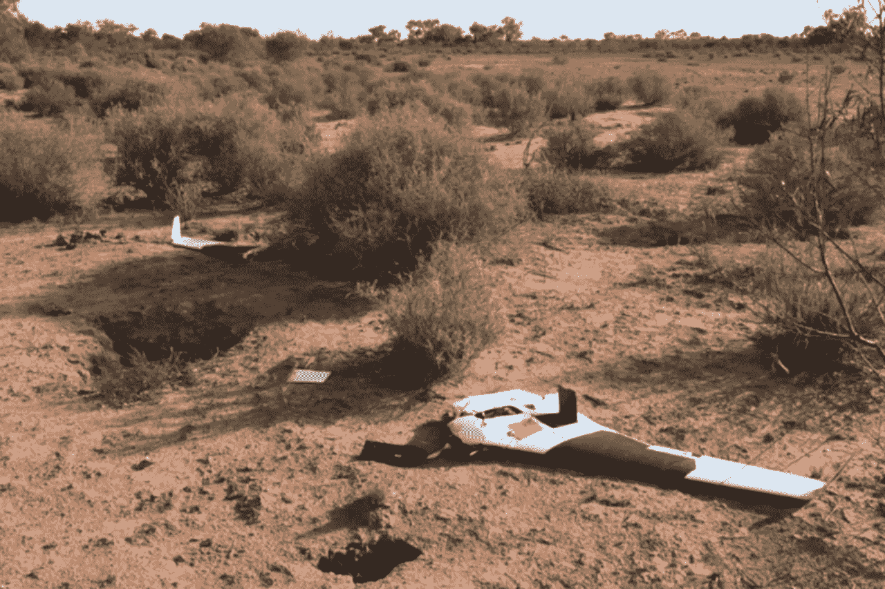

# 澳大利亚和亚马逊:澳大利亚之战

> 原文：<https://medium.com/swlh/australia-amazon-the-battle-down-under-48501cdcf34f>

## 澳大利亚在地理上与世界大部分地区分离，长期以来一直保持着独立和个性。

然而，快速传播的技术和随处可得的信息使世界变得更小了。

在互联网上，从西雅图点击一下鼠标就可以到达澳大利亚。

亚马逊的第一个澳大利亚配送中心占地 25 万平方英尺，位于墨尔本以南仅一小时车程的地方。

借用[达米恩·凯夫在本周日《纽约时报》上的文章](https://www.nytimes.com/2017/10/19/books/australias-amazon-book-battle.html?rref=collection%2Fsectioncollection%2Fbusiness&action=click&contentCollection=business&region=rank&module=package&version=highlights&contentPlacement=11&pgtype=sectionfront)，

> 亚马逊进入澳大利亚不仅是对单个零售品类的压力测试，也是对澳大利亚生活方式的压力测试。

“我们的文化，以及所有的文化，正在被外来的影响淹没，”墨尔本领先的独立书店“阅读”的合伙人马克·鲁伯说。“我们在为捍卫我们的声音而战。”

据[悉尼先驱晨报](http://www.smh.com.au/business/property/amazons-arrival-like-christmas-is-not-that-far-away-20171018-gz3c1f.html)报道，澳大利亚商人做好准备的时候到了:

> 亚马逊传统上需要两到五年的时间才能在一个新的国家获得牵引力，因此专家表示，现在是澳大利亚零售业、房东和租户开始进入状态并对购物中心进行“亚马逊验证”的时候了。

祝你好运…

同样大声疾呼的澳大利亚人声称，好市多在他们高度个性化的市场上没有机会。然而，在 2016 年，[澳大利亚消费者在好市多消费了超过 15 亿美元](http://www.news.com.au/lifestyle/real-life/good-news/a-new-costco-store-has-opened-in-australia-and-it-has-some-jawdropping-items/news-story/7cc2d83554709e4570c417773e322dc8)，今年又有新店开业。

# 亚马逊的胜利并不确定。

星巴克试图渗透澳大利亚市场，但迄今为止失败了。然而，这一努力远未结束。星巴克经历了考验，吸取了一些教训，正在重新焕发活力。

*丹尼尔·帕菲特(Daniel Parfitt)的一架价值 8 万美元的无人机被一只楔尾鹰袭击后坠毁。图:汤姆·劳——华尔街日报*

此外，技术并不总是能打败土著居民。正如本周末《华尔街日报》报道的那样，澳大利亚楔尾鹰正在使用它们的“高超的空中技巧”攻击高科技且昂贵的无人机，并从空中将其撕碎。

最终，澳大利亚消费者将投票决定:便利性、品种和价格与长期的当地商家关系。这是一个有新选择的新时代。

*大卫·j·卡茨，纽约市*

大卫·j·卡茨(David J. Katz)是行业领先的跨国消费品公司 [*Randa Accessories*](https://www.linkedin.com/company/47572/) 的首席营销官，也是全球最大的男士配饰企业。

他的专长是与零售商、品牌和供应商合作，在不断发展的市场中创新并取得成功。

大卫被 *LinkedIn* 选为 2017 年“[顶级声音。](https://www.linkedin.com/pulse/linkedin-top-voices-2017-must-know-people-inspiring-todays-roth)“他被*女装日报*评为[引领时尚产业](https://www.google.com/url?sa=i&rct=j&q=&esrc=s&source=images&cd=&ved=0ahUKEwjO-M2y7ITYAhUHKiYKHcheAlkQjRwIBw&url=http%3A%2F%2Fwwd.com%2Fwwd-publications%2Fdigital-daily%2Fmondays-digital-daily-april-3-2017%2F&psig=AOvVaw1UUxt9X_VP2djw_y76zFzB&ust=1513180933315355)，被*先生杂志评为[男装推动者](http://www.mr-mag.com/menswear-movers-of-2016/)。*

他是一名公共演说家，也是畅销书《设计应对:有效的创意直接营销》的合著者。《纽约时报》、《华尔街日报》、《纽约杂志》、《赫芬顿邮报》、《先生杂志》、和 *WWD* 都对他进行了专题报道。

大卫毕业于塔夫茨大学和哈佛商学院。

他是神经生物学、消费者行为和“刺激与反应”的学生巴甫洛夫这个名字听起来很耳熟。

— — — — — — — — — — — -

## 这篇文章发表在 [The Startup](https://medium.com/swlh) 上，这是 Medium 最大的创业刊物，拥有 299，352+人关注。

## 在这里订阅接收[我们的头条新闻](http://growthsupply.com/the-startup-newsletter/)。

