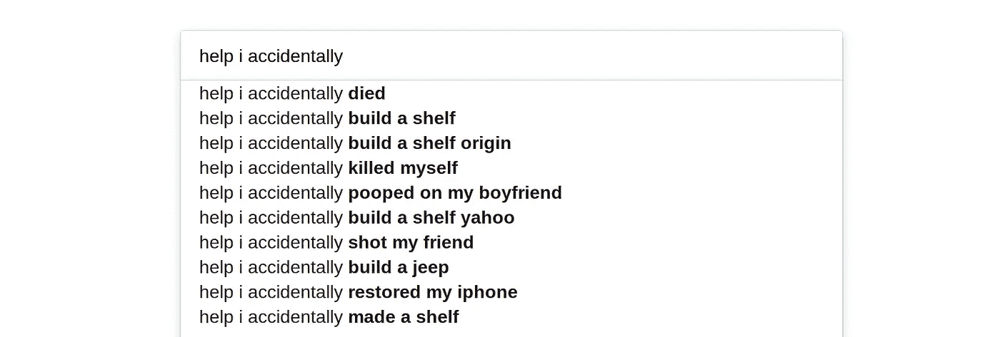

# Go 中的自动完成引擎:让我们来构建它

> 原文：<https://medium.com/swlh/autocomplete-engine-in-go-lets-build-it-1f8e9beb1b9e>



不久前，出于兴趣和好奇，我开发了一个小型的自动完成 web 服务。它的一部分包含了我在这篇文章中将要谈论的大部分内容。

我们将在 Go 中构建一个小型的完成提示器。

对于这个实验，我有几个假设:

*   我们不关心子词匹配
*   我们想要一点打字错误的宽容
*   我们将进行不区分大小写的匹配

## 基于前缀的映射

我们将利用 [PrefixMap](https://github.com/alediaferia/prefixmap) ，这是我的一个小 Map 实现，有助于基于前缀的键匹配。你可能在[维基百科](https://en.wikipedia.org/wiki/Trie)上看到过这种叫做基数树、Trie 或者前缀树的地图，但是我在 Go land 上找不到这种树的命名约定。也许你可以在评论里建议一个更好的名字。

无论如何，基于前缀的地图将是我们提供建议的主要数据来源。我们将使用它来存储我们希望通过引擎匹配的所有建议。

## 莱文斯坦距离

我们将使用 [Levenshtein distance](https://en.wikipedia.org/wiki/Levenshtein_distance) 作为度量来计算输入的字符串与我们找到的匹配有多远。特别是，我们将自己的相似性度量定义为:

```
 levenshtein(match,substr)
 1.0  —   — — — — — — — — — — — — — — 
             max(|match|,|substr|)
```

其中`substr`是输入的字符串，`match`是我们找到的候选匹配。

`1.0`的相似性意味着`substr`和`match`相等。

## 问题是

> 我们有一个输入可能匹配的字符串列表。我们希望找到一些符合我们定义的某个相似性阈值的候选匹配。

这是当您开始在启用自动完成功能的输入字段中键入文本时所发生的事情的一个非常简化的版本。每次输入时，到目前为止，您输入的字符串都会根据数据源进行评估，以找到与您最相关的建议。所有这些都必须快速发生才能有效。您希望您的自动完成服务比正在键入的用户更快，这样他就可以节省时间并选择建议，而不是全部键入。

由于这个特殊的原因，我们将要使用的前缀映射的实现将能够有效地找到给定前缀的所有值。这将使我们不必预先用给定键的所有可能的前缀填充更传统的映射。相反，由于树状结构值将被存储到映射中，我们将能够遍历树中共享一个公共前缀的值。

## 示例解决方案

对于这个具体的例子，我们的数据源将是一个世界国家的列表。我们的目标用户将不得不选择正确的国家，所以他们将开始输入，我们将提供一些建议，以节省他们的输入。

## 自动完成代码

首先，让我们从低挂的水果开始。

我们已经定义了*相似性*的概念，所以我们将开始为它写一个函数。

如您所见，该函数接受参数`ld`作为输入之一。这就是我们想要知道相似度的单词之间的 Levenshtein 距离。

现在，让我们用现有的国家列表填充 PrefixMap。出于练习的目的，我将使用由这个[在线服务](http://www.countries-list.info/Download-List)提供的英文国名列表，我已经将它转换成 Go slice。你可以在这里找到它的要点[。](https://gist.github.com/alediaferia/0ca95bd099a5236b6a5cd676b00b7984)

现在我们已经拥有了所有需要的东西，让我们来研究这个小程序的主要部分:匹配代码。

```
...
        values := datasource.GetByPrefix(strings.ToLower(input))
	results := make([]*Match, 0, len(values))
	for _, v := range values {
		value := v.(string)
		s := similarity(len(value), len(input), LevenshteinDistance(value, input))
		if s >= similarityInput {
			m := &Match{value, s}
			results = append(results, m)
		}
	}

	fmt.Printf("Result for target similarity: %.2f\n", similarityInput)
	PrintMatches(results)
...
```

我们正在利用 PrefixMap 的 [GetByPrefix](https://godoc.org/github.com/alediaferia/prefixmap#PrefixMap.GetByPrefix) 方法。`GetByPrefix`将返回映射中属于指定前缀的所有值的展平集合。很方便，不是吗？

如你所见，我在这里应用的进一步过滤是相似性验证步骤。我正在浏览我们检索到的匹配列表，根据我们在程序中接收到的相似性输入对它们进行过滤。

*你可以在*[*GitHub*](https://github.com/alediaferia/blog-examples/tree/master/go-autocompleter-example)*上找到完整的实现示例。*

## 输出

真的是这样。下面是我们刚刚编写的小代码的几个调用示例:

```
$ go run autocompleter.go -similarity 0.3 itlaly

Result for target similarity: 0.30
match: 	Italy	similarity: 0.67$ go run autocompleter.go -similarity 0.2 united

Result for target similarity: 0.20
match: 	United Arab Emirates	similarity: 0.25	
match: 	United Kingdom	similarity: 0.36	
match: 	United States	similarity: 0.38$ go run autocompleter.go France

Result for target similarity: 0.30
match: 	France	similarity: 1.00	
match: 	Metropolitan France	similarity: 0.32
```

## 进一步的改进

正如您所看到的，我们的小程序允许在某些情况下出现小的打字错误，除非它出现在我们输入的开始。这是因为我们使用了前缀 Map，当然，如果我们以错误的前缀开始，它将不会匹配任何东西。这种意义上的改进可能是，在第一遍中没有找到指定相似性的匹配时，退回到全文搜索。

希望这篇文章对你有所帮助，或者至少是有趣的。让我知道你是否需要任何澄清，或者如果你必须推荐一个更好的方法来实现这一点。

*最初发表于* [*一个 dev 的主线程*](https://alediaferia.com/2018/01/06/autocomplete-engine-go/) *。*


## 这篇文章发表在 [The Startup](https://medium.com/swlh) 上，这是 Medium 最大的创业刊物，拥有 281，454+读者。

## 在这里订阅接收[我们的头条新闻](http://growthsupply.com/the-startup-newsletter/)。

