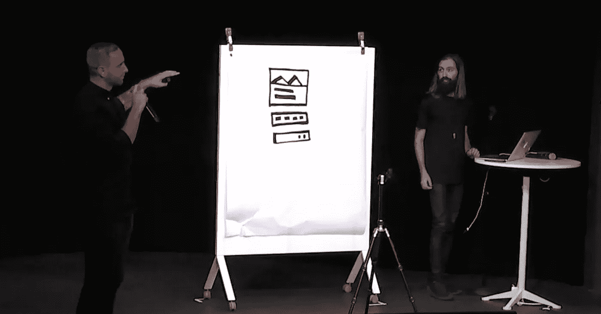
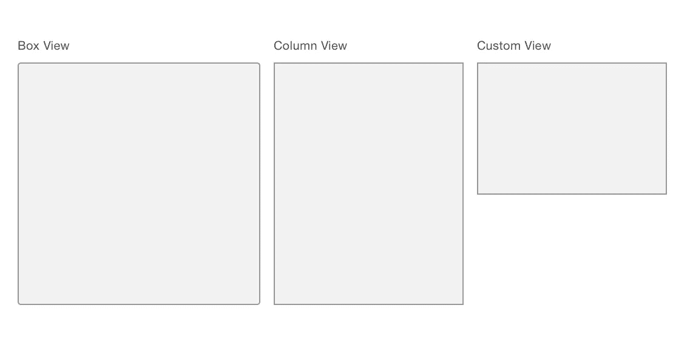
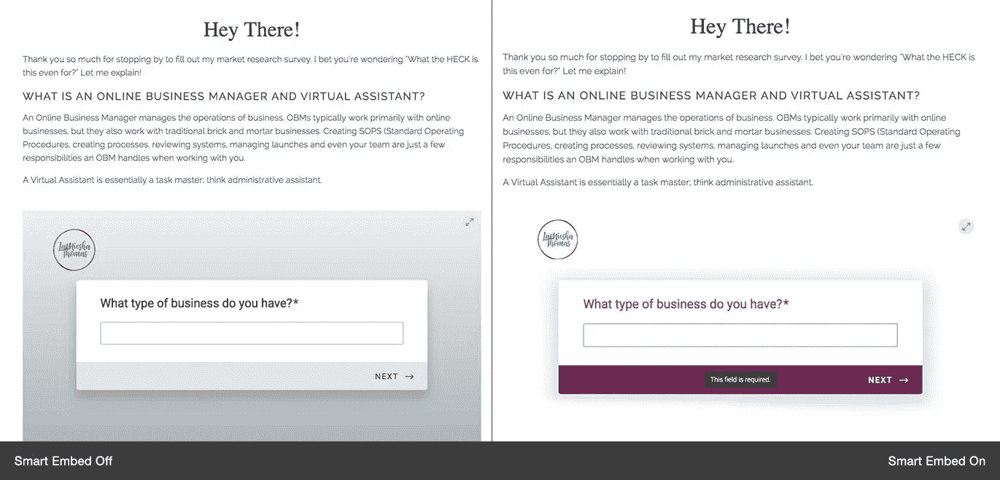
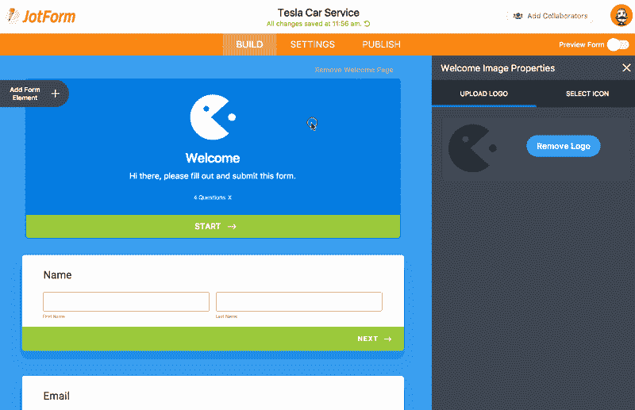
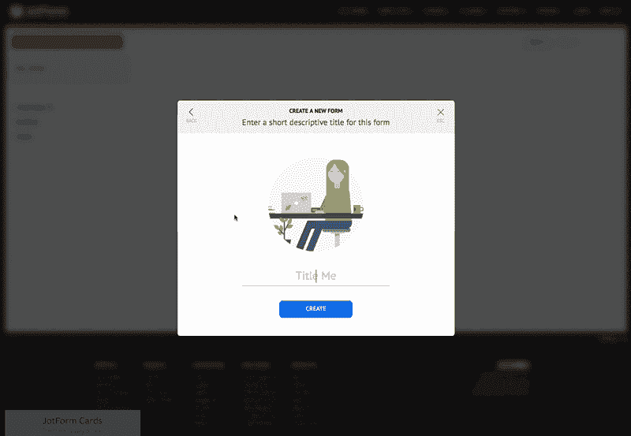
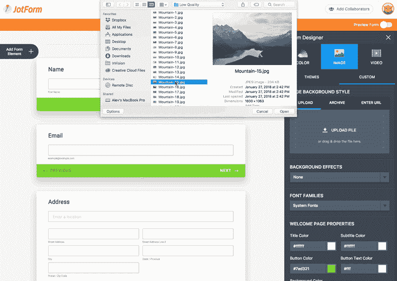
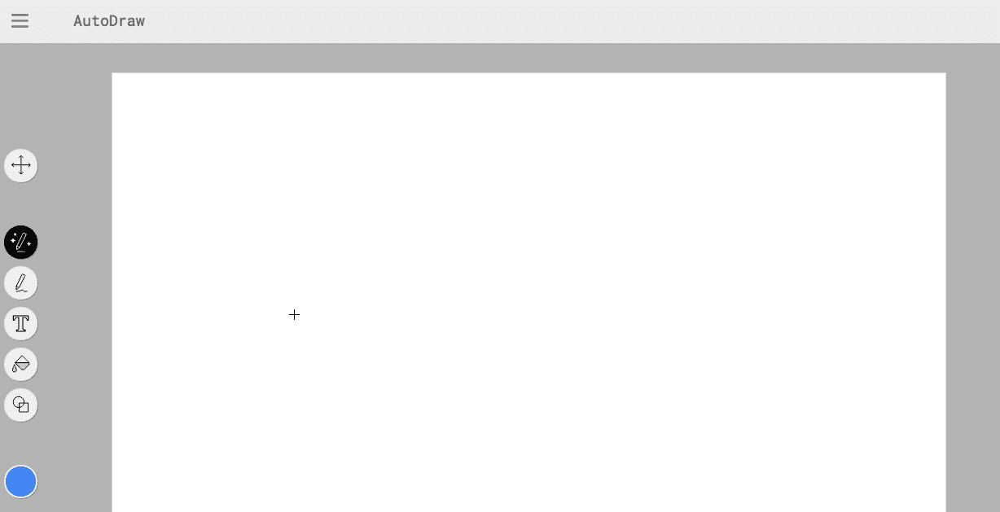
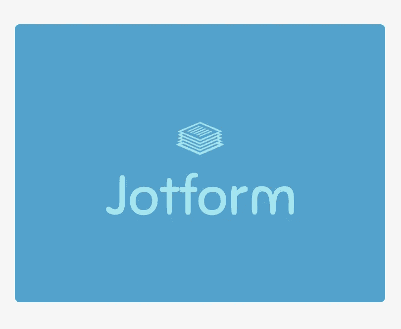
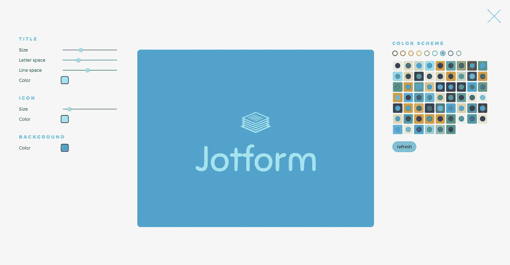

# 用户界面的自主适应

> 原文：<https://medium.com/swlh/autonomous-adaptation-of-user-interfaces-66ea9022f0a0>

## 设计的未来掌握在机器手中。

Photo by [Juan Carlos Fernández Rodríguez](https://unsplash.com/photos/LidrIEeo4D0?utm_source=unsplash&utm_medium=referral&utm_content=creditCopyText) on [Unsplash](https://unsplash.com/search/photos/chameleon?utm_source=unsplash&utm_medium=referral&utm_content=creditCopyText)

想想就在十年前，我们还在谈论革命性的新 iPhone，以及它将如何永远改变我们的生活，这难道不疯狂吗？

快进到 2018 年，苹果永无止境的 iPhone 更新已经是旧闻了。

真正热门的话题是人工智能，也就是计算机如何开始比我们更聪明。

一如既往，技术进步改变了(并将继续改变)我们的产品体验。

与此同时，技术继续为组织和设计师创造新的机会。成功追随新趋势的公司——尤其是在竞争对手赶上之前——将会脱颖而出。

他们将能够为他们的 UX 创建新的和改进的用户界面，这些界面是自主的和自适应的。

我自己的公司 [JotForm](https://www.jotform.com/) 就亲身经历过这种情况。在开发我们新的在线表单 [JotForm Cards](https://www.jotform.com/cards/) 时，我们利用了现有的最新技术来创建一个与众不同的 UX。

我们不是唯一的。

*这里有一些例子可以确切地说明我的意思……*

## 1.从草图到界面(Airbnb)

产品周期由许多阶段组成。每当一个规程完成了它的工作，它就把责任传递给另一个规程。自然，传递这种共享的意义需要一些时间。时间是没有人愿意浪费的东西。

Airbnb 最近宣布了一项新的自主技术来解决这个问题。他们的技术将设计师的白板图纸转化为特定于组件的可执行代码行，供 Airbnb 工程师使用。通过压缩产品周期的几个阶段，他们节省了大量的时间——并且领先。

## 2.适应页面风格的表单(JotForm)

在过去的八个月里，我们一直在 [JotForm](https://www.jotform.com/) 做一个新的表单设计。桌面和移动版本并不像我们希望的那样工作，我们的嵌入表单视图结果也不尽如人意；因此，我们开始深入挖掘，以便更好地理解问题的根源。

短版？我们的研究向我们展示了三种不同的嵌入表单视图，它们不符合我们的设计(框视图、列视图和自定义视图)。

Embed forms adapting to page style

因此，使用嵌入式表单网站来维护我们的响应式设计方法是很棘手的(因为不明确的缩放和样式问题)。

因此，我们决定创建一个自主和自适应的系统，以便为我们的用户生成 a) *适当的表单布局解决方案*和 b) *样式选项*。

这是我们在 [JotForm Cards](https://www.jotform.com/cards/) 的新功能之一——基本上，它会自动将**我们的**表单与**你的**网站的设计相匹配。

想试试吗？只需复制并粘贴脚本嵌入代码到您的网站。JotForm Cards 将对其进行分析，并为您的网站生成最佳外观。

我们用来创建这个的技术叫做[智能嵌入](http://docs.couchcms.com/miscellaneous/smart_embed.html)，一个可以改变表单布局和样式的适应性嵌入视图。

简而言之，它根据 iframe 的大小来组织表单的内容。它还生成样式以确保视觉和谐。如果你对结果不太满意，你可以使用在线编辑模式进行调整。

## 3.根据用户标识生成表单样式(JotForm)

标志是任何品牌的重要视觉表现。但是有时候，要把一个标志和一个网站很好地结合起来并不容易。

我们亲身经历过这个问题。这就是为什么我们决定创建一个自主的、自适应的功能，它采用一个公司的徽标，并根据其美学生成一个自定义的表单。

*这里有一个例子:*

当您添加徽标时，表单的背景、按钮和进度条样式会自动更改。 [JotForm Cards](https://www.jotform.com/cards/) 也重新安排了配色方案，以确保一切搭配美观。

您可以在 [JotForm](https://www.jotform.com/) 仪表板的 [My Forms](https://www.jotform.com/myforms/) 部分测试此功能。只需将您的徽标添加到您的欢迎页面上，坐下来，看着奇迹发生…

## 4.为欢迎页面生成图标(JotForm)

[平台](https://www.jotform.com/)上的每一个表单都有独特的身份。因此，如果一个表单有一个徽标，表单创建者和它的回答者之间的交流就会改善。但是一些表单创建者可能没有或者没有使用徽标。

JotForm 卡使用自定义图标来解决这个问题。如果您是注册用户，您的表格图标将从您的行业详细信息中生成。如果您不是注册用户，或者您还没有在您的用户资料中定义您的行业，那么 [JotForm Cards](https://www.jotform.com/cards/) 将会从您的表单标题中解释一个图标。

*看看这个例子:*

Finding icons from form title.

## 5.生成带有背景图像的表单样式(JotForm)

自定义背景图像是表单创建的另一个很酷的特性。但是设计辅助设计元素(比如按钮和进度条)来补充这些背景图片对于一个没有经验的用户来说是一件痛苦的事情——或者仅仅是一个时间不够的人。

有了 [JotForm Cards](https://www.jotform.com/cards/) ，你不需要成为设计内聚表单的专家:你只需要上传一张反映你品味和偏好的背景图片。JotForm 智能主题将处理剩下的工作。

该表单的所有 UI 元素都将被修改，以保证有吸引力的最终结果。

Smart form styling from selected background.

## 6.将绘图变成视觉效果(谷歌自动绘图)

谷歌最近发布了 [Auto Draw](https://www.autodraw.com/) ，这是一个基于用户草图生成视觉元素的程序。你能用鼠标画出的任何东西都会被人工智能自动完成——并得到改进。

[自动绘制](https://www.autodraw.com/)根据提交的图纸更新其建议。用户还可以在“你的意思是……”部分看到推荐的“最接近的匹配”。

 [## 自动绘图

### 大家快画图。AutoDraw 将机器学习与天才艺术家的绘画结合起来，帮助你画东西…

www.autodraw.com](https://www.autodraw.com/) 

## 7.基于输入单词的徽标生成器(商标)

[Brandmark](http://brandmark.io/) 是一个 AI logo 生成器。它与[智能嵌入](http://docs.couchcms.com/miscellaneous/smart_embed.html)的不同之处在于它需要用户的输入。本质上，它根据提交的关键字生成徽标概念；你所需要做的就是键入你公司的名称，并添加一些描述。 [Brandmark](http://brandmark.io/) 会自动找到合适的字体和图标。然后，它将它们结合起来，创造出你全新的企业形象。

*这里有一个基于我的输入的例子:*

Brandmark generated JotForm Logo

如果您对结果不满意，可以使用编辑模式进行微调。

Brandmark Logo Edit Mode

# 最后的想法

这是一个事实:自主和适应性设计创造了一个更好的 UX。它们提高了产品的质量，同时让更多的人可以接触到它们。

像这样的技术还可以节省时间，增强设计师的能力。

能够跟随这一趋势的公司将在早期获得收益。

AI 要接管世界了吗？谁知道呢。也许在拐角处有一个更大的“下一件大事”。

但与此同时，让我们充分利用手边的创新。

你有什么想法？请在下面的评论中告诉我。

*最初发表于*[*【www.jotform.com】*](https://www.jotform.com/blog/413-Autonomous-adaptation-of-user-interfaces)*。*

但与此同时，让我们充分利用手边的创新。

你有什么想法？请在下面的评论中告诉我。