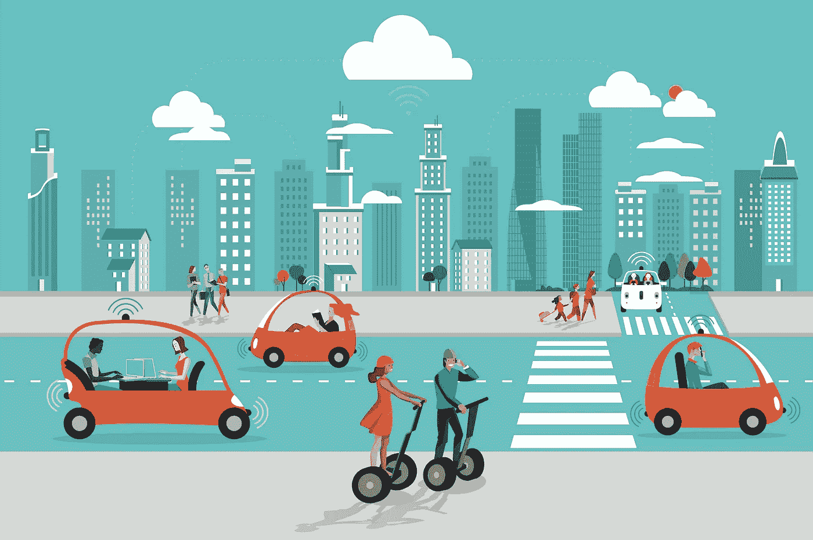
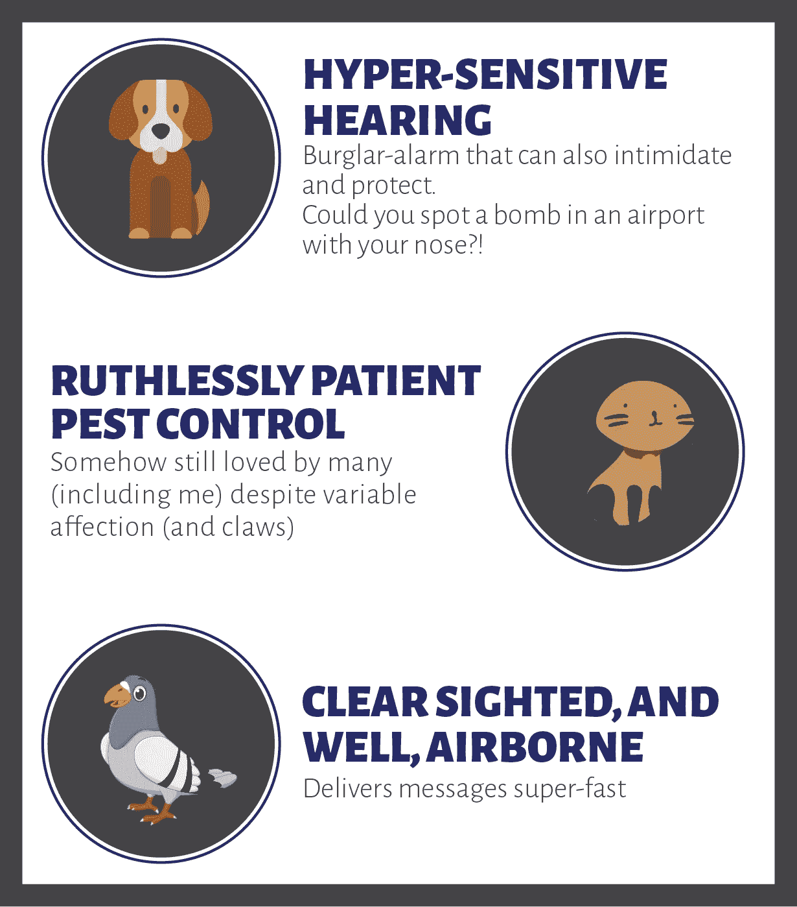
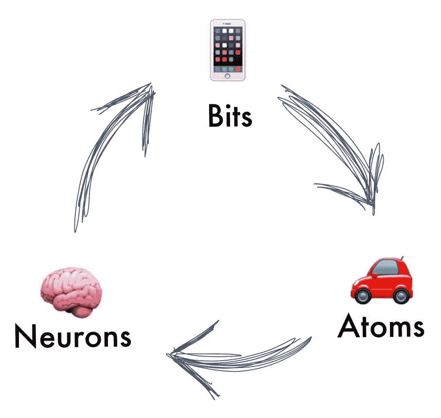

# 自动驾驶汽车:我们需要开始问的 5 个问题

> 原文：<https://medium.com/swlh/autonomous-vehicles-5-questions-we-need-to-start-asking-a01ee14a84b0>

[Jesussanz](https://jesussanz.com/mi-portfolio/page/3/)/[iStock.com](https://www.istockphoto.com/)

> **“写科幻小说。你所构想的新现实要么被编码和建造，要么被立法禁止。”—蒂姆·伯纳斯·李**

我曾经问过蒂姆爵士([万维网](https://en.wikipedia.org/wiki/Tim_Berners-Lee)的发明者)，“我们能做些什么来确保机器学习和人工智能对人类产生积极影响？”

他的回答:“写科幻小说……”

自动驾驶汽车(“AVs”)可能是我们这一代人的*颠覆性创新。技术和法律挑战得到了大量报道。我们也需要考虑人类面临的挑战。*

*让我们拿一些关于移动未来的想法，抓一把科幻小说，然后把它们扔进搅拌机。一些“嗡嗡声”是不可避免的，但我会尽量保持在最低限度。*

## ***1。我们应该推动无人驾驶汽车前进，还是拖住它？***

***好:***

*   *AVs 不会停(多)；释放出大片城市区域，成为住宅、商业和公园。*
*   *AVs 应该不会杀人；有望终结全世界每年约 100 万的车祸死亡。*

*[MSN](https://medium.com/u/78c5166b8328#1e2cf5f848fb) 关机的时候，你可能已经感到难过了。你感觉到这个的悲伤了吗？！*

**

*Hedwig’s self-sacrifice.Harry Potter and the Deathly Hallows: Part 1*

## ***4。人类的(新)最好的朋友。AVs 会比 PC 更像宠物吗？***

*基思·亨尼西(Keith Hennessey)是斯坦福大学“开放之路”的教师，他问了我一个非常左的问题，“一匹马在 0-5 的自主范围内属于哪个等级？”([自主比例](https://www.forbes.com/sites/robertszczerba/2018/07/19/rise-of-the-machines-understanding-the-autonomy-levels-of-self-driving-cars/#7fd0977e9593)大致为 0:完全非自主汽车，5:汽车随时随地自动驾驶)。我说一匹马可以是 2 级到 5 级+。为什么这么高？我父亲告诉过我一个他曾经认识的骑手。一天结束时，他可以放下缰绳，他的马会找到回家的路。骑手是盲人。*

*AVs(以及更广泛的机器学习/人工智能)将拥有超人的能力。这不应该吓到我们。人类有很长的历史来接纳比我们更有能力的其他生物进入我们的生活和社会。几个例子:*

**

*Pets that have superpowers*

*这些动物很重要，不是因为它们“像”我们，而是因为它们比我们更有能力(哪怕只是在一个狭窄的领域)。他们可以忽视，如果需要的话，伤害，压制或者抛弃我们。结果呢？我们控制不了他们。我们珍惜它们。*

> *“当你的马没有被要求就跟着你，当它用头蹭你的时候，当你看着它，感觉到脊梁骨一阵刺痛……你知道你被爱着。”*
> 
> *—约翰·莱昂斯*

## ***5。结束循环。你能做什么？***

*AVs 很重要。他们会对世界有好有坏。借鉴科幻、幻想和自然历史，大胆思考对人类的影响，可以帮助我们决定前进的方向和防范的方向。*

**

*Tech’s Third Wave: bits move atoms move neurons…*

*他们移动自己的能力将使 AVs 看起来比其他机器更有活力。如果我们做得对，这不会吓到我们。把某样东西视为劣等品会让我们偏执地认为角色有一天可能会颠倒过来。当我们承认某事或某人更好时，我们崇拜他们。*

*同理心的联系将为科技带来第三次浪潮。可能是最后阶段；创建一个完整的循环，其中软件(bits)驱动 AVs(原子)激发情绪(神经元)导致进一步的行动。*

*我没有结论——只是对可能性感到难以置信的兴奋，并担心会以正确的方式追求它们。*

*我想以我的朋友兼顾问布兰登的一个想法作为结束语:*

> ***“仅仅让人们的生活变得更容易还不够。我们需要让他们生活得更好。”***

*这是对我们所有人的挑战。*

## *作者:*

*詹姆斯·佩利是 OXO 公司的首席执行官，joinoxo.com 是首席执行官。詹姆斯最近从斯坦福大学毕业，现在在旧金山工作，他总是很兴奋地与关心以下问题的人交谈:*

*   *机器学习*
*   *自动驾驶汽车*
*   *共享经济*

> **感谢您的阅读。如果你喜欢，请随意按下按钮👏(想看多少遍就看多少遍！)帮别人找。**

***脚注:***

1.  *关于。司机失业，哈里·坎贝尔([拼车人](https://therideshareguy.com/))强调了[难以自动化的司机任务](https://qz.com/work/1312224/what-uber-and-lyft-drivers-think-about-self-driving-cars/)。剧透:它涉及到🤮)*

**

## *这篇文章发表在 [The Startup](https://medium.com/swlh) 上，这是 Medium 最大的创业刊物，有+ 381，508 人关注。*

## *在这里订阅接收[我们的头条新闻](http://growthsupply.com/the-startup-newsletter/)。*

**