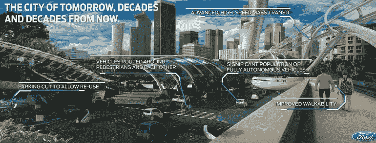
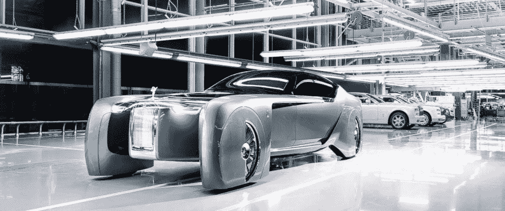

# 自动驾驶汽车——经济与人类(下)

> 原文：<https://medium.com/swlh/autonomous-vehicles-economy-humans-part-2-d14c2ef771f1>

[继续我之前的文章《驶向未来——自动驾驶汽车》——在这篇文章中阅读更多关于自动驾驶汽车对经济的影响&对人类的影响]

# **经济依赖部门**

1.  随着汽车和石油行业的游说者试图阻止无人驾驶汽车的努力失败，政治将变得丑陋。
2.  许多律师将失去收入来源——交通违规、车祸诉讼将大幅减少。
3.  救护车和其他急救车辆可能会减少使用，性质也会改变。更多的人将乘坐常规的自动驾驶汽车，而不是救护车。救护车会更快地运送人们。军用车辆可能也是如此
4.  随着加强控制和安全成为可能，机场将允许车辆直接进入航站楼，甚至可能进入停机坪。
5.  对出租车和卡车司机的需求将会下降，最终为零
6.  餐馆和酒吧将出售更多的酒
7.  车辆很可能会被各种各样的广告填满(其中大部分你可能会在路上行动)，尽管可能会有支付更多费用来获得无广告体验的方法
8.  城市、乡镇和警察部队将失去来自交通罚单、通行费(如果没有取消，可能会被取代)和燃油税的收入急剧下降。这些很可能会被新的税收所取代(很可能是车辆行驶里程税)。
9.  驾照会慢慢消失，大多数州的机动车部门也会消失。
10.  许多道路和桥梁将被私有化，因为少数公司控制了大部分运输并与市政当局达成交易。随着时间的推移，政府可能会完全停止资助道路，桥梁和隧道

# **人类**

1.  老年人和残疾人的流动性将会大大改善(随着时间的推移)
2.  父母们将有更多的选择来独自带着孩子四处走动。优质安全的端到端儿童运输服务将有可能出现。这可能会改变许多家庭关系，增加父母和子女获得服务的机会
3.  人与人之间的货物流动将变得更便宜，并开辟新的市场
4.  更多的人将参与赛车(汽车、越野、摩托车)来取代他们对驾驶的情感联系
5.  我们的隐私会减少，因为内部摄像头和使用日志会跟踪我们何时何地去过哪里。外部摄像头也可能会记录周围环境，包括人。这可能会对犯罪产生积极影响，但也会带来许多复杂的隐私问题，并可能引发许多诉讼
6.  在道路上受伤或死亡的人会少得多，尽管我们会认为是零，当事故真的发生时，我们会非常沮丧

# **新产业——新未来**

1.  黑客攻击车辆将是一个严重的问题。新的软件和通信公司和技术将会出现来解决这些问题。
2.  各种各样的传感器将被嵌入具有第二用途的车辆中——如改善天气预报、犯罪检测和预防、寻找逃犯、基础设施状况(如坑洼)。这些数据将被货币化，很可能由拥有运输服务的公司来实现。
3.  随着汽车行业广告支出的消失，娱乐资金将会发生变化。想想你看到或听到多少关于汽车、汽车融资、汽车保险、汽车配件和汽车经销商的广告。
4.  汽车融资行业将会消失，打包次级汽车贷款的新的巨大衍生品市场也将消失，这可能会导致 2008-2009 年金融危机的迷你版。
5.  汽车设计和制造领域的新玩家将是各种公司的混合体。可能会有 2 到 3 家主要公司控制面向客户的运输市场的 80%
6.  创新的类似应用程序的市场将为在途购物开放，从礼宾服务到食品、商品、教育到娱乐购物

最后……

杰夫·贝索斯将通过亚马逊收购更多互联领域的公司，最终成为“地球上最富有的人”——而埃隆·马斯克将在火星上争夺同样的地位。

谢谢你

法尼·马鲁帕卡

**产品营销&创业布道者**

https://www.linkedin.com/in/phani-marupaka-02646b3**T4**3/

图片提供:谷歌自动驾驶汽车图片

页（page 的缩写）s:我在 quora 上读了很多文章来总结这篇文章——所以我不能把个人荣誉归功于任何特定的人。

## 这篇文章发表在 [The Startup](https://medium.com/swlh) 上，这是 Medium 最大的创业刊物，有 314，551+人关注。

## 在这里订阅接收[我们的头条新闻](http://growthsupply.com/the-startup-newsletter/)。

