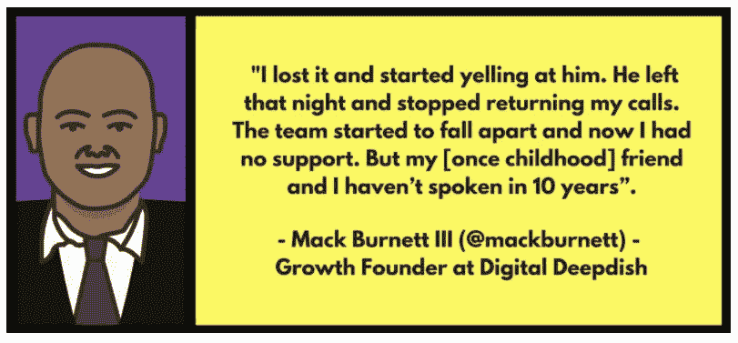

# 避免陷阱:与你的朋友一起创业，而不要撕扯彼此的喉咙

> 原文：<https://medium.com/swlh/avoid-the-pitfalls-build-a-business-with-your-friend-without-ripping-each-others-throats-out-a3cb0192ab31>

**原载于** [**混搭**](http://mashable.com/2017/09/19/how-to-start-a-business-with-your-friend/?utm_cid=hp-r-1#2Vc1qr3T2mqa) **和** [**醒目博客**](https://blog.strikingly.com/blog/build-a-business-with-your-friend?utm_source=medium%20blog)

*(Co-founders of Strikingly, in order of appearance: Teng Bao, Dafeng Guo, David Chen)*

> “和你最好的朋友一起创业是个坏主意。和老婆或者女朋友一起创业也是一个很糟糕的想法。根据不同的情况，你最终会变得没有朋友、离婚或者单身。戈登·米勒

这个建议大家都听说过。
所有人。

不要把工作和娱乐混为一谈。因为快乐总是会消失。

大多数时候，业务也是如此。

你已经在像 Reddit 和勇士论坛这样的在线论坛上读到了这些恐怖故事。

或者你可能已经经历过了，这让你少了一个长期的朋友、爱人或亲戚。

> “我要求他专注于业务。我失控了，开始对他大喊大叫。那晚他离开了，不再回我电话。这个团队开始分崩离析，现在没有人支持我了。我们在脸书仍然保持联系，也许我们通过 DM 聊过一两次。但是我和我[曾经的童年]朋友已经 10 年没说过话了”。马克·伯内特三世

哈佛商学院的诺姆·乏色曼为他的书《创始人的困境》研究了成千上万的创始人，他发现超过 50%的创业失败是由于联合创始人的冲突。

为什么？

也许他们没有犯下。

也许他们的工作风格不兼容。

也许他们对公司有不同的愿景。

也许当他们争吵时，变得情绪化和个人化，事情失去了控制——很快。

商业关系中的这些分裂可能有无数的原因(或者只有一个)。

而且很多都是可以在承诺和许诺之前避免的。

Quora 上的一位评论者建议，“在前进的过程中找出陷阱和挑战。没有这些陷阱，你永远不会成长，也不会学习”。

***这是可怕的建议。***

在这些条款下—

您的朋友现在已阻止您使用他们的所有社交媒体，并且未回复您的短信或来电。

你的另一半离开了你，带走了狗、冰块托盘和马桶座圈。

或者一个家庭成员已经完全切断了你的联系，而你在下一次家庭聚会时得到了那些侧目。

你会吸取教训吗？…
***值得吗？***

更不用说分离发生时的陷阱——以及提起的诉讼。

我们不仅与[stalling 的联合创始人](https://blog.strikingly.com/blog/how-to-get-into-y-combinator-the-no-bs-approach)(滕宝，&郭达峰)进行了交谈，他们已经创业五年了(朋友的时间几乎是他们的两倍)，我们还联系了几位企业家，听取他们如何预测和避免这些联合创始人的错误，这些错误已经分裂了企业，破坏了关系。

听起来很戏剧化？

确实是。生意是严肃的事情。

正如醒目的联合创始人大卫所说，“无论你的联合创始人是朋友，你的堂兄，还是你正在谈恋爱，都要知道，一旦你和他们一起做生意，事情就再也不会一样了”。

# 从小处着手

> “如果你承诺了一个项目，却没有兑现，那么友谊就会破裂。但是，如果没有真正的承诺(例如，对收到的反馈没有反应，或者几天后对项目没有真正的兴趣)，什么都不会真正改变，你继续你的生活。——郭大丰

大丰建议你从小事做起，而不是边喝啤酒边做出新的、令人兴奋的努力。

比如周末的小项目。

> “一起做一个小项目，找出你的工作方式，看看(这个人)在压力下是如何工作的。有很好的机会，比如黑客马拉松项目或为期一周的兼职项目创意。如果 hackathon 项目失败了，你们不再一起做生意了，最好是离开，而不是在做了 6 个月后发现你们的愿景出现了分歧。

通过这样做，你可以在现实生活中了解这个人是否会成为你未来的好伴侣。

一些迹象表明你和这个人可能不是好伙伴？

*   缺乏交流——也许是因为你是个早起的人，而他们是个夜猫子
*   他们在压力下崩溃(例如，不知道如何在截止日期前确定优先级)
*   他们很少有或没有耐心，很容易发怒
*   他们缺乏责任感，不坚持项目
*   他们没有承诺(也就是说，他们不像你那样认真对待它)

这就是 Syed Balkhi 和他的联合创始人 Thomas 在创办 optin monster(T2)之前所做的事情。

> “我们决定做一个较小的激情项目。这让我们在开始更大的合作之前真正了解了对方。当我们在激情项目上一起工作时，我们意识到我们确实互补了彼此的技能。在努力工作、诚实和关心顾客方面，我们有着相同的核心价值观。自从我们在 OptinMonster 开始合作以来，我们的关系越来越好。

[浪子论坛](https://twitter.com/MJDeMarco?ref_src=twsrc%5Egoogle%7Ctwcamp%5Eserp%7Ctwgr%5Eauthor)的 MJ Demarco 有着不同的经历。

> “回到我二十几岁的时候。我和两个朋友创业了。我 100%致力于这项事业。我的其他创始人有其他优先事项，我们的业务是他们的第四或第五兴趣。一位创始人专注于其他业务。另一位创始人希望在工作中获得晋升，并从事体育运动。这让我成为唯一一个拼命牺牲的人。我的合作伙伴都是好人，也很有动力——只是他们的兴趣是多元的，这不是良好合作关系的基础。当事情明朗后，我没有为此与他们争吵，我们只是同意解除合作关系”。​

在短期项目中，最好是早发现而不是晚发现，而不是在关系和实际收入岌岌可危的时候。

# 不要穿过小溪

你还记得《捉鬼敢死队》中的那句台词吗，埃贡警告不要过河？

如果你做了会发生什么？
那就糟了。

所以，你决定和这个人一起管理公司。
超级。

把“过河”想象成你和你的联合创始人因为没有明确规定你们每个人在公司内的职责而踩了对方的脚。

Zapier 公司的 Wade Foster 记得他和他的联合创始人刚开始创业的时候:

> “我们尝试了几种不同的合作模式。有一条路看起来非常直观，但经过大约 6 个月的努力，很明显魔鬼就在细节中。我们认为直观的一切都不是”。

在做出所有其他业务决策之前，让我们先来看看你们的合作关系需要巩固的基础构件。

否则你的公司很可能会崩溃，把你埋在废墟中。

> 警告:不要跳过与你的联合创始人的这些讨论。如果你对谈论这个感到不舒服，那么你怎么能诚实和公开地讨论在新的业务中肯定会出现的其他问题呢？最好现在就解决这个问题，并建立一个公开的沟通，而不是 6 个月后，你的律师在房间里，礼貌在窗外。

## 同一页

不要边走边想计划。

我们已经谈过这个了。
这是个糟糕的主意。

你有一个目标，但你的联合创始人有另一个目标。

达成共识。
一条心，一条心。

正如滕所说:

> “为了公司或产品的更大目标，你们所有人都需要相信同样的使命。需要从一开始就尽可能明确目标，以防止任何冲突”。

## 你在想钱

谁得到什么，得到多少？

有人会因为这个人想出了这个主意而比其他人得到更多吗？

在创始人通过创始人导师的建议，惊人地确定他们在 T4 成功后继续前进之后，他们签署了一份标准合同，在三个合伙人之间进行股权分割。

完成了。
简单明了，开门见山。

现在，在你所有其他紧迫的优先事项的宏伟计划中，这只是一个短暂的想法。

## 基本规则

Techstars 已经帮助创立了 1000 多家公司。

他们见过所有能想到的联合创始人团队的组合。

这是创始人兼联合首席执行官[大卫·布朗](https://twitter.com/dbrown?lang=en)建议所有联合创始人做的事情:

*   一开始就谈论当冲突出现时你会如何处理(例如，你们都愿意接受批评吗？)
*   就你不同意的情况下你会怎么做进行对话(并且没有第三个创始团队成员)。谁的观点占上风？
*   确保你抽出时间来征求建设性的反馈，不要把它当成是针对个人的(例如，我做了什么让你发疯的事情吗？)

听起来很尴尬吗？有可能。

不管怎样，习惯就好。

你的联合创始人生涯将充满这类讨论。

## 了解你的角色

“每个人都应该明确自己在公司的角色”，滕说。“如果创始人之间的技能有重叠——比如说你们两个都编码——一个做前端，另一个做后端”。

如果你们两个都擅长营销——一个可以处理产品，另一个可以处理付费广告。

如果你是一个内向的人，而你的联合创始人是一个外向的人——你处理幕后工作，而你的搭档处理媒体和销售。

总的来说，不要骗自己。

诚实地说出你的优势和你能做出最大贡献的地方。

诚实，在你能为企业增加最大价值的地方，将有助于友好地推动前进。

# 对抗

在我们进入伴侣关系中最难的部分之前，让我们假设一些事情已经在你们的关系中固化了。

*   你和你的伴侣之间有一种潜在的信任和尊重。如果不这样做，任何争论都无法解决。
*   你们都有自知之明。
    正如大丰所说，“有些人甚至没有意识到他们在情绪化(例如*“我没有情绪化，我充满激情”！*)。
    了解情况，这样你就知道是否需要走开或后退，并在以后重新组织”。

## 统治他们的唯一原则

> 我明白了，人们会忘记你说过的话，会忘记你做过的事，但人们永远不会忘记你带给他们的感受。玛娅·安杰洛

“不能收回”。

“一旦你用言语伤害了某人，你就无法消除那种痛苦。“在我说任何话之前，”大丰说，“我会三思而后行。这就是我的真理”。

这种心态是 Strikingly 的联合创始人相互之间热烈讨论的方式。

以下是他们的一些心得，关于他们是如何找到解决困境的合适方法的:

*   没有必要蹑手蹑脚地面对你的联合创始人。如果有，那会伤害关系。
    坦诚地说出你们之间的任何顾虑。
*   开始的时候，你可能会发现自己有激烈的争吵，当然你会觉得这是针对你个人的。
    很自然。但你会克服的。克服它的过程是意识到公司的进步比你个人的争吵更重要。你知道企业需要在哪里，你需要做什么，所以接受这不是针对个人的。
*   最糟糕的事情是消极攻击，因为它可能会持续数周，甚至数月，并产生长期影响。
    谈论一个伤害你和企业生产力的商业杀手。

*   尽最大努力不要掺杂情绪，用数据来证明你的观点。这就是如何说服对方。
    不是个人观点，是统计和事实。
*   如果你能把你的沮丧转化成有成效的东西，不管是产品创意还是替代建议，那就去做吧。专注于手头的任务，明确最终目标。
*   如果联合创始人之间在如何推进某个特定项目的问题上存在分歧，十有八九，最终决定应该由在该领域最有专业知识的人做出——这一点你们应该已经达成一致。

合伙人之间的对抗是不可避免的。

避免一场爆炸性的冲突是自我意识和控制情绪的关键。

如果你发现自己失去了控制，在再次走进去之前，先走开，让你的头脑清醒过来。

在达成决议之前，可能要进行多轮讨论。所以知道自己的极限对你有好处。

当我们问[罗斯·西蒙兹](https://rosssimmonds.com/)在与同事或联合创始人发生争执后，他是如何放下残余情绪的，他说他“一直专注于对企业最有利的事情，并从这种情况中去除了所有情绪”。

“放手”，西蒙兹解释说，“我带着这种观点进入场景，这样很容易专注于进展而不是感觉”。

# 额外津贴

> “作为一名单身创始人，我觉得自己背负着无法与任何人分享的重担”。——GrooveHQ 的亚历克斯·特恩布尔

许多独立创业者都背负着一个沉重的负担，通常是默默地，一直压着他们。

做出重大决定的压力不仅影响你，也影响你的员工。

从你一天中要做的所有决定中，你的大脑被烧焦了——即使是做最简单的决定，比如“今晚我该吃什么？”，太过分了。

你有你觉得不能和任何人讨论的问题。

你感到孤独。
郁闷。就好像地心引力向你压来，你一直都很疲惫。

独自去做可能会在精神上和情感上伤害你，并让你走上黑暗的道路。

从人们提到的与你的朋友一起做生意的所有告诫中，要知道这种沉重的负担伴随着个体创业而来。

solo 创业可行吗？
当然！

尽管我们仍然会列举一些与他人一起经历这一旅程的额外好处:

*   重大决策可以从不同的角度进行分析和审视——无论你是悲观主义者还是乐观主义者，现实主义者还是梦想家——从各个角度审视它将有助于你找到推动业务发展的最佳解决方案。
*   如果你晚上工作到很晚，至少你可能不是一个人。

*   每个人都有自己的角色和专家团队来完成特定的任务。当公司发生“火灾”时，如果你是一名创业者，所有的问题都会找上你。对于联合创始人来说，根据问题的范围，它会交给最好的人和团队来处理..
*   最重要的福利是什么？你永远不会孤单。当事情开始变得沉重时，你有一个人可以把你拉到一边和你说话。有人可以倾诉你的挫折和担忧。他们能够感同身受，因为他们正在经历同样的事情。

有时只是说出来(或尖叫出来)——把它放在世界上(没有特别为你的沮丧寻找答案)——并且有一个能理解你所说的话的人，就足以缓解你的思想，所以你可以前进并避免那些黑洞。

*Let it out woman. Just let it out…*

# 一切都归结到这一点

现在，如果你决定与朋友、亲戚或爱人建立伙伴关系，你就知道自己会遇到什么了——好的、坏的和尴尬的。

你知道如何在汹涌的水流中航行。

因为他们会来，但希望会通过…没有伤亡。

现在我想以迈克尔·波兹涅夫的一句话来结束这篇文章。

在他与一位朋友长达 16 年的商业伙伴关系中，这导致了:

抑郁、极度的自我怀疑和恐慌症。

最终从这种合作关系中分离出来后，这让他建立了 iwannabeablogger.com 的，如今每篇博客文章收到超过 100 条评论，博客文章分享量远远超过 1K。

迈克尔的建议是:

> “和相信你的人在一起。一旦你觉得自己被指责了不该被指责的事情，这是你必须和那个人分手的第一个信号。你和你的共同创始人应该被共同的价值观和目标所约束。评估诚实，不仅仅是你的工作和对你们共同事业的贡献，还有你的合作伙伴的努力。
> 
> 但最重要的是，要快乐健康”。

为今天和未来的共同创始人干杯。

我们希望永远不要在 Reddit 论坛上找到你的“联合创始人的恐怖故事”。

## 你和朋友、家人或爱人一起创业了吗？我们错过了对你有帮助的提示吗？

## 请在下面留下评论，分享你的智慧(或你的经验教训)。

【blog.strikingly.com】最初发表于**。**

**

## *这篇文章发表在 [The Startup](https://medium.com/swlh) 上，这是 Medium 最大的创业刊物，拥有 274，241+人关注。*

## *在此订阅接收[我们的头条新闻](http://growthsupply.com/the-startup-newsletter/)。*

**