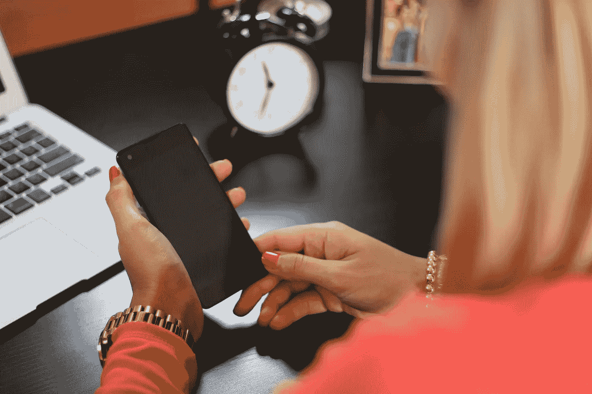

# 让会议更有效率的绝妙方法

> 原文：<https://medium.com/swlh/awesome-hacks-to-have-more-productive-meetings-e75a2f968217>

我发现会议出奇地放松。当你走进一个会议的时候，你会放慢速度，绕过你真正应该讨论的话题。但我相信，如果你要把人们从座位上叫走，那真的应该有一个非常好的理由。

> 基本上，如果某件事需要召集一群人离开他们的办公桌，那就需要集中精力把它做好。

那么，如何在**召开更有成效的会议**？这里有一些我用来让会议变得高效的技巧！

# 什么使会议富有成效？

好的，所以会议就是一群人(超过 1 人)聚在一起讨论问题并做出决定。高效会议的目标是增加每分钟决策的数量。最简单的方法是:

1.  减少重要决策之间的空白空间(通过删除不重要的决策)
2.  减少会议的总时间

> *更有成效的会议的目标是增加每分钟决策的数量。最简单的方法就是减少重要决策之间的空白，减少会议的总时间*

考虑到这一点，以下是我让会议更有成效的一些古怪方法:

# 通过高度集中的议程让您的会议更有成效

制定议程并不应该让你感到惊讶。但是高度集中的部分应该。涉及多个话题的会议没有重点，也没有成效。当你在不同的话题间跳跃时，确保清晰、可行的要点也变得更加困难。

> 陷入多个话题的会议没有焦点。当你在不同的话题间跳跃时，确保清晰、可行的要点也变得更加困难。

现在我知道你的第一反应是“嗯，但是我需要更多的会议来达到同样的目的，这样效率会更低！”。没有。这是胡说八道，这就是原因。

潜意识里，我们对待大多数会议的方式是“我有一些面对面的时间，我最好最大限度地利用它”。你可以用各种各样的话题来填满它，比如:

*   个人元素(家里怎么样？),
*   办公室八卦(还没修好我的显示器！),
*   以及其他任何不相关的废话。

实际上，大多数会议的存在是因为有一两件非常重要的事情需要你去完成。这些是你们应该见面谈的唯一的事情。其他事情都应该放下，或者在会议之外处理(比如在电子邮件中)。更好的是，试着在一些小事情上起带头作用，给人们留下你是一个多么令人印象深刻的“主动者”的印象！

至于你的高效会议的重点议程是什么？这里有一个简单的框架，可以确保你的议程成功:

1.  有什么问题/情况(目前)
2.  是什么导致了这个问题/情况(过去)
3.  你确定了什么选项/步骤来解决问题/情况(未来)

最后，在结束会议之前，请确保您清楚地掌握了结果以及接下来的步骤。

附:一个好的“下一步”是世卫组织必须在什么时候做什么。

# 远程会议是富有成效的会议

我完全支持远程工作。原因是，当你脱离了生态系统，不得不“追赶”时，一切感觉都快了 100 倍。你没时间担心会计部的珍妮在做什么。

如果你曾经通过视频电话开过会，你就会知道他们有多尴尬。说闲话很奇怪，你不断地意识到你在盯着自己的脸。所以你尽你所能快速通过它，使它成为一个富有成效的会议。还有 tadaaaaa，就是它了！通过视频电话(Skype / Google Meet)进行更多的会议，你基本上就能让自己开出超高效的会议！

# 没有干扰的会议是富有成效的会议

智能手机和笔记本电脑已经成为我们日常生活的重要组成部分。mobileinsurance.com 的一项研究发现，普通人每天花大约 90 分钟打电话(相当于一年 23 天，相当于普通人一生的 3.9 年)。虽然数字设备不会去任何地方，但我们需要做更多的工作来确保它们得到有效利用！

让你的会议富有成效的一个简单的技巧是在会议期间把你的手机放在看不见的地方。你可以通过多种方式做到这一点，包括将手机放在办公桌上，或者放入会议室里的一个盒子或罐子里(如果公司采取统一立场，消除干扰，让会议富有成效)。这是让你的会议富有成效的一个非常简单的方法，尤其是当公司的每个人都尽最大努力来监督会议的时候。

# 常设会议是富有成效的会议

好吧，这个更狡猾一点。避开会议室，在走廊里开会或站在一般的办公区域，以此来进行高效的会议。我知道这听起来很疯狂，但是听我说完。这里的目标是尽快对重要的事情做出决定。当别人有地方要去，或者你感到不舒服的时候，没有什么比这更能让你更快地抓住重点。此外，通过站立，你会自然地踱步或摇摆，根据我的经验，这能让你在讨论中保持敏锐！

另外，如果你挡住了一条走廊/一扇门，或者在别人去洗手间的路上抓住了他，你会得到加分🙂

# 喜欢这篇文章？请打碎它👏按钮给它一些❤️ ❤️ ❤️！此外，请留下您的回复，因为我很想知道您如何让会议更有成效。

*原载于 2018 年 4 月 15 日*[*【stephenmaclennan.com】*](https://stephenmaclennan.com/awesome-hacks-to-have-more-productive-meetings/)*。*

## 这篇文章发表在《创业公司》杂志上，这是 Medium 最大的创业刊物，有 318，983 人关注。

## 订阅接收[我们的头条新闻](http://growthsupply.com/the-startup-newsletter/)。

