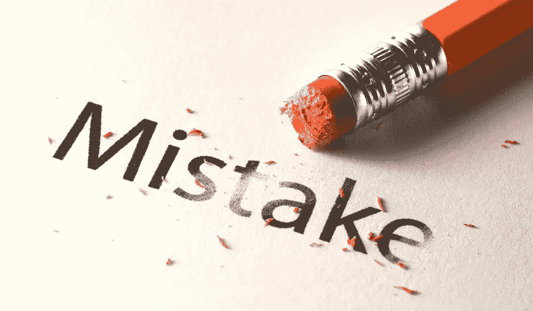
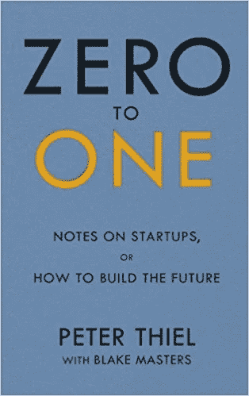
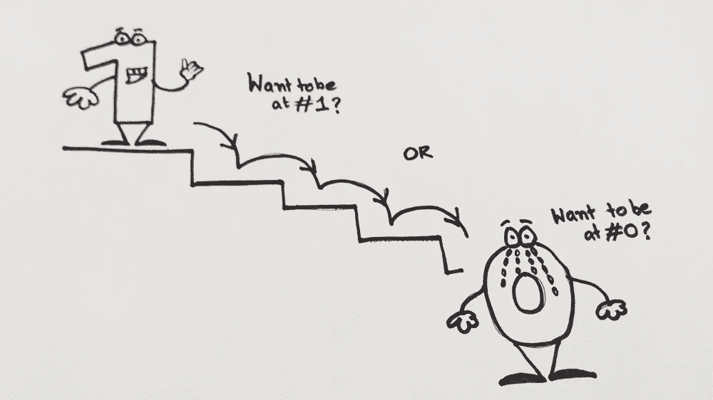
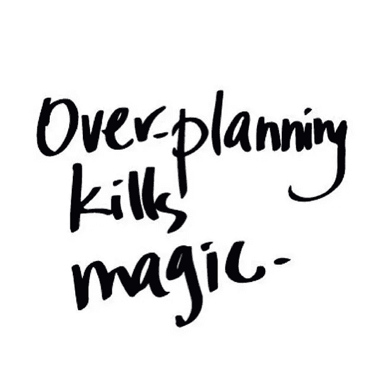
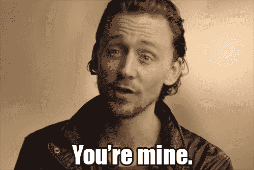

# 可怕的企业家错误会让你从 1 跌到 0

> 原文：<https://medium.com/swlh/awful-entrepreneur-mistakes-that-make-you-climb-down-from-one-to-zero-5b87f495072b>

你听说过 NYT 畅销书《[零比一](https://www.amazon.com/gp/product/0804139296/)》吗，作者是[创始人基金的合伙人彼得·泰尔？](https://foundersfund.com/team/peter-thiel/)你当然知道。毕竟，这是一位企业家写的，他在 1999 年推出了第一个在线转账系统 PayPal。

这是一本多好的书啊！通过回顾他从创建和出售 [PayPal](https://www.paypal.com/in/home) 、投资脸书并在此过程中成为亿万富翁的经历，讲述了彼得创业成功的哲学和策略。

唷——我觉得有很多东西要学。

然而，我将分享与他在书中分享的所有策略和哲学正好相反的东西。

他痴迷于创业期间的成功、痛苦和丰富多彩的旅程。

他在书中很乐观，并不断启发他在创业路线图中学到的经验。

但我认为有点不同。选择人迹罕至的道路来解释一个企业家在废墟上建立一个帝国的痛苦。

你会发现许多经验丰富的企业家会犯错误，但你永远不会发现他们在自己的书中对此谈了很多。

但是想象一下，如果他们在书中或笔记中叙述了这些，它可能会帮助许多正在崛起的企业家从 1 跌到 0。

我认为大多数企业家，如果不是全部的话，在目标设定或清晰的愿景方面没有问题。相反，他们没有预料到，甚至没有意识到前面的道路充满了坎坷。

所以我觉得创业者不要重蹈覆辙。然而，没有一个作者或专家敢在他们的书中指出或指出那些常见的错误。

> 奖金阅读:[RIP Product——为你犯下的这些可怕的错误](https://www.linkedin.com/pulse/rip-app-5-mistakes-makes-your-see-death-soon-swarnendu-de?trk=portfolio_article-card_title)

这里有一些精心挑选的常见错误，你可以绕开它们，避免停机。让我说清楚，要从零上升到一，你需要使用这个是-否选项列表作为你的发射台。

如果你不这样做，你可以自由地倒在地上。

但是不要回头看这份清单，因为你已经耗尽了你的商业投资回报。所以再次参考这个清单，就像从头开始一样。

## 1.你太热衷于计划和战略，但从未加入搏击俱乐部(这意味着你没有采取行动！)

我知道你需要计划。规划是任何企业成功的垫脚石。

但是过度规划？啊哈——它肯定会让你从 1 爬到 0。

[过度规划害死你的生意](https://www.lifehack.org/articles/work/overplanning-can-kill-your-business-idea.html)，你会想自杀吗？不，你不知道。你需要的是一个好计划。将导致决定的计划。

明确的决策计划需要-

*   专注于几个关键主题，而不是解决你所有的潜在问题
*   在转移到其他次要问题之前，强化已经给公司带来收入的领域。

## 2.想成为万事通，但却一事无成

我个人觉得帽子上加太多羽毛不一定都是好事。毕竟帽子变重了，你的成长被埋在下面了。

当一个客户过来要求几乎一盘“服务”时，你总是点头说“是”。

对客户提出的任何要求说“是”很容易，但是如果一个要求超出了你的专业范围，你就在拿你的时间、技能甚至你的品牌冒险。**轰！**

当你与客户交谈时，记住最初让你开始创业的服务/产品。把你的精力花在完善你觉得有激情的事情或一组事情上。

当我对某些功能说“不”而不是尽我所能榨取每一分钱时，我想我的客户是真的爱我。

## 3.你对你的产品有偏见，以至于对你的竞争对手视而不见

当你开始创造一个产品时，我知道你感觉像一个父亲，不愿意听到关于它的任何一个字。你可能认为这是市场上最好的东西。

这对你的自尊心来说是不是太大了？从长远来看，忽略你可以为改进产品而做的所有工作并不重要。

同样重要的是不要落入完美的手中。重要的是在“知道什么时候你需要完美”和“什么时候你不需要”之间找到一个健康的平衡。

犯错误是自然的，因为没有人是完美的。当这种情况发生时，站起来找出问题所在，重新制定策略，重新开始。在整个事件中，重要的是不要再犯同样的错误。

## 4.想独自经营生意？—这肯定会伤害你

你认为你能独自做这件事吗？你有那么傻吗？

如果没有沃森，即使是夏洛克也不可能成功(如果你把他看作是一个犯罪侦查行业的企业家的话)。)

如果你是一家初创企业，或者已经获得了一些天使投资——在某个饱和点上，一定要让朋友或家人参与进来。

我为什么这么说？—既然你会需要一个依靠的支柱。正如没有不冒风险的生意，所以要在所有这些风险情况下保持坚强，你需要有人支持你。

但是在这一系列事件中，要确保你不会在生意中找到错误的合作伙伴。选择合适的商业伙伴的首要步骤是认识到伙伴关系就像“婚姻”意思是，你们会吵架，会有误解，会吵架，会有分歧，但是你们需要有。因此，从第一天开始就设定期望，让你们双方之间的事情保持灵活和清晰。

## 5.你对现金流一无所知

创业时，你从未忽视财务。很明显，没有一分钱，你甚至不能买一把椅子和一张桌子。商业和金融齐头并进。但是[创业者哪里出了问题，很快就变成僵尸](https://www.theguardian.com/small-business-network/2017/aug/07/zombie-startups-entrepreneurs-failing-grow-businesses)？

这很容易诊断。他们几乎不检查财务报表，并继续在一些领域花费超过所需的现金。比如招聘、办公室装修、购买昂贵的工具和其他华而不实的物品——这些至少在 5 年内不应该出现在遗愿清单上。—结果，他们很快就用完了现金。

他们需要的是平衡资本，明智地投资。

阅读、分析并根据你的财务报表采取行动。如果你想在这个行业待久一点，集中精力投入更多的资本而不是支出。

# 该总结了

现在企业家犯的错误很多。然而，我想指出这五个主要的和最重要的，因为其余的你可能已经遇到了。我可能听起来不乐观，因为我谈了太多关于失败的事情。

> 但是“失败是一种选择”。正如埃隆·马斯克所说，“如果你没有失败，那么你就没有足够的创新。”

> 这篇文章最初发表在 [CEOWorld 杂志](http://ceoworld.biz/2018/06/27/awful-entrepreneur-mistakes-that-make-you-climb-down-from-one-to-zero/)。

**关于 SWARNENDU**

**Swarnendu De 是** [**创新解决方案**](http://www.innofied.com/) 、**获奖应用程序和游戏开发公司的联合创始人。**

Innofied 成立于 2012 年，是发展最快的软件开发公司之一，总部位于加尔各答，在浦那设有一个扩展的 R&D 中心。它在全球范围内发展壮大，在加州萨克拉门托设立了新的客户服务中心。Swarnendu 管理 Innofied 的技术和业务开发运营。凭借 10 多年的行业经验，Swarnendu 还撰写了由英国 Packt 出版社出版的 [Backbone.js 模式和最佳实践](https://www.amazon.com/Backbone-js-Patterns-Best-Practices-Swarnendu/dp/1783283572)。

他还是[cross India Adventure Tourism](http://crossindia.in/about)的联合创始人兼首席技术官，并领导其 IT 和数字营销业务。他定期在他的个人博客、[公司博客](http://innofied.com/author/swarnendude/)、LinkedIn 和其他热门平台上写作。

在推特上通过[@ swarnendud](http://twitter.com/swarnendude)关注他。

## 这篇文章发表在 [The Startup](https://medium.com/swlh) 上，这是 Medium 最大的创业刊物，有 339，876 人关注。

## 订阅接收[我们的头条新闻](http://growthsupply.com/the-startup-newsletter/)。

