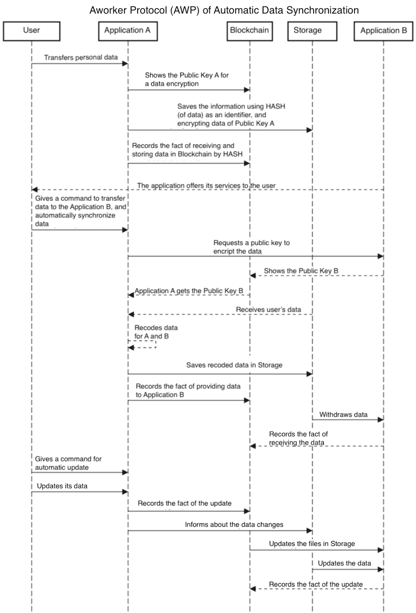

# 工作协议(AWP):数据同步是如何工作的？

> 原文：<https://medium.com/swlh/aworker-protocol-awp-how-will-data-synchronization-work-f9f2ab24f234>

从 [Unsplash](https://unsplash.com/photos/e31ANd1PXUw)

Wwith[Aworker](https://aworker.pro/)公司将能够通过一个与 a worker 协议相连的应用程序来测试候选人。公司打开一个连接到 Aworker 协议的站点或应用程序，并检查存储在分布式分类帐中的所有信息。

Aworker 平台的基础由智能契约和协议组成。Aworker 为开发人员创建分散式应用程序提供了一个完整的有用服务列表。我们还提供存储和数据交换系统，以及所有类型应用程序的框架，包括 API、SDK 和其他模块等工具。

应用程序与工作平台的交互将通过使用 API 来实现。Aworker 生态系统包括跨平台架构的开发，该架构将在选定的区块链(比特币、以太坊、EOS、NEO)中存储数据(哈希)。

Aworker 使用 DPoS consensus 算法来实现高数据保留率和更大的可伸缩性。

> *总之，我们的使命是建立一个声誉生态系统，让人们有机会在没有第三方参与的情况下轻松验证自己的身份和专业能力，每个人都能够控制自己的数据，并根据自己的知识和能力获得奖励。*

# 它将如何工作？

# 人力资源应用程序开发人员使用 Aworker 协议的优势

*   获得访问用户数据库的权限，这可能会引起他们的客户(公司)的兴趣。
*   Devs 可以立即访问人的数据的数据库。他们不需要从零开始聚集观众。
*   开发者将通过他们的应用程序从出售的数据中获得佣金形式的额外收入。

总而言之，**应用程序开发人员可以从以多种不同方式使用工作协议**中受益，这有助于他们更快地创建具有验证数据的高质量应用程序，并且费用更低。

你是开发者，想了解更多？给我写信，地址是 anton@aworker.io

我也提醒你一个工人私人销售#4 现在正在直播！欲了解更多详情，请访问 [aworker.io](https://aworker.io/)

## 这篇文章发表在 [The Startup](https://medium.com/swlh) 上，这是 Medium 最大的创业刊物，拥有+365，763 名读者。

## 在此订阅接收[我们的头条新闻](http://growthsupply.com/the-startup-newsletter/)。

