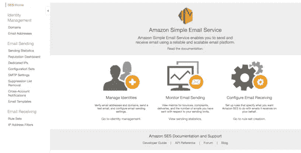

# AWS、MX 记录和注意差距

> 原文：<https://medium.com/swlh/aws-mx-records-and-minding-gaps-ee88de50e7d9>

很长一段时间以来，我都避免在自己的域名上设置自定义的、特定于域名的电子邮件地址。这有几个原因。

T2:我想既然每个人都已经熟悉了 GMail，而且它已经获得了如此高的声望，甚至雅虎推出了 Ymail，我没有个性化的电子邮件地址并没有损失太多。

T wo，在我尝试设置我自己的电子邮件地址的有限经验中——基本上是通过点击 cPanel 复选框/单选按钮的一些难以理解的序列来在我的域上设置电子邮件——我已经意识到我很少实际使用这些特殊的电子邮件地址，因为在一个不熟悉的(即非 GMail) UX 阅读那些没有适当垃圾邮件过滤器的电子邮件至少可以说是令人讨厌的。

在我把我的个人网站从 Linode 转移到 AWS 后，这种情况发生了变化。

我从 AWS 控制台上获得的自信让我想知道我是否应该给自己弄一个 **@ramachandr.in** 电子邮件地址。

## 简单电子邮件服务

AWS 有一个很棒的工具叫做简单电子邮件服务，它让你建立自己的邮件服务器变得轻而易举。从哲学上讲，SES 是一种交易型电子邮件服务——想想营销或 1:N 沟通。它比 GMail 更接近 MailChimp。稍后我会对此有更多的话要说。

从我这个新手的角度来看，SES 的唯一问题是它的文档，像许多 AWS 文档一样，是不必要的密集和神秘。

例如，看看下面的截图。乍一看，你可能很难解释为什么*身份管理*(很容易与 IAM 和安全混淆)会出现在左侧菜单中。

Courtesy: My personal image library

事实上，*身份管理*可以更好地理解为*域或电子邮件验证*，因为这就是它的本质。

通过这种方式，SES 可以确定您是拥有@域名，还是拥有一个或多个您希望用来通过 SES 发送电子邮件的 FROM 电子邮件。

回想一下上面的内容，SES 通常像 Mailchimp 一样用于发送或接收大量电子邮件。一种选择是验证一些你可以用来发送电子邮件的发件人电子邮件地址。另一种选择是通过在您的名称服务器上创建正确的 MX、TXT 和 CNAME DNS 条目来验证整个域。一旦域名被验证，几乎任何电子邮件 address@domain.com 可以用来发送电子邮件。SES 会优雅地处理它们。这可能就是为什么 Mailinator 可以向我们提供无限的可任意使用的电子邮件地址。

SES 的一个大问题是，你无法查看收到的邮件。想想我刚才说的。SES 无法让您轻松查看发送到您的个性化电子邮件地址的电子邮件！

你所能期望的最好情况是将收到的电子邮件保存到一个 S3 桶中，并使用社交网站在收到电子邮件时直接通知你。

每封保存到 S3 的电子邮件基本上都是一个. eml 文件——尽管在 S3，这个文件被称为. dms。dms 文件，将其重命名为。eml 并在 Mail 或 Outlook 中打开它。

这听起来真的很乏味:)。

有那么一瞬间，我以为我发现了 AWS 产品中的一个缺口，一个有进取心的企业家——我？—可以提供一个要转换的 SaaS。dms 电子邮件变成可读的，人类友好的 HTML。

唉，那是不可能的。

通过 WorkMail，lAWS，这个云解决方案的不懈努力，解决了这个问题。

您的入站电子邮件可以自动转发到包含在另一个名为 WorkMail 的 AWS SaaS 中的收件箱，它提供了完整的工业级收件箱解决方案。他们对这项服务的定价是每个用户每月 4 美元，50GB 的空间。

另一个免费的解决方案是这个[开源解决方案](http://www.daniloaz.com/en/use-gmail-with-your-own-domain-for-free-thanks-to-amazon-ses-lambda/)。当有新邮件到达时，它使用 Lambda 函数来侦听来自 ses 的通知，然后它会转到保存该邮件的 S3 桶，提取该邮件的内容并将其转发给 GMail。

## 结论

1.  使用 SES 建立自己的邮件服务很容易。我甚至没有使用 53 号公路，我花了大约 2-3 个小时才把一切都安排好。这里有一个问题—您不能让 CNAME 和 MX 记录具有相同的根关键字，也就是说，您不能让 CNAME 记录中的 ramachandr.in -> valueA 和 MX 记录= ramachandr.in -> valueB。由于分配的 LHS 是相同的，你的域名服务器可能会拒绝。[更多详情点击这里](/@ssr233/ses-gotchas-3f4f077c16e1)。
2.  如果你想要一个专业的收件箱，用工作邮件吧。真的很好。
3.  如果你不想给 AWS 更多的钱，使用免费的开源 AWS Lambda SES forwarder 将入站电子邮件转发到你首选的 GMail etc 帐户。

## 这篇文章发表在《T4》杂志《创业》(The Startup)上，这是 Medium 最大的创业刊物，拥有 337，320 多名读者。

## 在这里订阅接收[我们的头条新闻](http://growthsupply.com/the-startup-newsletter/)。

