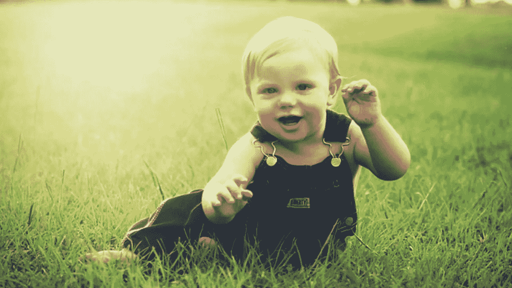

# 婴儿做得比你好

> 原文：<https://medium.com/swlh/babies-do-it-better-than-you-9060d5d0866b>

Source: Google Images.

当一个婴儿学会走路时，我们并不指望他马上站起来迈出第一步。

我们知道他会摔倒。

我们没有为他感到难过，而是鼓励他站起来重新开始。

所以他再试一次。
又掉下来。

经过一些练习后，他会设法走几步，但之后还是会摔倒。

这就是我们欣赏婴儿进步的方式，看:
-他摔倒前走了多少步
-他爬起来重新开始的速度有多快

我们都经历过这个过程。

久而久之，我们往往会在摔倒前走得更远。
而且我们在跌倒后往往会爬得更快。

然而，我们知道跌倒总是会发生。

这是一种我们在以后的生活中失去的心态。

相反，在决定开始新的事物之前，我们会永远等待。

然后，在最终尝试之前，我们花了相当多的时间做准备，期望马上成功。

在这种情况下，失败是有害的。

因为长时间的准备和很高的期望。

然而，当所有重要的事情都是爬起来，并在下一次跌倒之前再次努力做得更好 1%时，就没有理由感觉不好。

这不再是失败与否的问题了。

而是你在失败之前做得有多好。失败后，你能以多快的速度爬起来，再试一次。

不要逃避失败，**只是更好的失败。**

## 这篇文章发表在 [The Startup](https://medium.com/swlh) 上，这是 Medium 最大的创业刊物，有+ 375，985 人关注。

## 在此订阅接收[我们的头条新闻](http://growthsupply.com/the-startup-newsletter/)。

