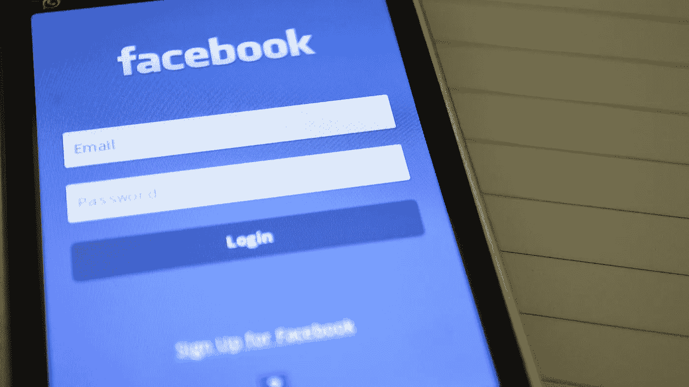

# 回到未来:新脸书算法

> 原文：<https://medium.com/swlh/back-to-the-future-the-new-facebook-algorithm-7c948523c4d4>

年初，面对铺天盖地的问题，我重返工作岗位。在一月的第二周，马克·扎克伯格发布重大声明后，大多数品牌都吓坏了。有消息称，脸书将再次更新其算法。这一次，对页面产生了灾难性的影响。

算法更新最大的推理？扎克伯格希望脸书帮助人们相互联系。又来了。这就是他最初建立社交网络平台的原因。

在通读了扎克伯格的帖子和他们的新闻订阅负责人亚当·莫塞里的[博客帖子](https://newsroom.fb.com/news/2018/01/news-feed-fyi-bringing-people-closer-together/)后，我很快意识到我的许多客户没有正确阅读完整的公告。他们没有理解的是，虽然这一重大变化最终将在所有脸书产品中推广，但它只适用于有机成分。脸书不再是一个内容分发平台。但是我已经超越了我自己…

## **房租到期**

据报道，脸书是世界上最大的内容出版商之一。这对一个不创造自己内容的公司来说是非常罕见的。那是因为你、我和其他营销人员都在为脸书创造内容。遗憾的是，我们发布的所有内容并没有像网站那样让脸书成为一个自有平台。观众也不是你的。事实上远非如此。把脸书想象成一座房子。你已经住了很多年了，你布置了它，你装饰了它。见鬼，你喜欢它。但是你不拥有它。你只是租了个地方。房东刚刚提高了房租。

通常当这种情况发生时，房客要么找到新的住处，要么掏钱付账。对于那些选择搬家的人，我相信你很清楚该去哪里。你研究过你的受众，你知道他们要么在 SnapChat 上，要么在 Twitter 上。或者你只是通过电子邮件营销看到了更好的投资回报(加上你实际上拥有你的受众数据)。但是对于我们这些选择留下来的人来说，这并不是那么糟糕。未来并没有那么可怕。

多年来，专家和“大师”们一直说脸书是一个付费游戏平台。脸书现在让这一点变得更加明显。正如我之前简单提到的，不是所有的页面文章都会从新闻提要中消失。只有有机的。有付费策略就 ok 了。嗯，算是吧。

脸书的广告库存正在耗尽，随着更多的品牌、营销人员和广告商可能会向他们的页面投入更多的资金，脸书的广告可能会变得更贵。宜早不宜迟。库存越少，竞争越激烈。现在令人兴奋的挑战是让*真正*擅长脸书。

## **新手机，谁 dis？**

我不打算具体说明这些变化是什么，意味着什么，因为所有主要的新闻媒体都报道了这些变化。你可以看到这里的、这里的和这里的。哦，还有这里的。对于那些选择继续在脸书投资的人，我在本周听了一个非常有趣的播客，由来自社交媒体审查员的 Michael Stelzner 主持。他研究了所有对算法提出的修改，并为营销人员提供了实用的解决方案。

1.**发布频率。如果你每天在不止一篇有机文章上投入资源，那你就是在浪费时间。不如把这些资源投入到完善你的付费策略上。**

2.**交战信号。**只创作有机的内容，让你的观众彼此互动，而不仅仅是你自己。这种参与不仅仅是一个表情符号或一句“太好了”或“谢谢”。你的追随者需要彼此进行真正的 T21 对话。是的，脸书知道如何识别真实的对话。

3.**现场视频**。视频已死。视频直播万岁。脸书将不再在新闻提要中优先播放预先录制的视频。他们说这促进了太多的“被动观看”。相反，他们想要的是人们互动和评论视频。根据他们的研究，这种情况只会发生在直播视频中。是时候升级你的视频游戏了。

4.**见-先** : [还记得这个](https://www.facebook.com/help/1188278037864643?helpref=faq_content)吗？这是你的关注者可以“选择加入”的唯一选择，他们仍然可以在他们的新闻源中看到你的内容。通过选择此选项，您的有机帖子将在您发布后立即出现在您的关注者的订阅源中。提示您的追随者使用此选项。

5.**躲避交战诱饵** : 算法巧妙。真聪明。就像我们都知道什么是“点击诱饵”一样，它也知道什么是啮合诱饵。如果你不知道，那么很简单，你不能再明目张胆地要求你的追随者评论你的帖子。是的，这是你希望他们做的，但是你需要找到更有创造性的方法，让你的追随者评论你的内容，而不是用那些确切的话来说。令人沮丧，我知道。

6.脸书广告公司:是时候好好干了，伙计们。

7.信使聊天机器人:它们已经存在了一段时间，但我认为内容制作者没有充分利用这项技术。Messenger 被吹捧为新的内容分发渠道，通过它，您可以在私人环境中向参与的用户提供内容。你不必在这里所有的促销和折扣中为吸引注意力而争斗；只需进一步了解你在与谁打交道，然后提供最适合该特定用户需求的内容。

在接下来的几周和几个月里，你会想要激发你的观众积极参与你的内容。

没有人确切知道这些新变化会带来什么影响。但是你必须让你的观众互相交流和聊天。脸书正在改变。你愿意与之改变吗？

## 这个故事发表在 [The Startup](https://medium.com/swlh) 上，这是 Medium 最大的企业家出版物，拥有 289，682+人。

## 在此订阅接收[我们的头条新闻](http://growthsupply.com/the-startup-newsletter/)。

