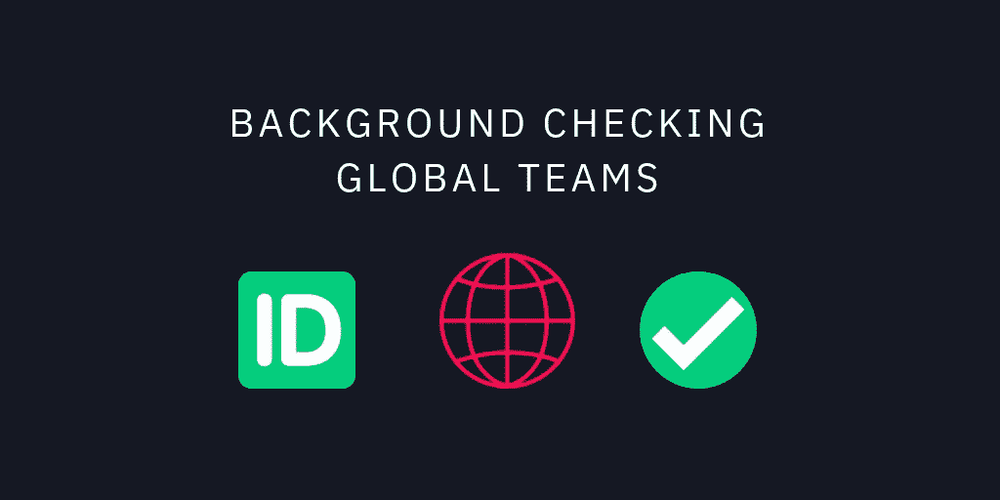
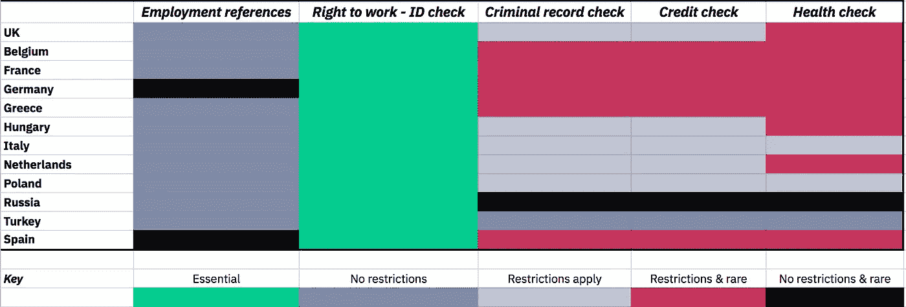
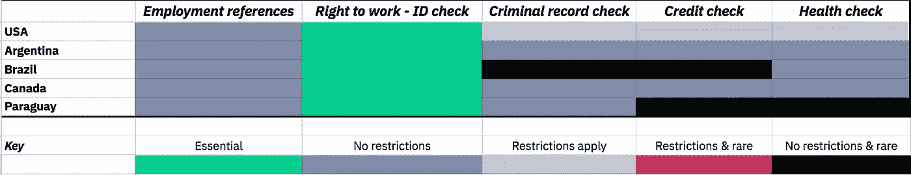
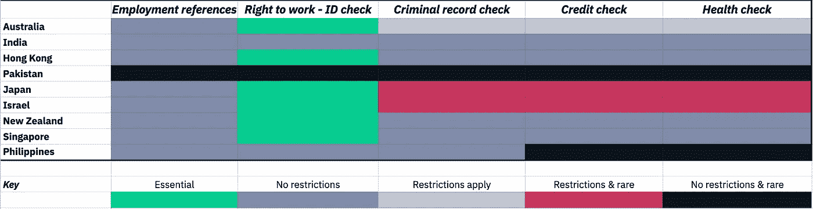

# 背景调查全球团队

> 原文：<https://medium.com/swlh/background-checking-global-teams-3e06e3ca0920>

## [雇佣分布式团队第 3 部分](/zinc_work/why-twice-as-many-blockchain-teams-are-distributed-ca1065ba973b)

在一个国家招聘时，背景调查已经够复杂了。背景调查一个全球分布的团队，遵守当地法律是一项难以完成的任务，除非你对劳动法有特殊的偏好。

我写这个系列是为了帮助那些试图应对雇佣全球分布团队的复杂性的公司[。我将专注于当地的法律，就可以做哪些检查提供指导，并涵盖欧洲、美洲和亚洲的热门目的地。](/zinc_work/why-twice-as-many-blockchain-teams-are-distributed-ca1065ba973b)

通常情况下，背景调查公司会寻求收集尽可能多的数据，并尽可能长时间地保存这些数据。你通常必须接受他们的指导方针，揭露偏见。Zinc 的理念是收集*最少*可能的数据以确保安全和合规，而不是保留这些数据。相反，Zinc 以一种可信的方式记录收集的数据，并将其返还给个人，供他们保存和重复使用。Zinc 是背景调查工具的提供商。我们强烈主张用户隐私，尊重匿名。因此，当我们打破常规时，我们经常面临道德困境。

开始检查前要遵循的步骤…

1.  **遵守当地法律:**在一个新的管辖区进行检查之前，一定要先检查当地政府的指导方针。
2.  **与角色的相关性:**一般来说，检查是在对工作至关重要时进行的。财务检查通常在与金钱打交道时进行，例如，在金融服务中的角色。涉及重型机械操作的岗位健康检查。对涉及医疗保健或儿童工作的角色进行刑事调查。
3.  **征求许可:**在进行任何检查之前，征求候选人的许可。这在许多国家不是必需的，在其他国家是强制性的。但是首先联系候选人，让他们知道在流程开始时的检查是很重要的。
4.  **检查类型指南:**在大多数国家/地区，雇佣证明人和学历检查是允许的，并且已经执行。这些检查可由雇主或第三方进行。在大多数国家，工作权检查和居住权检查是被允许和执行的。这些在全球非常普遍，在全球流程中使用它们是非常安全的。财务和刑事检查差别很大。刑事调查在亚洲很常见，但财务调查却不常见。财务支票在美国很常见，但刑事支票却不常见。这两种角色在欧洲都不常见，在一些国家是不允许的。

# 欧洲

欧洲有很好的数据保护法，正确的行为得到执行。在大多数情况下，你必须征得申请人的同意，并且只允许进行相关的检查。

[**英国~** 官方指南](https://www.gov.uk/employers-checks-job-applicants)

**要点:**你必须对所有工作的申请人进行工作权利证明 ID 检查。医疗保健、政府、银行或儿童保育领域都需要检查。例如，银行业要求 6 年的地址历史和就业调查。

允许但有限制:进行信用或犯罪调查并不常见。医疗保健&犯罪调查要求该职位在金融、政府医疗保健或儿童保育领域。

无限制地允许:进行就业证明或教育背景调查是很常见的。雇主可以对任何职位进行信用检查和基本信息披露(DBS)服务检查。

欧盟公民可以在英国工作到 2020 年 12 月 31 日，之后他们需要定居身份。

[**比利时** ~指导方针](https://www.belgium.be/en/work/coming_to_work_in_belgium/work_permit)

**要点:**你必须对申请人进行工作权利证明 ID 检查。

**允许但有限制:** [犯罪、信用和健康背景调查并不常见](https://www.lexology.com/library/detail.aspx?g=65e711ff-0745-4d80-a5e6-516dacccc482)。在比利时，数据不公开。只有数据主体可以向地方当局请求提取犯罪、信用或健康记录。任何检查都必须是必要的，并且与工作相关。

无限制地允许:进行就业证明或教育背景调查是很常见的。

[**法国~** 指导方针](https://uk.practicallaw.thomsonreuters.com/0-503-0054?transitionType=Default&contextData=(sc.Default)&firstPage=true&comp=pluk&bhcp=1#co_anchor_a705826)

基本要求:你必须对申请人进行工作权利证明。

**允许但有限制:**与比利时一样，法国的记录只提供给相关个人，第三方不得获取。任何检查都必须是必要的，并且与工作相关。

无限制地允许:进行就业证明或教育背景调查是很常见的。

[**德** ~指南](https://uk.practicallaw.thomsonreuters.com/3-503-3433?transitionType=Default&contextData=(sc.Default)&firstPage=true&comp=pluk&bhcp=1#co_anchor_a386420)

**要点:**你必须对申请人进行工作权利证明 ID 检查。

**允许但有限制:**任何检查必须是必要的，并且与工作相关。犯罪、信用和健康背景调查并不常见。

不受限制地允许:进行就业证明或教育背景调查并不常见。

[**希腊~** 政府指导方针](https://uk.practicallaw.thomsonreuters.com/5-620-5757?transitionType=Default&contextData=(sc.Default)&firstPage=true&comp=pluk&bhcp=1#co_anchor_a126208)

**要点:**你必须对申请人进行工作权利证明 ID 检查。

**允许但有限制:**任何检查必须是必要的，并且与工作相关。对处理个人数据的所有限制适用于雇主和处理个人数据的任何第三方。

无限制地允许:进行就业证明或教育背景调查是很常见的。

[**匈牙利~** Gov 指南](https://www.dataprivacy.hu/?p=1530)

基本要求:你必须对申请人进行工作权利证明。必须检查与职业相关的犯罪记录；法律、政府&金融服务。他们不允许从事其他职业。

**允许但有限制:**与比利时&法国一样，匈牙利的记录只提供给相关个人，第三方不得获取。任何检查都必须是必要的，并且与工作相关。

无限制地允许:进行就业证明或教育背景调查是很常见的。

[**意大利~** Gov 指南](https://www.lexology.com/library/detail.aspx?g=a6bcddcf-32a5-4f7e-b879-31c3111b44ef)

基本要求:你必须对申请人进行工作权利证明。

**允许但有限制:**仅允许对特定角色进行犯罪和信用背景调查(*例如*，某些财务职位)。**任何检查都必须与工作相称且相关。**

不受限制地被允许:进行就业证明或教育背景调查是很常见的。

[**荷兰** ~ Gov 指南](https://business.gov.nl/regulation/screening/)

基本要求:你必须对申请人进行工作身份证明检查。必须检查与职业相关的犯罪记录；法律、政府和金融服务。他们不允许从事其他职业。

**允许但有限制:**仅允许对特定角色进行犯罪和信用背景调查(*例如*，政府、金融、医疗保健)。**任何检查必须与工作相称且相关。**

**无限制地允许:**进行就业证明或教育背景调查是很常见的。

[**波兰** ~ Gov 指南](http://www.dziennikustaw.gov.pl/)

**要点:**你必须对申请人进行工作权利证明 ID 检查。

**允许但有限制:**根据《波兰劳动法》的规定，可以要求候选人提供某些有限的个人数据。只有在其他法律适用的情况下，例如在政府工作中，才允许进行犯罪和信用调查。初步医疗检查，以确认没有健康原因阻碍该人就业。今年 1 月，波兰对金融服务行业的从业人员实施了强制性的犯罪调查。

无限制地允许:进行就业证明或教育背景调查是很常见的。

[**俄罗斯** ~ Gov 指南](https://uk.practicallaw.thomsonreuters.com/5-503-4083?transitionType=Default&contextData=(sc.Default)&firstPage=true&comp=pluk&bhcp=1#co_anchor_a841435)

**要点:**你必须对申请人进行工作权利证明 ID 检查。年轻男性必须遵守军规。

允许没有限制:犯罪和信用调查是允许的，但不能用来拒绝工作申请。进行就业证明或教育背景调查是很常见的。

[**土耳其** ~ Gov 指南](https://uk.practicallaw.thomsonreuters.com/8-383-1562?transitionType=Default&contextData=(sc.Default)#co_anchor_a139304)

**要点:**土耳其法律对背景调查没有法律限制。根据《土耳其劳动法》,雇主必须为每名雇员保留一份人事档案，尽管该档案必须包含哪些内容并未具体说明。因此，土耳其的雇主通常会将雇员的犯罪记录、健康报告等存档。雇主不限于要求雇员提供健康或犯罪记录。进行就业证明或教育背景调查是很常见的。

[**西班牙** ~ Gov 指南](https://uk.practicallaw.thomsonreuters.com/8-503-1479?transitionType=Default&contextData=(sc.Default)#co_anchor_a1038701)

基本要求:你必须对申请人进行工作身份证明检查。对于某些职位，员工必须提供一份证明，证明他或她没有犯罪记录。

允许但有限制:信用和犯罪调查并不常见。**任何检查必须与工作相称且相关。**

**允许无限制:**允许进行证明人和教育背景调查。大多数公司和机构更喜欢将信息直接交给申请人，这样他或她就可以将信息传递下去。

# 美国的

美国可以说是所有国家中最复杂的，各州的法律差异很大。进行就业证明或教育背景调查是很常见的。背景调查在美国和加拿大已经相当成熟和根深蒂固。联系我们以获得任何特定状态的具体建议:hello@zinc.work

[**美国~** 政府指导方针](https://www.eeoc.gov/eeoc/publications/background_checks_employers.cfm)

**要点:**你必须对申请人进行工作权利证明 ID 检查。

有限制地允许:各州的法律各不相同。背景调查和教育背景调查很常见。犯罪背景和信用调查通常可以根据适用的联邦、州和地方法律进行，越来越多的州和地方司法管辖区限制申请中的犯罪历史问题，并且仅允许在有条件的工作机会之后进行此类调查。如果在报价后按照适用法律进行体检、药物和酒精筛查，通常是允许的。

无限制地允许:进行就业证明或教育背景调查是很常见的。

[**阿根廷~** Gov 指南](http://www.jpof.com.ar/publicaciones/A_Regional_Guide_To_Background_Checks__.pdf)

**要点:**您必须对申请人进行工作权利证明 ID 检查。必须检查与职业相关的犯罪记录；法律、政府& FS。他们不允许从事其他职业。

**无限制地被允许:**进行就业证明或教育背景调查是很常见的。健康检查对任何角色来说都是常见的。信用和犯罪调查不太常见，但在征得同意的情况下，任何角色都可以进行。

[巴西~ Gov 指南](https://uk.practicallaw.thomsonreuters.com/1-503-5032?transitionType=Default&contextData=(sc.Default)&firstPage=true&comp=pluk&bhcp=1#co_anchor_a832808)

基本要求:你必须对申请人进行工作权利证明 ID &居留检查。

**无限制地允许:**进行就业证明或教育背景调查是很常见的。健康检查很常见。信用和犯罪调查不太常见，但在征得同意的情况下，任何角色都可以进行。

[**加拿大~** 政府指导方针](https://www.monster.ca/career-advice/article/background-checks-ca)

**要点:**你必须对申请人进行工作权利证明 ID &居留检查。社会保险号码也需要检查。

不受限制地允许:进行就业证明或教育背景调查是很常见的。健康、信用和犯罪调查对任何职位来说都是常见的。他们都是经同意才被允许的。检查后适用严格的反歧视规则。

[巴拉圭**~**巴拉圭政府指导方针](http://www.jpof.com.ar/publicaciones/A_Regional_Guide_To_Background_Checks__.pdf)

基本要求:你必须对申请人进行工作权利证明。

无限制地被允许:进行职业介绍和犯罪调查是很常见的。任何其他形式的检查都不受限制。

# 亚洲

与欧洲和美国相比，对背景调查的限制很少。你通常不需要征得同意，至于你可以申请哪些支票，这与你受雇于哪个部门无关。

[**澳大利亚~** Gov 指南](http://www.recruitcheck.com.au/articles/pre-employment-screening-basics.aspx)

**要点:**你必须对申请人进行工作权利证明 ID 检查。

允许但有限制:进行就业证明或教育背景调查是很常见的。经申请人同意，允许进行信用、犯罪和健康检查，并遵守相关的反歧视法律。提供的就业机会可能会受到犯罪记录检查或医疗检查(如果有必要，以确定是否适合某一特定工作)。

[T3【印度】~ Gov 指南](https://www.mayerbrown.com/files/uploads/Documents/PDFs/Employment/A-Global-Guide-Background-Checks.pdf)

**基本:**无

无限制地允许:进行就业证明或教育背景调查是很常见的。健康、信用和犯罪调查对任何职位来说都是常见的。没有法定要求对申请人进行工作权利证明 ID 检查，但这是可取的。因为雇员护照上的签证章/标签将包括雇主的姓名，雇主将被要求代表雇员向外国人地区登记处(FRRO)提供一份承诺书，以便在 FRRO 为雇员进行登记。

[**香港~** 政府指引](https://www.mayerbrown.com/files/uploads/Documents/PDFs/Employment/A-Global-Guide-Background-Checks.pdf)

**要点:**您必须对申请人进行工作权利证明 ID 检查。

不受限制地允许:进行就业证明或教育背景调查是很常见的。健康、信用和犯罪调查对任何职位来说都是常见的。他们都是经同意才被允许的。

[**巴~** Gov 指南](https://www.mayerbrown.com/files/uploads/Documents/PDFs/Employment/A-Global-Guide-Background-Checks.pdf)

**基本要求:**对预聘没有监管要求。

不受限制地被允许:进行任何背景调查是不常见的。雇主没有办法检查申请人的信用/财务记录。

[**日本~** Gov 指导方针](https://www.mayerbrown.com/files/uploads/Documents/PDFs/Employment/A-Global-Guide-Background-Checks.pdf)

**要点:**对预聘没有监管要求。

允许但有限制:进行就业证明或教育背景调查并不常见，它们很难获得。信用背景调查是允许的，但是劳动局不鼓励。应该非常需要证明这种检查的合理性。

[**纽西兰~** Gov 指南](https://www.mayerbrown.com/files/uploads/Documents/PDFs/Employment/A-Global-Guide-Background-Checks.pdf)

**要点:**你必须对申请人进行工作身份证明检查。

无限制地允许:进行就业证明或教育背景调查是很常见的。健康，信用和犯罪调查是允许的。

[**新加坡~** 政府指导方针](https://www.mayerbrown.com/files/uploads/Documents/PDFs/Employment/A-Global-Guide-Background-Checks.pdf)

**要点:**你必须对申请人进行工作权利证明 ID &居留检查。

**无限制地允许:**进行就业证明或教育背景调查是很常见的。雇主还可能要求未来的候选人接受体检并出示资格证明。除申请人同意外，没有其他限制。

[**以色列~** 政府指导方针](https://www.mayerbrown.com/files/uploads/Documents/PDFs/Employment/A-Global-Guide-Background-Checks.pdf)

**要点:**你必须对申请人进行工作身份证明检查。

教育背景和过去的工作背景调查是常见的，也是允许的。

**允许但有限制:**大多数背景调查只有在与要求相关时才被允许。劳动法禁止刑事检查。

[**菲律宾~** Gov 指南](https://www.mayerbrown.com/files/uploads/Documents/PDFs/Employment/A-Global-Guide-Background-Checks.pdf)

**要点:**对预聘没有监管要求。

不受限制地允许:菲律宾劳动法赋予雇主提供雇佣前检查的管理特权。雇主通常要求申请人提交他们的身份证，社会保障系统身份证号码，税收身份证号码，和出生证明。

来源:= >[https://www . dlapiperiintelligence . com/going Global/Employment/index . html](https://www.dlapiperintelligence.com/goingglobal/employment/index.html?c=AU&c=HK&c=IN&t=03-pre-hire-checks)[https://www . Mayer brown . com/files/uploads/Documents/pdf/Employment/A-Global-Guide-Background-checks . pdf](https://www.mayerbrown.com/files/uploads/Documents/PDFs/Employment/A-Global-Guide-Background-Checks.pdf)

如果您需要任何关于缺失司法管辖区的建议，请联系我们。

联系使用锌公司位于区块链[的招聘工具包](https://zinc.work/)进行背景调查； [hello@zinc.work](http://hello@zinc.work) 。

**网址** : [https://zinc.work](https://zinc.work)

**推特:**https://twitter.com/zinc_work

**领英:**[https://www.linkedin.com/company/zinc-work/](https://www.linkedin.com/company/zinc-work/)

## 这篇文章发表在 [The Startup](https://medium.com/swlh) 上，这是 Medium 最大的创业刊物，拥有+396，714 人关注。

## 在这里订阅接收[我们的头条新闻](http://growthsupply.com/the-startup-newsletter/)。

