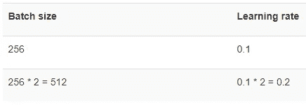
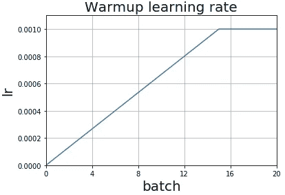
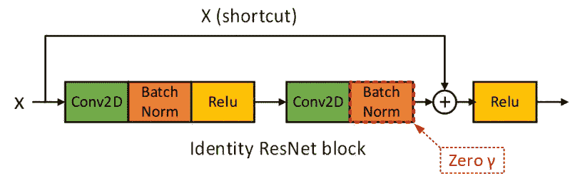
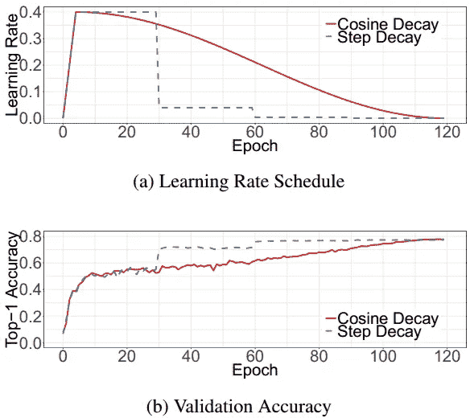
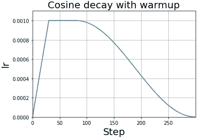
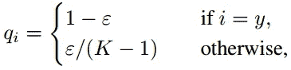

# Keras 中卷积神经网络用于图像分类的技巧包

> 原文：<https://medium.com/swlh/bag-of-tricks-for-image-classification-with-convolutional-neural-networks-in-keras-ff99d0ef68f9>


这篇教程向你展示了如何在 Keras API 中实现一些图像分类任务的技巧，如 https://arxiv.org/abs/1812.01187v2[的论文](https://arxiv.org/abs/1812.01187v2)中所示。这些技巧适用于各种 CNN 模型，如 ResNet-50、Inception-V3 和 MobileNet。

# 大批量训练

对于相同数量的时期，与使用较小批量训练的模型相比，使用较大批量训练的模型会导致验证准确性下降。四种启发法，有助于最大限度地减少大批量训练的负面影响，提高准确性和训练速度。

# 线性比例学习率

随着批量大小线性增加学习速率

例如



在 Keras API 中，您可以像这样缩放学习速率和批量大小。

# 学习率热身

使用太大的学习率可能导致数值不稳定，特别是在训练的最开始，参数是随机初始化的。预热策略在初始 ***N*** 时期或 ***m*** 批次期间将学习率从 0 线性增加到初始学习率。

尽管 Keras 自带 [LearningRateScheduler](https://keras.io/callbacks/#learningratescheduler) 能够更新每个训练时期的学习率，但为了更好地更新每个批次，这里介绍了如何实现定制的 Keras 回调来实现这一点。

`warm_up_lr.learning_rates`现在包含了每个训练批次的预定学习率的数组，让我们将它可视化。



# 每个 ResNet 块的零γ最后一批规范化层

批处理规范化使用γ缩放一批输入，使用β进行移位，γ和β都是可学习的参数，默认情况下，它们的元素在 Keras 中分别初始化为 1 和 0。

在零γ初始化试探法中，我们为位于残差块末端的所有 BN 层初始化γ = 0。因此，所有残差块仅返回它们的输入，模仿具有较少层数并且在初始阶段更容易训练的网络。

给定一个 identity ResNet 块，当最后一个 BN 的γ初始化为零时，这个块将只把快捷方式输入传递给下游层。



你可以看到这个 ResNet 块是如何在 Keras 中实现的，唯一的变化是行， [BatchNormalization](https://keras.io/layers/normalization/#batchnormalization) 层的`gamma_initializer='zeros'`。

# 无偏差衰减

将 L2 正则化应用于所有参数的标准权重衰减将它们的值推向 0。它包括对层权重应用惩罚。然后将惩罚应用于损失函数。

建议仅对权重应用正则化，以避免过度拟合。其他参数，包括 BN 层中的偏压和γ和β，保持不变。

在 Keras 中，将 L2 正则化应用于核权重是毫不费力的。选项**bias _ regulator**也可用，但不推荐使用。

# 训练改进

# 余弦学习率衰减

在前面描述的学习率预热阶段之后，我们通常会从初始学习率开始稳步降低其值。与包括指数衰减和阶跃衰减在内的一些广泛使用的策略相比，余弦衰减在开始时缓慢降低学习速率，然后
在中间变得几乎线性降低，并在结束时再次减慢。它有可能提高训练进度。



这是一个完整的带有预热阶段的余弦学习率调度程序的例子。在 Keras 中，调度程序在每个更新步骤的粒度上更新学习率。

您选择使用调度器中的 **hold_base_rate_steps** 参数，顾名思义，该参数在进行余弦衰减之前保存特定步数的基本学习速率。由此产生的学习率时间表将有一个平台，如下所示。



# 标签平滑

与原始的独热编码输入相比，标签平滑改变了真实概率的构造，



其中ε是一个小常数。标注平滑鼓励全连接图层的有限输出，使模型更好地进行概化，并且不容易过度拟合。对于标签噪声，这也是一种有效且理论上可行的解决方案。你可以在这里阅读更多关于[讨论](https://qr.ae/TUnRbn)的内容。
以下是在训练分类器之前，如何对单热点标签应用标签平滑。

结果

```
Before smoothing: [**0.** **0.** **0.** **0.** **0.** **1.** **0.** **0.** **0.** **0.**]
After smoothing: [**0.01**  **0.01**  **0.01**  **0.01**  **0.01**  **0.90999997**  **0.01**  **0.01**  **0.01**  **0.01**]
```

# 结论和进一步阅读

在这篇文章中，还有两个培训优化没有涉及到，即，

*   **知识提炼**利用预先训练的较大模型的输出来训练较小的模型。
*   **Mixup 训练**，某种意义上类似于增强，它通过对两个样本进行加权线性插值，形成新的样本，从而创造更多的数据。我们将在以后的文章中考虑实现这一点。

阅读论文[https://arxiv.org/abs/1812.01187v2](https://arxiv.org/abs/1812.01187v2)了解每一个技巧的详细信息。

我的 GitHub 上有源代码。

[](https://github.com/Tony607/Keras_Bag_of_Tricks) [## Tony607/Keras_Bag_of_Tricks

### Keras-Tony 607/Keras _ Bag _ of _ Tricks 中卷积神经网络用于图像分类的技巧包

github.com](https://github.com/Tony607/Keras_Bag_of_Tricks) 

[在 Twitter 上分享](https://twitter.com/intent/tweet?url=https%3A//www.dlology.com/blog/bag-of-tricks-for-image-classification-with-convolutional-neural-networks-in-keras/&text=Bag%20of%20Tricks%20for%20Image%20Classification%20with%20Convolutional%20Neural%20Networks%20in%20Keras) [在脸书分享](https://www.facebook.com/sharer/sharer.php?u=https://www.dlology.com/blog/bag-of-tricks-for-image-classification-with-convolutional-neural-networks-in-keras/)

【www.dlology.com】最初发表于[](https://www.dlology.com/blog/bag-of-tricks-for-image-classification-with-convolutional-neural-networks-in-keras/)**。**

*[](https://medium.com/swlh)*

## *这篇文章发表在 [The Startup](https://medium.com/swlh) 上，这是 Medium 最大的创业刊物，拥有+405，714 名读者。*

## *在此订阅接收[我们的头条新闻](http://growthsupply.com/the-startup-newsletter/)。*

*[](https://medium.com/swlh)*