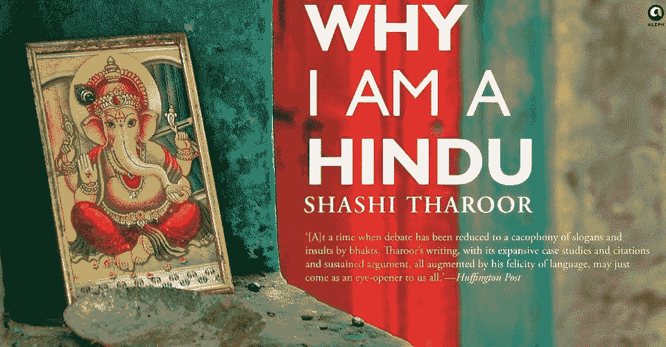

# 平衡已经过时了

> 原文：<https://medium.com/swlh/balance-has-had-its-time-in-the-sun-39714d527aa0>

当我与印度的朋友交谈时，其中一个话题是工作与生活的平衡。说到这一点，欧洲的文化与印度和美国的文化有很大不同。在欧洲，人们更加强调平衡的人生观。

但是平衡不一定是一件好事。

平衡，顾名思义，就是让两个或两个以上的事物保持平衡，不屈服于任何一个成分施加的力。在工作中，这意味着平衡我们工作的时间和我们做其他事情的时间，所有这些都被归为“生活”。

我曾经认为平衡的工作生活是持久幸福的核心。但是，我开始意识到平衡已经过时了。更重要的是与目标一致。

虽然我们在谈论工作与生活的平衡时会用到平衡这个词，但我们并不是真的在谈论平衡。我们实际上在谈论的是定义我们希望与之一致的目标的自由。

伴随权力而来的是责任。

当我们有能力和自由去定义我们想要达到的目标时，我们就有责任去做，并且做好。

许多人只是让事情发生在他们身上，而不是在第一时间锻炼。即使他们做了，他们也做得不对。因此，你经常会注意到人们对自己做出的许多决定感到后悔。

一旦我们定义了这个目的，那么平衡的问题就不会出现了。因为我们所做的一切都是为了这个目的。

这个目的的概念是印度教的核心原则(可能也是大多数宗教的核心原则)。古代印度教徒称之为*达摩。*古希腊人称之为*阿雷特。*

在成长的过程中，我总是询问母亲的宗教信仰。但是，随着时间的推移，我开始明白这就是她(以及其他许多像她一样的人)的命运。宗教信仰是向我们的生活方式灌输目标的一个好方法。

但是也可以完全定制。我们可以定义我们自己的。如果你仔细观察，你会发现所有受欢迎的小说(和非小说)主角都有这种使命感。从《哈利·波特》到《龙珠 Z》的小悟空，每个人身上都能看到。

平衡已经过时了。目标是城里的新事物。

PS:感谢沙希·塔鲁尔让我再次想到印度教。

## 在你走之前…

*如果你喜欢这个，支持我的工作。你需要做的就是鼓掌。*

[*跟我讨论美好生活的错综复杂。*](http://eepurl.com/cqwJZT)

[*读我的书*](https://www.amazon.com/s/ref=nb_sb_noss?url=search-alias%3Daps&field-keywords=mayantuyacu)